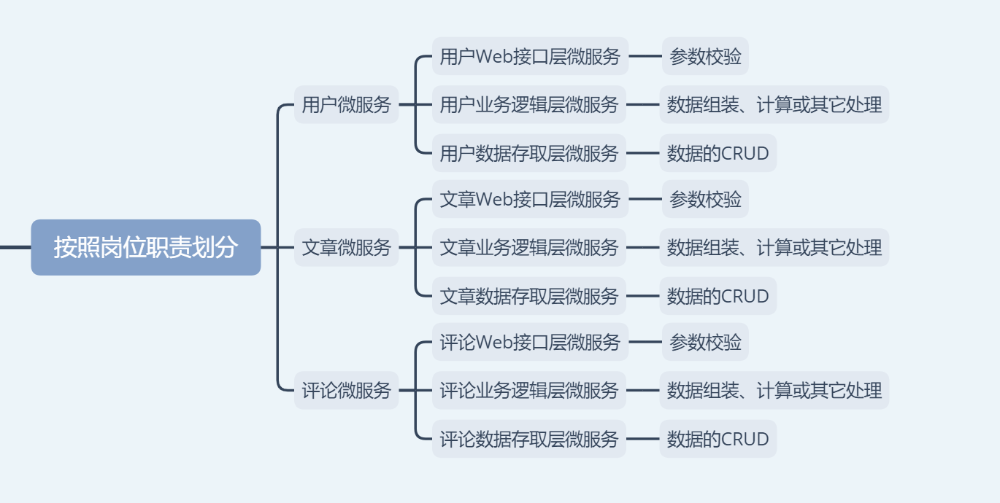
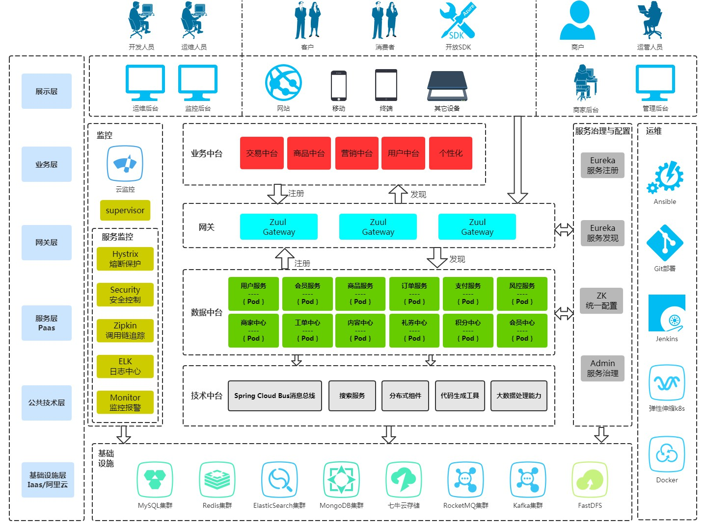

三层架构和微服务是我们公司系统架构1.0最鲜明的特点，由技术顾问最先提出，项目经理两边协调和总体把控，而我主要负责执行以及过程中的问题处理、人员培训等。
<!--more-->

在Java中，三层架构通常是指数据持久层、业务逻辑层、表现层。

在没有确定三层架构和微服务这套架构体系之前，经过了如下演变(不想涉及公司太多，故以博客相关进行举例说明)。

## 一、单体统一大杂烩

相当于一个单体服务，这个单体服务承载着系统所有的功能。
但这个单体统一大杂烩架构很快就被驳回了，至于原因，大家可以阅读这篇文章[从单体架构到分布式微服务架构的思考(告诉大家单体微服务的利与弊)](https://youcongtech.com/2021/04/17/%E4%BB%8E%E5%8D%95%E4%BD%93%E6%9E%B6%E6%9E%84%E5%88%B0%E5%88%86%E5%B8%83%E5%BC%8F%E5%BE%AE%E6%9C%8D%E5%8A%A1%E6%9E%B6%E6%9E%84%E7%9A%84%E6%80%9D%E8%80%83/)。

## 二、按照粗粒度划分

但这个也被驳回了，具体原因我也记不清了。从创业公司的架构演变到教育SaaS公司，基本上都践行这样的按粗粒度划分或者是在此基础上进行部门小组职责划分。

## 三、按照细粒度划分

相当于在博客微服务的基础上进行再细化，化粗为细。但这个也被驳回了。

## 四、按照岗位职责划分

这个被最终采用。被采用的原因之一，由数据建模人员或DBA亲自编写SQL，而对应的开发人员只需负责Web层的参数校验以及业务逻辑层的数据计算或组装以及其它可能的处理即可。而这个最终演变为我们的三层架构和微服务体系。这套三层架构和微服务体系到底对不对呢？放在当时由于一些客观原因，是对的。而后来，主客观因素的变更，三层架构和微服务体系也得随之变动，因为不再适合当前情况了。

## 五、总结
从单体统一大杂烩到按照岗位职责划分，最终我们这套架构体系差不多是这样的:

