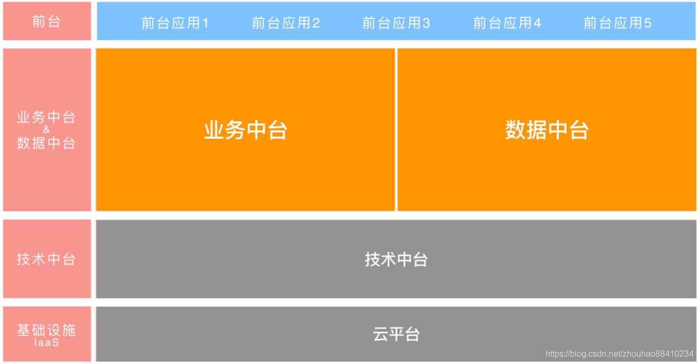

## 一、什么是中台?
"中台"是对传统"软件平台"的升级和加强，通过在企业层面引入新的专业化职能分工、数据唯一性建模等规则；在解决软件行业"重复造轮子"问题的基础上，进一步解决了传统"软件平台"未能解决的"软件平台间职能边界划分问题"及"数据孤岛问题"。

而我个人的理解如下图所示:
<!--more-->

我对中台的定义是:
**中台就是为了解决重复造轮子、重复建设、集结多方面资源的一种解决问题的方案(或者可以叫企业级可复用平台解决方案)。**

## 二、项目初期为何会提到中台呢？
一切源于项目经理的设想。

## 三、为何最后又放弃了中台？
**我个人觉得原因可归纳为如下**:

- 我们当下的业务场景并不适合中台；
- 中台的建设成本很高，一开始弄这个，很容易舍本逐末(对于当初尚未为公司创造盈利的部门而言，很容易折断)。

而且技术顾问也非常反对并在微信群分享了这篇文章:
[“中台”是怎么臭了大街的](http://www.cniteyes.com/archives/36885)

## 四、我对中台的一些思考
- 大公司流传下来的一套管理手段或技术手段不一定适合中小公司，具体情况具体分析，一定要结合实际情况而定；
- 好的方案一定要能够落地，不能落地的方案，不能叫好的方案；
- 中台的本质是快，快速搭建以及快速验证，目的在于减少或降低试错成本，但对于小公司而言，试错成本很高，一开始就错的话，后面很难纠正，不如一开始求稳第一，快在其次(换句话说，想清楚在做，而不是一开始想都没想直接就开始做了)。