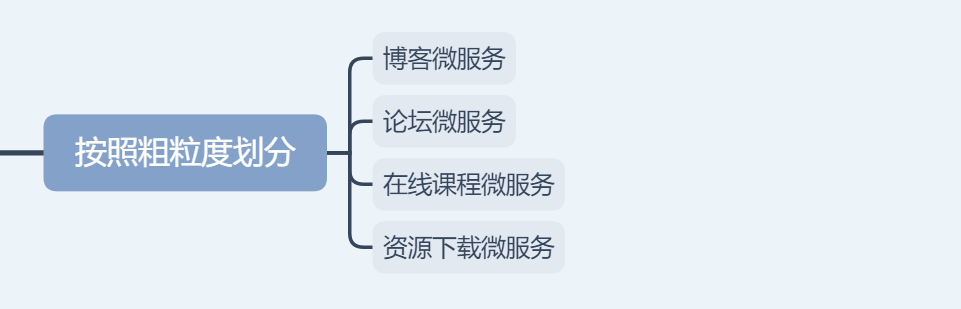

## 一、架构2.0的定义
经过三到四个版本的迭代以后，将原有开源项目的一些我们用不到的组件进行去除，并同时将过去三层架构与微服务的这套体系进行合并与移除，合并通用的，移除弃用的。相当于变成这样:

<!--more-->

关于我是如何对系统重构的(变三层为一层)，感兴趣的朋友可以阅读这篇文章:
[谈谈系统重构](https://youcongtech.com/2021/09/29/%E8%B0%88%E8%B0%88%E7%B3%BB%E7%BB%9F%E9%87%8D%E6%9E%84/)

## 二、架构中的微服务去中心化治理
曾读过一本书叫《分布式服务架构:原理、设计与实战》，书中提到微服务的交互模式一共有3种，微服务的分解和组合模式一共有6种，微服务的容错模式一共4种。我结合这本书上面的理论知识谈谈我在架构2.0的实践。

### 1.微服务的交互模式

#### (1)读者容错模式
读者容错模式指微服务化中服务提供者和消费者之间如何对接口的改变进行容错。从字面上来讲，消费者需要对提供者提供的功能进行兼容性设计，尤其对服务提供者返回的内容进行兼容，或者解决在服务提供者改变接口或者数据的格式的情况下，如何让服务消费者正常运行。

#### (2)消费者驱动契约模式
消费者驱动契约模式用来定义服务化中服务之间交互接口改变的最佳规则。
服务契约分为:提供者契约、消费者契约以及消费者驱动的契约，它从期望与约束的角度描述了服务提供者与服务消费者之间的联动关系。

- 提供者契约:是我们最常用的一种服务契约，顾名思义，提供者契约是以提供者为中心的，提供者提供了什么功能和消息格式，各消费者都会无条件地遵守这些约定，不论消费者实际需要多少功能，消费者接受了提供者契约时，都会根据服务提供者的规则来使用服务。
- 消费者契约:是对某个消费者的需求进行更为精确的描述，在一次具体的服务交互场景下，代表消费者需要提供者提供功能中的哪部分数据。消费者契约可以被用来标识现有的提供者契约，也可以用来发现一个尚未明确的提供者契约。
- 消费者驱动的契约:代表服务提供者向其所有当前消费者承诺遵守的约束。一旦各消费者把自己的具体期望告知提供者，则提供者无论在什么时间和场景下，都不应该打破契约。

#### (3)去数据共享模式
与SOA服务化对比，微服务是去ESB总线、去中心化及分布式的；而SOA还是以ESB为核心实现遗留系统的集成，以及基于Web Service为标准实现的通用的面向服务的架构。在微服务领域，微服务之间的交互通过定义良好的接口来实现，不允许使用共享数据来实现。

#### (4)我的实践
过去的三层架构和微服务体系，从Web接口服务、业务逻辑服务到数据存取服务，容错方面基本上比较宽松，通用性错误归纳为三类:

- 参数错误；
- 数据组装或计算错误；
- SQL报错。

参数错误一般发生在Web接口服务，数据组装或计算错误一般发生在业务逻辑服务，SQL报错一般发生在数据存取服务。而API之间的调用的结果通常有且只有两种(参数错误排除在外)，一个是响应码为200，另外一个是响应码为500。

针对响应码进行数据提取，响应码正常，数据提取正常，哪怕为空也没关系，消费者一方也能自行判断)，而响应码非200的情况下，则说明出问题了，而通常这种错误，我们直接抛给调用者，调用者通常不会将数据返给前端，而是内部处理后，反馈一个200给前端展示，虽然容错比较好，但不利于问题的发现，于是我们后来引入了枚举，通过枚举定义接口调用的异常处理，这有助于我们发现问题、定位问题、解决问题。这一点体现了读者容错模式，客观地说并未做的那么好。

服务之间的调用，哪怕取缓存里的数据或者调用第三方数据库及其其它数据库中的数据，我们均定义接口，通过接口的方式来获取，而不是每次一个接口服务将中间结果存到缓存或数据库中，其它接口服务再从中拿出来继续处理。这一点体现了去数据共享模式，我自认为做的很不错。因为在微服务的划分或者是代码层的划分，我非常赞同一点，**一个接口(细粒度)或者一个微服务(细粒度的集合体)只做一件事情。**

读者容错模式和去数据共享模式这一点都在架构2.0中体现着。

### 2.微服务的分解和组合模式

#### (1)服务代理模式
服务代理模式是最简单的服务组合模式，它根据业务的需求选择调用后端的某个服务。在返回给使用端之前，代理可以对后端服务的输出进行加工，也可以直接把后端服务的返回结果返回给使用端。

#### (2)服务聚合模式
服务聚合模式是最常用的服务组合模式，它根据业务流程处理的需要，以一定的顺序调用依赖的多个微服务，对依赖的微服务返回的数据进行组合、加工和转换，最后以一定的形式返回给使用方。

这里，每个被依赖的微服务都有自己的缓存和数据库，聚合服务本身可以有自己的数据存储，包括缓存和数据库等，也可以是简单的聚合，不需要持久化任何数据。

#### (3)服务串联模式
服务串联模式类似一个工作流，最前面的服务1负责接收请求和响应使用方，串联服务后再与服务1交互，随后服务1与服务2交互，最后，从服务2产生的结果经过服务1和串联服务逐个处理后返回给使用方。

#### (4)服务分支模式
服务分支模式是服务代理模式、服务聚合模式和服务串联模式相结合的产物。

分支服务可以拥有自己的数据库存储，调用多个后端的服务或者服务串联链，然后将结果进行组合处理再返回给客户端。分支服务也可以使用代理模式，简单地调用后端的某个服务或者服务链，然后将返回的数据直接返回给使用方。

#### (5)服务异步消息模式
前面所提到的服务代理模式、服务聚合模式、服务串联模式、服务分支模式都使用了同步的Restful风格的同步调用来实现，同步调用模式在调用的过程中会阻塞线程，如果服务提供方迟迟没有返回，则服务消费方会一直阻塞，在严重情况下会撑满服务的线程池，出现雪崩效应。

#### (6)服务共享数据模式
服务共享数据模式其实是反模式，前面提出了去数据共享模式，由于去掉了数据共享，所以仅仅通过服务之间良好定义的接口进行交互和通信，使得每个服务都是自治的，服务本身和服务的团队包含全角色栈的技术和运营人员，这些人都是专业的人做专业的事，使沟通在团队内部解决，因此可以使效率最大化。

#### (7)我的实践
架构2.0体现了服务代理模式(服务代理模式不论是常规的单体微服务还是通用型分布式微服务均有体现)、服务串联模式(前面提到过类似工作流，请求均为同步请求，容易阻塞)等。

而最早的架构1.0体现服务代理模式、服务聚合模式、服务串联模式、服务分支模式等。

架构2.0最直观概述，让微服务的分解与组合变得更简单，之前的三层架构和微服务体系(架构1.0)相当于把流程复杂化而非简单化，这次系统架构重构和升级为2.0，相当于将流程复杂化变为简单化。

### 3.微服务的容错模式

#### (1)舱壁隔离模式
这里用航船的设计比喻舱壁隔离模式，若一艘航船遇到了意外事故，其中一个船舱进了水，则我们希望这个船舱和其他船舱是隔离的，希望其他船舱可以不进水，不受影响。在微服务架构中，这主要体现如下两个方面:

##### a.微服务容器分组
将微服务的每个节点的服务池分为三组:准生产环境、灰度环境和生产环境。准生产环境供内测使用；灰度环境会跑一些普通商户的流量；大部分生产环境和VIP商户的流量则跑在生产环境中。

##### b.线程池隔离
在微服务架构实施的过程中，我们不一定将每个服务拆分到微小的粒度，这取决于职能团队和财务的状况，我们一般会将同一类功能划分在一个微服务中，尽量避免微服务过细而导致成本增加，适可而止。

这样就会导致多个功能呢混合部署在一个微服务实例中，这些微服务的不同功能通常使用一个线程池，导致一个功能流量增加时耗尽线程池的线程，而阻塞其他功能的服务。

#### (2)熔断模式
可以用家里的电路保险开关来比喻熔断模式，如果家里的用电量过大，则电路保险开关就会自动跳闸，这时需要人工找到用电量过大的电器来解决问题，然后打开电路保险开关。在这个过程中，电路保险开关起到保护整个家庭电路系统的作用。

对于微服务系统也一样，当服务的输入负载迅速增加时，如果没有有效的措施对负载进行熔断，则会使服务迅速被压垮，服务被压垮会导致依赖的服务都被压垮，出现雪崩效应，因此，可通过模拟家庭的电路保险开关，在微服务架构中实现熔断模式。

#### (3)限流模式
针对服务突然上量，我们必须有限流机制，限流机制一般会控制访问的并发量，例如每秒允许处理的并发用户数及查询量、请求量等。

#### (4)失效转移模式
若微服务架构中发生了熔断和限流，则该如何处理被拒绝的请求呢？解决这个问题的模式叫做失效转移模式，通常分为下面几种。

- 采用快速失败的策略，直接返回使用方错误，让使用方知道发生了问题并自行决定后续处理。
- 是否有备份服务，如果有备份服务，则迅速切换到备份服务。
- 失败的服务有可能是某台机器有问题，而不是所有机器有问题，例如OOM问题，在这种情况下适合使用failover策略，采用重试的方法来解决，但是这种方法要求服务提供者的服务实现了幂等性。

#### (5)我的实践
微服务的容错主要采用熔断模式、限流模式、失效转移模式(快速失败策略)等。
熔断模式的实现主要是Hystrix，限流模式的实现集成了Sentinel，失效转移模式(快速失败策略)全局异常处理机制已经处理好了。

容错的目的在于整个系统不会因为某个局部报错或大量并发而导致整体不可用(单体应用就存在这个问题)。