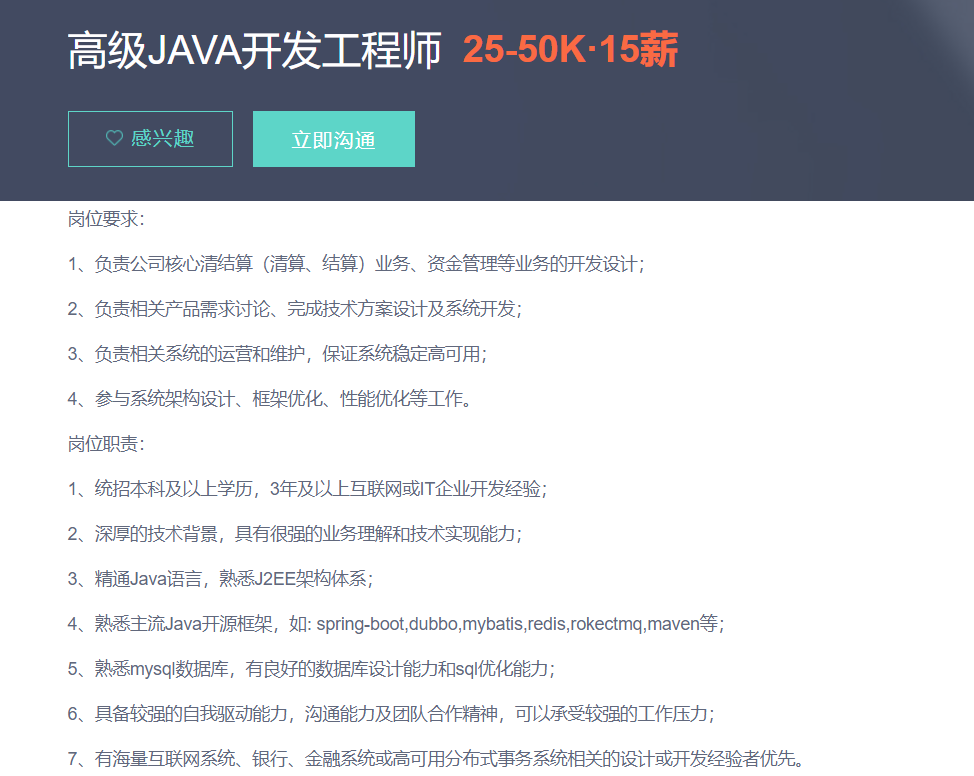
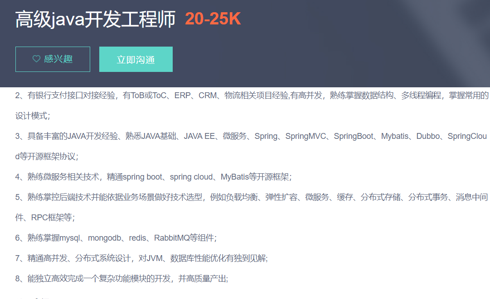
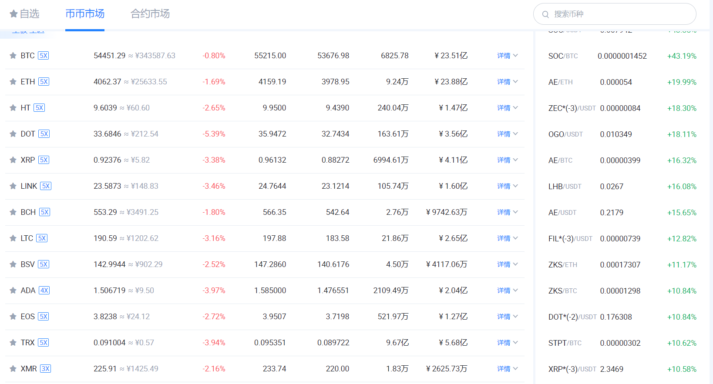

本文讲的内容主要为如下两大块，分别为:

- 学习投资；
- 理财投资。
<!--more-->

## 一、学习投资
学习投资从我作为一名程序员的角度来看，它包含三大块，即技术、业务、管理等。这三大块对于处于不同时期程序员的权重是不一样的。

### 1.技术
技术还可以划分为三大块，即行业通用型技术栈、业务专有型技术栈、其它热门技术栈等。我从我个人的职业生涯经历来说明这些。

#### (1)行业通用型技术栈
行业通用型技术栈，结合我的经历，以Java开发工程师为例，我认为包含如下:

- Spring、SpringMVC、MyBatis、SpringBoot；
- MySQL数据库，能够编写SQL；
- 常用的Linux命令；
- Redis；
- Tomcat；
- Java常用:容器(包含List、Map、Set等)、IO、字符串、异常处理、数组、枚举、注解、控制执行流程、操作符、接口、复用类及方法、泛型等。

上述六点不论是作为Java初级开发工程师或者是Java中级开发工程师均可以通用型应用于任何行业的项目，或者说在任何行业项目中都能找到影子。

#### (2)业务专有型技术栈
所谓业务专有型技术栈，针对不同的业务，采用不同的技术方案，这个技术方案是在行业通用型技术方案的前提下。

例子如下:

a.报表业务，我需要操作Excel相关，对应的技术方案可能是Apache Poi、EasyPoi、EasyExcel等。

b.数据抓取业务，我需要爬取对应的数据，对应的技术方案可能是JSOUP、WebMagic、Crawler4j、Gecco、Spiderman、Heritrix、WebController。

c.提供接口给第三方业务，我需要针对接口进行安全鉴权，对应的技术方案可能是Spring Security、Shiro、Sa-Token等。

d.报告业务，基于模板生成word文档，对应的技术方案可能是Poi-tl、Freemarker等。

e.微信公众号业务，让微信公众号同数据库联动起来，对应的技术方案可能是WxJava、jeewx-boot、基于Http-Client自研等。

f.搜索业务，对应的技术方案可能是Elastic Search、Lucene、Solr、Nutch等。

g.风控业务，对应的技术方案可能是Drools、BRMS、Easy Rules等。

h.内部审批流程业务，对应的技术方案可能是Snaker、OpenwebFlow、JBPM、Activiti、Flowable等。

#### 3.其它热门技术栈
如分布式(SpringCloud、SpringCloud Alibaba、Dubbo)、Zookeeper、Kafka、RabbitMQ、Kubernetes、Service Mesh、Serverless等技术栈。

不论是行业通用型技术栈、业务专有型技术栈还是其它热门技术栈，要学习它们均需要花费一些时间，这些时间就是投资的本金(时间对于大多数人而言是最平等的，无贫富的差距，能否改变现有情况，关键在于是否愿意花时间去投入，付出不一定会有回报，不付出是万万没有回报的)。

### 2.业务
我在[2020年的一些思考和总结](https://youcongtech.com/2020/10/07/2020%E5%B9%B4%E7%9A%84%E4%B8%80%E4%BA%9B%E6%80%9D%E8%80%83%E5%92%8C%E6%80%BB%E7%BB%93/)曾提到一点，**"业务是基础，产品是蓝图，而技术是将蓝图变成现实的手段"。**
以前我的看法是技术人员只需把技术做好就行，但现在看来，这是远远不够的，因为单单埋头搞技术的话，有太多的局限性，当然了，这并不表示技术对于技术人员不重要。

技术实现的前提依赖于对业务的理解是否对(包含需求理解以及在理解需求之后的设计工作)，如果不对，就可能会造成返工，一旦返工，就得加班，我个人很不喜欢加班，我对工作的态度是，**8小时内高效率地完成工作任务和解决工作过程中遇到的问题。**

对于程序员而言，业务的积累主要体现如下两点？

- 第一、平时的兴趣爱好；
- 第二、所处公司的业务性质。

第一点体现程序员用自己的业余时间开发一些相关的业务型的开源项目以及业余时间博览群书。
第二点体现工作导向型，需要什么学什么，公司的业务是银行，促使你学习银行相关的知识；公司的业务是保险，促使你学习保险相关的知识；公司的业务是在线教育，促使你学习在线教育相关的知识。公司的业务决定你所学的业务知识。

业务知识的积累很重要，因为良好的设计依赖于丰富的经验，丰富的经验中包含对业务知识的积累和理解。

以一些招聘网站为例:

这两个招聘岗位的图片足以说明一点，业务积累的重要性。更何况，不少程序员创业都在相关业务领域有一定的积累，例如我曾经待过的教育SaaS公司，该公司CEO、CTO以及技术总监、技术经理、产品总监等创业核心团队，就在在线教育这块有过6年以上的积累(既有业务，也有技术)，正因为他们有积累，最后也成为他们成功的重要因素。

### 3.管理
任何行业都离不开管理二字，在不少人看来，做技术做到一定的年限就得往管理层面上转，例如从高级Java开发到项目经理、从高级Java开发到技术经理、从高级Java开发到技术总监、从高级Java开发到CTO。无论怎么转，都绕不过高级Java开发，高级Java开发也可以叫Leader，即团队组长。团队组长日常的工作主要围绕这么几个方面？

- 第一、参加需求评审会议；
- 第二、阅读产品经理提供的产品需求文档、产品原型并提出相关的疑问，以及做相关的库表设计；
- 第三、针对第二点做相关的任务分配和时间规划并交由项目经理或技术总监等；
- 第四、协助团队小伙伴解决在数据建模、接口开发相关的业务问题和技术问题；
- 第五、跟进团队小伙伴开发的进展情况以及与其它相关部门保持一定的联系(测试部门、运维部门等)。

如何成为一名优秀的管理者也是我至今仍在探索与实践，之前买了一个左耳听风的极客学习课程，里面有篇文章题目引起了我的注意，叫《如何成为一个大家愿意追随的Leader?》

这篇文章核心我归纳为两点:

- 第一点，Boss和Leader的区别有哪些。
- 第二点，一个优秀的Leader所具有的特征有哪些。

#### (1)老板和Leader区别有哪些
- Boss是驱动员工，Leader是指导员工；
- Boss是制造畏惧，Leader是制造热情；
- Boss面对错误喜欢使用人事惩罚的手段，而Leader面对错误喜欢寻找解决问题的技术或管理办法；
- Boss只是知道怎么做，而Leader则是展示怎么做；
- Boss是用人，而Leader是发展人；
- Boss从团队收割成绩，而Leader则是给予团队成绩；
- Boss喜欢命令和控制，而Leader喜欢沟通和协作；
- Boss喜欢说"给我上"，而Leader喜欢说"跟我上"。

#### (2)一个优秀的Leader所具有的特征有哪些
- 帮人解决问题；
- 被人依赖；
- 赢得他人信任；
- 开放的心态+倾向性的价值观；
- 用自己的示例来引领；
- 保持热情和冲劲；
- 能够抓住重点，看透事物的本质；
- 描绘令人激动的方向，提供令人向往的环境；
- 甘当铺路石，为他人创造机会。

最后，你如果问我《如何成为一个大家愿意追随的Leader?》这篇文章对不对呢？我只能说每个人的工作经历是不一样的，结合实际情况，选择适合自己的，采纳并实践。

## 二、理财投资
关于我的理财投资经历，下面的文章均有体现，可供读者朋友借鉴参考，避免重蹈覆辙，文章列表如下:
[基金定投经历](https://mp.weixin.qq.com/s?__biz=MzUxODk0ODQ3Ng==&mid=2247485546&idx=1&sn=c8036893c0e3fddf7250aca8df322478&chksm=f9805b79cef7d26ffdd64d1650227aade538e2dd6c553d079ecb1141002c3d6c0d84343cded0&token=166285557&lang=zh_CN#rd)
[记一次玩比特币的经历](https://mp.weixin.qq.com/s?__biz=MzUxODk0ODQ3Ng==&mid=2247484531&idx=1&sn=22ee12830d4af0c2d7db3156d2f4d582&chksm=f9805760cef7de76bfa1d30f1d9e952478aa3b817004aeedad941550d85f7500ed5f5c3d145d&scene=21#wechat_redirect)
[一次失败的股票投机](https://mp.weixin.qq.com/s?__biz=MzUxODk0ODQ3Ng==&mid=2247485780&idx=1&sn=6de6d8e84a25861a5738dea4409b91f7&chksm=f9805a47cef7d35114161c5ec6c4d853a09d0055e80a6d3a9caa33d596a3d39bc8dc84f37857&token=166285557&lang=zh_CN#rd)
[关于贷款消费](https://mp.weixin.qq.com/s?__biz=MzUxODk0ODQ3Ng==&mid=2247484370&idx=1&sn=1d19c7c5cd4316c5bd242ec0bd358d31&chksm=f98050c1cef7d9d7ee1efe0c4bee3be3ac4fc8111b2b300b4c7e0cc82b56e8135c04290b69d9&scene=21#wechat_redirect)
[推荐阅读《小狗钱钱》](https://mp.weixin.qq.com/s?__biz=MzUxODk0ODQ3Ng==&mid=2247484346&idx=1&sn=63bc3afc1a6cfc00caa22470686f50a7&chksm=f98050a9cef7d9bf7dcd747ee50c217cf51608e63b7bd3084e06a89490bd314e18ee94e78503&scene=21#wechat_redirect)

针对我所经历的，我总结和提炼了如下六点理财投资策略，仅供参考:

- 理性消费，量入为出；
- 不要炒股；
- 不要玩虚拟货币(如比特币等)和虚拟货币中的杠杆；
- 定投基金(股债平衡)；
- 投资学习；
- 稳定的工作；
- 一个好的身体；
- 积极乐观的生活态度。

### 1.理性消费，量入为出
当一个人的收入不断上升的时候，相应的开支也随之往上升。收入往上升，说明了能力不断的提高；开支往上升，说明了生活质量不断的提高。总而言之，这是一件好事。但还是要建立一套良好的消费观，所谓良好的消费观很简单，我归纳为两点:

- 消费在自己的承受范围内，不超前消费；
- 购买自己真正需要的东西。

### 2.不要炒股
我以前没玩过股票，也是从今年玩的，刚开始赚了不少钱，比我在基金上还要赚的更多，但是最终所赚的，都亏出去了，最后还倒赔了一千多。这正好充分地验证了一句话，**"你永远赚不到，超出你认知范围外的钱"。**回忆这些年来的一些经历，的确赚了不少钱，但这些钱都是在我的认知范围内。但超出我认知外的，即便一开始能赚钱，最后都亏出去了。也许会有朋友说，"见好就收，我能控制自己的欲望"。如果你有这样的思想，请看我写的这篇文章[斗地主心得](https://mp.weixin.qq.com/s?__biz=MzUxODk0ODQ3Ng==&mid=2247485492&idx=1&sn=5e6acfc325840ffd5376176a66626448&chksm=f9805b27cef7d23154ad778ce23948d3ce178a4098f2343d988105396bf90146c9a47b01f450&token=166285557&lang=zh_CN#rd)

### 3.不要玩虚拟货币(如比特币等)和虚拟货币中的杠杆
杠杆就不说了，多少人因此一夜暴富，多少人又因此家破人亡。
虚拟货币，具有去中心化的特性，国家政府并不认可这样的方式，而且某些平台暗箱操作性极强(特别是垃圾币，涨的话价格非常高，一旦跌下来，就是一文不值，而某些平台识别用户在最高点抛售的时候，立即显示平台故障，使用户无法卖出，最后垃圾币价格到相对较低点，平台故障已经处理好了，而在此期间平台收割了一波"韭菜")，不少人通过火币网购买如BTC、ETH、HT、DOT、XRP等。下面是火币网的各种币图:

### 4.定投基金(股债平衡为主)
定投基金算起来有三年的经历了，这三年中，货币基金、债劵基金、股票型基金、指数型基金、股债平衡型基金均投资过。货币基金、债劵基金一直稳赚从未亏过。股票型基金和指数型基金相对而言，指数型基金赚的比较多，迄今为止总体上还是在盈利，指数型基金，以中证500和沪深300是我赚的比较多，然后接着就是纳斯达克指数，这些属于宽基指数，行业指数新能源、白酒、军工、银行、消费、医疗、有色金属等盈亏平衡了。股票型基金主要指混合型基金，算起来未曾盈利过。股债平衡型，看起来还是处于盈利状态。至于说为什么定投基金以股债平衡为主，股票型基金和债劵基金各占50%，既能抗通货，也能在一定程度上保持盈亏方面的平衡。不过呢？对于基金定投，我的观念是小步投入以及不要想着基金定投就能实现财务自由。不过呢?换句话说，小步投入，慢慢的积累，说不定若干年后也是一笔不小的储蓄。基金的定投是依赖于可持续的本金，可持续的本金主要指薪资上的收入，这就表示大家还是得做好本职工作提高自己的能力，让可持续的本金变得更多才行。如果没有可持续的本金，那么定投基金也从无从谈起。

### 5.投资学习
投资学习我在前面提到过，我过去曾写过的一些文章也提到过，包含具体的步骤，大家都可以从下面这些文章中找到:
[技术人对赚钱的思考与摸索](https://mp.weixin.qq.com/s?__biz=MzUxODk0ODQ3Ng==&mid=2247485760&idx=1&sn=22a926ff407f8df95462af1d753aafd0&chksm=f9805a53cef7d34579c74c485b129fc9f20439a2e28e56bbf29abcdfb294d9cb02d10c12ec51&token=166285557&lang=zh_CN#rd)
[博客园整改之思考](https://mp.weixin.qq.com/s?__biz=MzUxODk0ODQ3Ng==&mid=2247485648&idx=1&sn=c0beb8420ecb0d91f9afb5257f3d283c&chksm=f9805bc3cef7d2d58f7c6164975b888ed37c8f2fdbd3e82fb3410b5c2d811f7003b10b6ed1b1&token=166285557&lang=zh_CN#rd)
[作为程序员的思考与反省](https://mp.weixin.qq.com/s?__biz=MzUxODk0ODQ3Ng==&mid=2247483865&idx=1&sn=6cb7a630aed5c695a02ff504492dced5&chksm=f98052cacef7dbdcfcde80c3441f4148e076d8ced7a50d7de733c79001286e20bf8dd5694062&token=166285557&lang=zh_CN#rd)
[致所有的开发者们](https://mp.weixin.qq.com/s?__biz=MzUxODk0ODQ3Ng==&mid=2247484213&idx=1&sn=2ee933248ab1f60ebc7fc8647591074e&chksm=f9805026cef7d930fa9ed94f7677ceebc302a745819b4a010fc6cd7eb00d9e44df76b8b29139&token=166285557&lang=zh_CN#rd)
[聊聊有效学习这件事](https://mp.weixin.qq.com/s?__biz=MzUxODk0ODQ3Ng==&mid=2247484400&idx=1&sn=1a3d3d7cab4b47b531c194cf4ca6a2b0&chksm=f98050e3cef7d9f56bef0a71c5c668f60a14285b286d9b98976303ba4df811781e8078d6f9c1&token=166285557&lang=zh_CN#rd)
[每个人都应该拥有自己的知识wiki](https://mp.weixin.qq.com/s?__biz=MzUxODk0ODQ3Ng==&mid=2247484455&idx=1&sn=107965ca72494cea3602463fcd500c84&chksm=f9805734cef7de2260bbc0d45ab0956a325d74bcb9690ddbf8deb6184d202ce10a0230465842&token=166285557&lang=zh_CN#rd)
[35岁程序员](https://mp.weixin.qq.com/s?__biz=MzUxODk0ODQ3Ng==&mid=2247484443&idx=1&sn=15bd2a5bb568e7f140c62186c49030ca&chksm=f9805708cef7de1e752711599224d941c187f4f42bb2a7587848af1f07d38982460875ae999e&token=166285557&lang=zh_CN#rd)
[原则导读](https://mp.weixin.qq.com/s?__biz=MzUxODk0ODQ3Ng==&mid=2247484578&idx=1&sn=0004282a6a5e224e05333b80da887c2f&chksm=f98057b1cef7dea7cd6637f58f74e7a714c02ef8185e432b9fa09c3aa1beb7d39f9996387df7&token=166285557&lang=zh_CN#rd)
[肖申克的救赎之感悟关键词](https://mp.weixin.qq.com/s?__biz=MzUxODk0ODQ3Ng==&mid=2247485776&idx=1&sn=9e60fd8bcd7fba1b31a2be418b6de90e&chksm=f9805a43cef7d3552955bd28fda2147a86e96a96e93bd414d46408c4acf6733eac7372aa5eb1&token=166285557&lang=zh_CN#rd)
[中国工厂系列之思考归纳](https://mp.weixin.qq.com/s?__biz=MzUxODk0ODQ3Ng==&mid=2247485764&idx=1&sn=9522ff16ecca6067d9d794ee01df565d&chksm=f9805a57cef7d341bc1427d515e8da1bce23cf8acaaf58c49bc6f3cd473c1c58c62133f21ff2&token=166285557&lang=zh_CN#rd)
[从单体架构到分布式微服务架构的思考](https://mp.weixin.qq.com/s?__biz=MzUxODk0ODQ3Ng==&mid=2247485665&idx=1&sn=cc5ed01f671790ed9b3ac92a2f5c0aef&chksm=f9805bf2cef7d2e4ed5ebda401c4e9dda708125ff6c0a77d77fe1a155666851e7e1ba0c3130c&token=166285557&lang=zh_CN#rd)
[老J的技术分享之总结](https://mp.weixin.qq.com/s?__biz=MzUxODk0ODQ3Ng==&mid=2247485677&idx=1&sn=bac717c02acf0cd8498762cd841edc91&chksm=f9805bfecef7d2e889ac626361b185f5c42e5e03860ef1b08850fa983805e9709f2f8e45dc3c&token=166285557&lang=zh_CN#rd)
[数据库设计之思考](https://mp.weixin.qq.com/s?__biz=MzUxODk0ODQ3Ng==&mid=2247485765&idx=1&sn=ddd624cccb79442d6cbadab2aae80f98&chksm=f9805a56cef7d340d8cee15f345cfe2dac8cc1f6d50f2c8a233be5dc24cf755ab391f3d42cdd&token=166285557&lang=zh_CN#rd)
[2020年的一些思考和总结](https://youcongtech.com/2020/10/07/2020%E5%B9%B4%E7%9A%84%E4%B8%80%E4%BA%9B%E6%80%9D%E8%80%83%E5%92%8C%E6%80%BB%E7%BB%93/)

### 6.稳定的工作
这个世界上任何事情无绝对，因为变化，使得很多东西变得相对起来。
**稳定的工作指代是无论男人还是女人一定要有属于自己的事业，事业和工作的区别可以有，也可以没有，有和没有在于观念上。**工作可以是为了碎银几两不得而为之的当一天和尚撞一天钟，工作也可以是促使自己变得更有价值的一种方式，关键在于思想观念上。从我个人的观念来看，工作是事业的一种表现形式，我需要工作为我保障基本的衣食住行，这是物质基础，同样我也需要依托于公司这个大平台来为我本人镀金(一是背景；二是能力的提升，不断的遇到问题，不断的解决问题，我就会变强，当一个人变强的时候，就能创造更多的价值)，这是发展基础。最终的结果于我于公司只有一个，那就是双赢。当然了，实际中并不会那么的美好，不然也就不会出现中年危机、内卷之类的。

### 7.一个好的身体
人的身体从生态学的角度来说，可以是一个生态系统。**生态系统之所以能维持相对稳定，在于生态系统具有自我调节能力。**生态系统的稳定性主要体现在抵抗力稳定性和恢复力稳定性。
抵抗力稳定性是指:**生态系统抵抗外界干扰并使自身的结构与功能保持原状(不受损害)的能力。**
恢复力稳定性是指:**生态系统在受到外界干扰因素的破坏后恢复到原状的能力。**

把人的身体看成一个生态系统，人身体的任一部分出了问题，如果放任之不管的话，最终将会使整体受损，就好比肠胃的问题如果不重视的话，最终可能演变为肠胃癌。

那么如何增加抵抗力稳定性和恢复力稳定性呢？方法如下:

- 锻炼身体，增强免疫力(2018年和2019年我每周坚持跑步五公里到10公里，那两年里，虽然也时常熬夜，时不时感冒，也能快速自愈)；
- 散步(对于天天坐办公室工作的群体来说，散步是有利于身体健康的，不经常散步走动的任和经常散步走动的人，还是有区别的)。

有人说，最好的方式就是作息规律。但这对于如今而言，很难。

### 8.积极乐观的生活态度
积极乐观对于一个人的重要性是不言而喻，积极乐观的生活态度，于我而言，时难时易。但是，马拉松的人生，没有这两个，是很难走下去的，人的痛苦，既有来自于外部，也有来自于内部，有些时候单单外部的痛苦就能把人彻底给压倒。如何培养积极乐观的态度成为每个人都想知道的。我目前所能想到的就是通过阅读、写作、运动、社交等相关的来培养自己积极乐观的生活态度，其中阅读和写作是我最主要的方式，也是这些年来我能够自我调节的一种有效方式。

