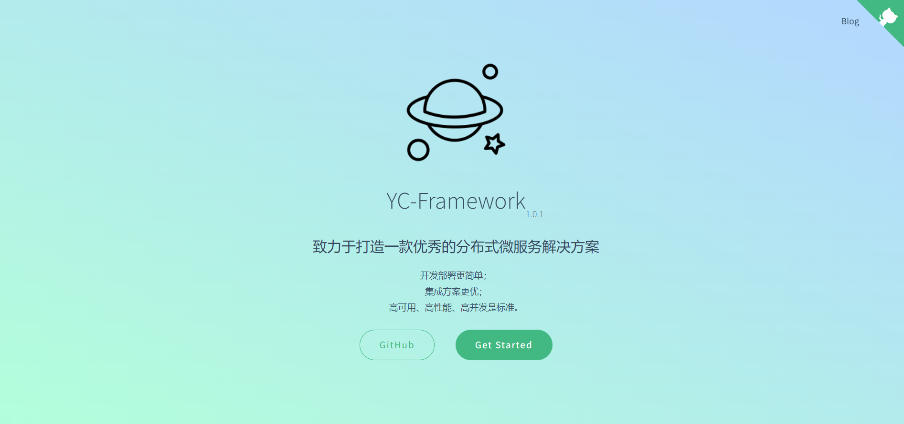
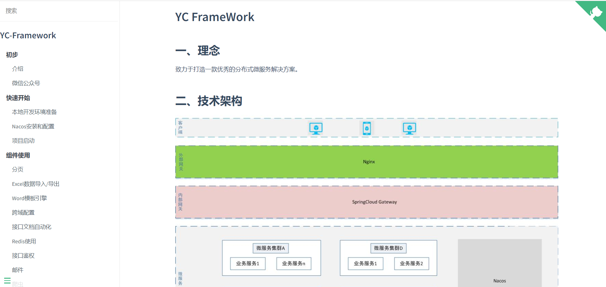
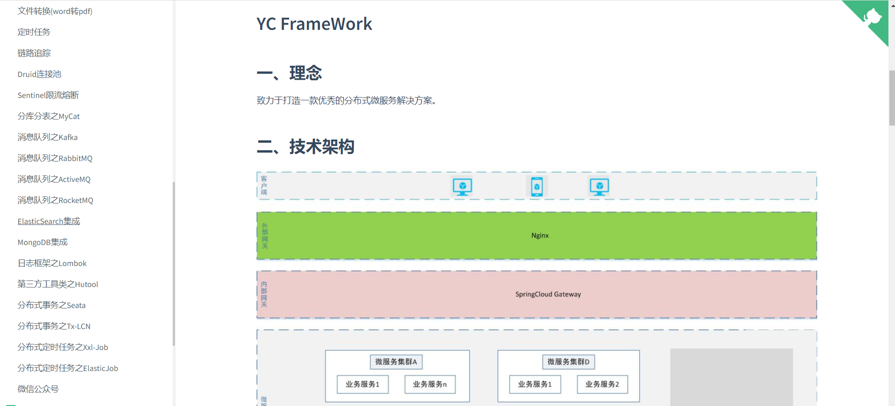

YC-Framework官方文档:
http://framework.youcongtech.com/

YC-Framework源代码:
https://github.com/developers-youcong/yc-framework.git

YC-Framework问题反馈:
https://github.com/developers-youcong/yc-framework/issues
<!--more-->

## 一、YC-Framework的由来是什么?
我很早以前就想写一个框架了，但不确定写什么好，直到近几年分布式微服务的实践，使我想着写一个最佳通用型分布式微服务解决方案(也可以叫框架)。关于框架的命名，我想了很多，最终以YC定下来了，YC一词最早的灵感来源于《黑客与画家》这本书,同样也是我本人姓名的简写。

## 二、YC-Framework致力于解决什么样的问题？
YC-Framework官方文档中就声明了如下:

表示解决的问题是:

- 让开发分布式微服务应用更简单；
- 让部署分布式微服务应用更简单；
- 集成众多的行业领域解决方案；
- 微服务如何简单的实现高可用、高性能、高并发。

## 三、YC-Framework适用于什么样的群体？
主要针对Java开发群体。

Java开发群体的要求如下:

- 熟悉Java语言，有相关的Java开发经验；
- 了解分布式微服务，有使用过SpringBoot+SpringCloud；
- 掌握Linux常用知识，懂得软件安装和配置；
- 懂得搜索和提问。

## 四、YC-Framework的学习成本是怎样的？
学习成本不高，有使用Java编程语言开发的经验即可。

## 五、YC-Framework如何实现技术兼容性？
不会过于追求高版本，适合才是最重要的。

## 六、YC-Framework的文档内容主体有哪些？
文档内容主体有五大部分:

- 初步；
- 快速开始；
- 组件使用；
- 测试；
- 部署。

部分相关图如下:

## 七、YC-Framework使用过程中出现了问题怎么办？
任何的框架都不可能不会有问题，欢迎大家前往[Github代码仓库-Issue提问](https://github.com/developers-youcong/yc-framework/issues)

针对任何的提问，我本人将在业余时间进行处理。

关于如何提问，准备提问前，建议阅读一下:
http://tieba.github.io/common/howtoask.html

## 八、YC-Framework如果不活跃的怎么办？
只要你具备SpringBoot、Spring、SpringCloud相关的开发经验和善于搜索、热爱学习就能自行改造和维护。一定程度上说明，只要具备相应的开发经验，改造起来，并不难(懂一定的原理+实际的经验+热爱学习，肯定是没问题的)。

## 九、YC-Framework的商业模式是怎样的？
目前暂不考虑如何实现盈利。

## 十、YC-Framework的开发者有哪些？
目前开发者就我一个人，也许将来会有更多志同道合的小伙伴加入。
