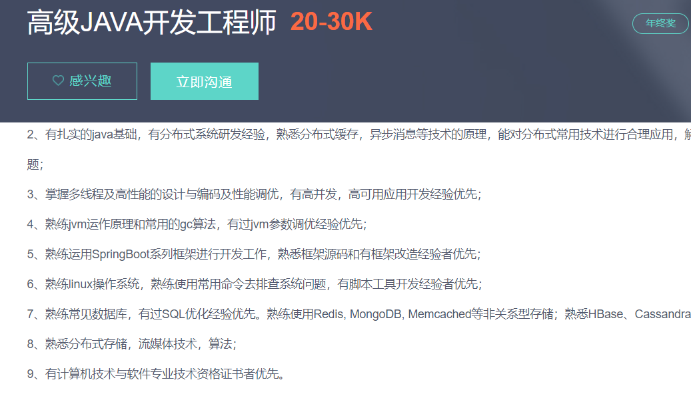

我曾在多篇文章中强调过“终身学习观”的这个理念，在确定这个理念的前提下，如何具体落实就显得至关重要。这个世界上“口嗨”是最容易的，最难的就是“实事求是”。“实事求是”是什么意思？引用毛概的话：
> 毛泽东思想，有三个基本面，分别为实事求是、群众路线、独立自主（这些至今仍有重要借鉴意义），“实事求是”是毛泽东思想的精髓，而其中的”实事求是“的具体含义就是一切从客观实际出发，理论联系实际，坚持在实践中检验真理和发展真理。毛泽东指出：“‘实事’就是客观存在着的一切事物，‘是’就是客观事物的内部联系，即规律性，‘求’就是我们去研究。”

下面来具体介绍我职业生涯中一些常用的方法论，主要为如下：
<!--more-->

- 1.简单学习法。
- 2.岗位招聘学习法。
- 3.工作学习法。
- 4.自我刻意练习学习法。
- 5.分享学习法。
- 6.复盘学习法。

## 一、简单学习法

所谓简单学习法最主要的特点就简单且易落地。

简单学习法的表现形式如下所示：

- 1.编写一个“Hello World"的示例运行起来；
- 2.将编程语言或框架的所有示例跑起来。

简单学习法的应用场景如下所示：

- 1.学习新的一门编程语言，掌握一些基本的语法；
- 2.学习编程语言中所包含的应用技术框架，掌握一些简单应用范式。

简单学习法有一个大的前提就是，动手写，拒绝复制黏贴。

也许有朋友觉得有现成的IDE，复制黏贴不挺好的，何必做这样的简单重复性劳动呢？

在我看来，这样的简单重复是有必要的，特别是对你尚不熟悉的编程语言或技术框架而言。动手写和复制黏贴完全是不一样的，动手写往往会加深你的印象，起到练习的作用，而复制黏贴并不能体现，大家可以回顾自己的编程语言或计算机课程的学习生涯很容易就明白这个道理。包括为了进大厂刷一些LeetCode算法题，关于那些算法题，网上都有各种各样的解答，但你可以借鉴不能完全抄袭，借鉴的前提就是自己要真正地去动手写去感受。**如果全靠记忆力去记题目的答案，在我看来是没有意义的，因为这样只是单单得其表象，而根本没有理解实质。*编程的本质是为了解决问题，解决问题的前提是要明确真正的问题，通过不断试验和提问找到真正的问题，再找到真正的问题之后，结合具体的方案去解决它，具体的方案通常是有步骤的，而这些步骤具有逻辑性，由此我们看，编程本质的特点即逻辑性。**

## 二、岗位招聘学习法
岗位招聘学习法，顾名思义，就是面向对应的岗位要求进行针对性学习。

以下图某高级Java研发工程师为例：

基于该岗位要求，有一些我们不太熟悉的技术栈可以提前了解学习。
例如熟悉jvm运作原理以及常用的GC算法、熟练使用SpringBoot框架进行开发、熟悉Linux操作系统、SQL常用的优化操作、Redis、MongoDB、Memcache等都是可以通过花一些时间学习并掌握的，从而不管你是在职或者跳槽，这样做，都能使你更具有竞争力。特别是针对一些朋友不知道学习什么好，这时给自己定一个目标，例如你是中级开发工程师，你的目标可以是高级开发工程师，从网上找一找相关的岗位要求然后进行针对性学习。这种岗位学习法的应用场景通常有这么几个？

- 第一、有助于促进你的职业生涯发展，你不知道你的目标是什么，你可以自己去寻找目标。
- 第二、在职如果太安逸，通过岗位招聘学习法，促使自己把时间利用起来，用于提高自己。
- 第三、如果不满足于现有公司的待遇，打算跳槽，可通过岗位招聘学习法找到意向公司进行刻意学习，从而增加面试成功的把握。

## 三、工作学习法
工作学习法，非常简单易懂，意思是从工作中学习。从工作中学习这一点，很多人都并不陌生。我曾写过一篇文章叫做[论员工与公司关系](https://youcongtech.com/2022/03/06/%E8%AE%BA%E5%91%98%E5%B7%A5%E4%B8%8E%E5%85%AC%E5%8F%B8%E5%85%B3%E7%B3%BB/)里面提到了一点，公司能够为我做什么，我列举了如下几点：

- 1.提供平台；
- 2.实践机会；
- 3.历练场所；
- 4.经济基础；
- 5.合作习惯。

而工作学习法充分地体现了上面五点。工作学习法对于我最初的两到三年帮助非常大，特别是我来北京以后，能力上得到很大的提升，技术视野的广度以及动手能力的提高等。工作学习法的可持续性与公司平台发展有很大关系，当公司平台规模扩大时，架构通常就需要适配公司平台业务的扩展，这时很多应用场景就来了，而解决这些应用场景的问题，通常能够使你的能力提高很多。而这些能力往往很值钱。

但工作学习法也有一定的局限性，那就是受公司本身业务发展的制约，发展得不好，很多场景都没有，这就需要你自己能够模拟创造这样的场景，后面会提到如何模拟创造场景。

**补充说明一点：**
工作学习法还有一个注意事项，那就是需要刻意去记录一些报错，有些时候面对一些报错，我们凭经验以及搜索引擎去解决，问题得到了解决，然后就不去深究了，接着，下一次还是一样的问题，仍然重复经验论和搜索引擎这样的套路。这样是不行的，要知道，每一次错误，都是一次成长的机会，这样的错误既有程序上，也有业务上，它们的价值都很大，千万不要忽略。

## 四、自我刻意练习学习法
我在[2020年的一些思考和总结](https://youcongtech.com/2020/10/07/2020%E5%B9%B4%E7%9A%84%E4%B8%80%E4%BA%9B%E6%80%9D%E8%80%83%E5%92%8C%E6%80%BB%E7%BB%93/)这篇文章中的我对学习的思考提到过“刻意练习过于简单”。面对职业生涯乃至人生这个维度，要想不断超越现有的自己，使自己变得强大，就得增加刻意练习的难度，换言之，以玩游戏为例，简单关卡谁都能通过，但难得关卡则需要很高的技术和技巧，这就很好地体现了初级游戏者、中级游戏者、高级游戏者他们之间的区别。对应到软件开发，初级开发者、中级开发者、高级开发者他们之间的区别很大，初级开发者做一些简单的工作，中级开发者通常能独立负责一个模块的开发和设计，高级开发者除了具备中级开发者的能力之外，还具有良好的沟通能力与团队协作能力，换言之高级开发者不仅仅能力独立负责某个模块的设计和开发，同时还具备管理的能力。
同时，自我刻意练习学习法还有一个重要的目的，那就是**脱离舒适圈**，关于舒适圈的危害我就不多说了。通常脱离舒适圈能够使自己不断成长，因为你不会满足于现有的一些成就，也不会因为现在的成就而骄傲自满。

**以前面的岗位招聘学习法为例，如果你没有分布式系统研发经验该怎么办？**

- 1.阅读分布式系统相关书籍，确保对此有一个大致的了解；
- 2.找到相应的分布式开源项目，将其跑起来；
- 3.尝试在对应的分布式开源项目的基础上，增加新的功能；
- 4.将其部署到服务器上；
- 5.上述四步每一步都必须要有产出，没有产出就没有有意义。

**有人担心运行分布式开源项目的服务器通常配置比较高？**
在我看来，不必担心，有很多办法解决。
例如，你不想花钱可以自己安装Vmware并在此基础上安装对应的Linux操作系统。
例如，你觉得自己安装Vmware搭建太麻烦，可以通过上云服务器，云服务器有按月续费、按年续费、按小时续费，你可以结合自己的需求进行购买。

**记住一点，学习上的花费都是有意义有价值的。这是我五年职业生涯中的深刻感受之一。**

**有朋友担心万一没效果怎么办？**
在我看来，一定会有效果，前提是你一定要执行。

- 1.阅读分布式系统相关书籍，你一定要记录笔记，可以通过Hexo自建自己的博客系统进行记录，也可以通过现有的有道云笔记、语雀、飞书、石墨笔记等工具进行记录。这是衡量你产出的关键指标。
- 2.找到相应的分布式开源项目，将其跑起来。通过在Github上找对应的分布式开源项目，然后将其运行起来，运行起来的过程中，你需要仔细阅读开源项目的文档，同样你需要解决分布式开源项目在你本机跑起来可能出现的问题，你需要将问题的解决过程记录下来，最终的衡量指标有两个，第一个是记录项目跑起来的过程中你解决了那些问题以及问题的原因是什么，第二个是项目运行起来，能够在里面操作相应的功能，完成对应的业务流程。
- 3.尝试在该分布式开源项目中增加新的功能，考验你是否真正读了文档以及在2的流程中你有没有认真去解决问题记录问题以及正常运行以后你有没有体验该系统的完整流程，只有你做到了2中，增加新的功能对于你并不难，而且在增加新功能的过程中，你还有可能会遇到问题，不怕遇到问题，就怕不出现任何问题，因为遇到问题并解决问题就是一次成长的机会。最终的衡量指标还是两个，第一个记录问题是如何解决的，第二个就是在该系统中能够看到你所增加的新功能并能实际操作。
- 4.将其部署到服务器上，你需要具备一些常用的Linux基础知识以及掌握一些常用的命令，如果不具备没关系，你可以学习，这些东西都是可以通过前面提到的简单学习法就能掌握的。在部署服务器的过程中，首先要把运行环境搭建好，然后就是一些数据库表的初始化，然后就是在本地配置好相应的配置信息，然后打包将其部署到服务器上面去。这个过程一定会遇到问题的。最终的衡量指标就是，通过浏览器输入对应的IP地址或域名就能操作该开源项目（记住，不是开源项目的演示地址，而是你自己改造开源项目以后自己搭建服务器部署以后的地址）

当你完完整整地执行了上面四步，你基本上就具备了开发分布式系统的能力。然后为了进一步提高，你可以随时提高刻意练习的难度。就好比玩游戏打怪，一关比一关难，但闯过以后，你一次比一次厉害。当然了，我个人不建议过于沉迷于游戏，但游戏中的一些好的理念是可以促进我们自身能力的提高。

## 五、分享学习法
我的导师Z大师常说，当你把自己所学的知识或技能分享给他人，他人能够听懂，就说明你真正搞懂了。

后来读了一些书，了解了一种学习法叫费曼学习法，费曼学习法的主要内容有如下：

- 1.选择你想要学习的知识或技能；
- 2.教给他人；
- 3.教的过程中卡壳了，回过头继续学习，直到让他人真正地明白。

分享学习法是一种进阶学习法，它区别于简单学习法和刻意练习学习法以及工作学习法与岗位招聘学习法。前四种学习法主要针对自己，而这一种学习法既有针对自己，也有针对他人。针对自己是因为自己是学习的主题，针对他人是因为需要借助他人来试验自己是否真正搞懂。

而在分享的过程中，如果是专业人群还好，如果是非专业人群你需要将其简化为通俗易懂，而简化整理为通俗易懂的过程中，你需要花费大量的精力去思考去实践，而这个过程会促使你自己不断地阅读以及不断地向他人请教，正所谓“术业有专攻是也”，每个人的擅长领域不一样，需要“不耻下问”，拒绝“不懂装懂”。作为分享者而言，分享知识的过程中，既是检验你有没有真正地搞懂，同样也考验你知识的分析、简化、整理等能力。

其实做开源项目也是一种分享学习法，开源项目的贡献者相当于分享者，开源项目的使用者相当于听众。开源项目使用过程中有任何问题，使用者通过issues的形式进行反馈，开源项目的贡献者则跟进使用者的反馈进行优化和完善，优化和完善的过程贡献者也不断成长着。

## 六、复盘学习法
复盘这个概念从2020年就知道了，但操作的频率不太高。今年读了一本书叫《复盘》，作者是虚舟。这本书再次深化了我对复盘的理解以及复盘的具体操作方法。

引用该书的一些话：
> 1.个人复盘的通用套路是“复盘三角”，包括三个步骤：记录、反思、提炼。
> 2.复盘和反思，本质上来说，就是一种自我审视和自我观察。
> 3.复盘相当于一个观察者，它不断的从这个推进流程中跳出来，看每一步是否存在问题，并及时进行反馈和调整。
> 4.反观、反思、反省者三个层次，构成一个好复盘的三个标准，一个好的复盘必须做到能反观、会反思、有反省。
> 5.经验+反思，是最重要的知识。
> 6.复盘是向过去学习、向生活学习，从过去的经验教训当中获取生活的智慧。
> 7.复盘六字诀：慢、写、真、问、离、行。
> 8.任何不以改善行动为目的的复盘都是伪复盘。

由此，我们可得出复盘的目的以及意义是什么。核心一句话：**一句话来概括，避免“秦人不暇自哀，而后人哀之；后人哀之而不鉴之，亦使后人而复哀后人也”的场景再度发生，吸取历史经验教训，指导当下生产经营发展。**

之前我写过一些复盘，文章如下：
[数据库被删之反思](https://youcongtech.com/2021/05/22/%E6%95%B0%E6%8D%AE%E5%BA%93%E8%A2%AB%E5%88%A0%E4%B9%8B%E5%8F%8D%E6%80%9D/)
[一次失败的股票投机](https://youcongtech.com/2021/07/18/%E4%B8%80%E6%AC%A1%E5%A4%B1%E8%B4%A5%E7%9A%84%E8%82%A1%E7%A5%A8%E6%8A%95%E6%9C%BA/)
[基于报告之复盘](https://youcongtech.com/2021/12/07/%E5%9F%BA%E4%BA%8E%E6%8A%A5%E5%91%8A%E4%B9%8B%E5%A4%8D%E7%9B%98/)
[Gateway Timeout 504问题复盘](https://youcongtech.com/2022/01/01/Gateway-Timeout-504%E9%97%AE%E9%A2%98%E5%A4%8D%E7%9B%98/)
[Linux设备上没有空间之复盘](https://youcongtech.com/2021/01/04/Linux%E8%AE%BE%E5%A4%87%E4%B8%8A%E6%B2%A1%E6%9C%89%E7%A9%BA%E9%97%B4%E4%B9%8B%E5%A4%8D%E7%9B%98/)
[ssh问题之复盘](https://youcongtech.com/2021/01/05/ssh%E9%97%AE%E9%A2%98%E4%B9%8B%E5%A4%8D%E7%9B%98/)

虽然这些复盘写的不那么好，但我觉得复盘可以分两方面：

- 第一、对内；
- 第二、对外。

对内，主要偏于对自己的解剖，这些解剖，没必要对外，可以自己私有不必公开。
对外，适用于技术与一些管理层面，包含对自己的可公开反思，也包含对整个流程以及宏观与微观层面的一些不足等。

就目前而言，我觉得比较通用的复盘策略三部曲就是：**回顾、反思、提炼。**这三部曲我个人觉得也最简单也最易落地。

**也许会有朋友疑问，复盘的频率应该是怎样的呢？**
我个人认为分情况来看：

如果是问题复盘，在发生这个问题并解决这个问题，找个时间马上做复盘。例如第一天发生这个问题解决了，如果当天自己的精神状态还可以的话，建议当天就做。

如果是你觉得很长时间没有成长，你可以基于自己的情况做日复盘、周复盘、月复盘甚至季复盘、年度复盘等。无论是日复盘、周复盘、月复盘还是季复盘、年度复盘等，均适用于上面的三部曲。但不同的是数据维度不一样。周复盘的数据来源是日复盘，月复盘的数据来源是周复盘，季复盘的数据来源是月复盘，年度复盘的数据来源是季复盘或月复盘。

## 七、总结
今天主要介绍的六种学习方法论，希望能够对诸位读者朋友有帮助。这六种方法论均可共存以及组成不同的搭配，**目的只有一个，那就是促使自己的能力不断提高，促使终身学习观更好的落地。**