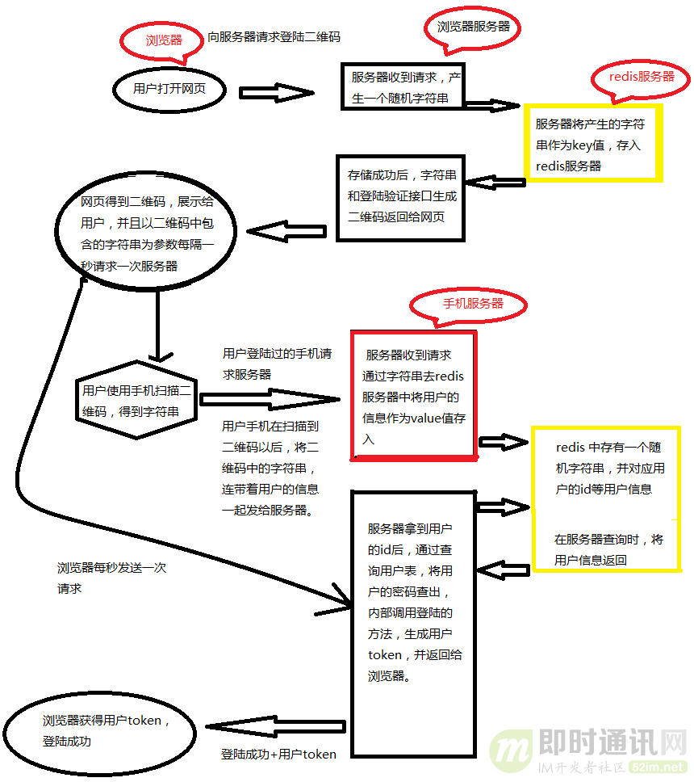
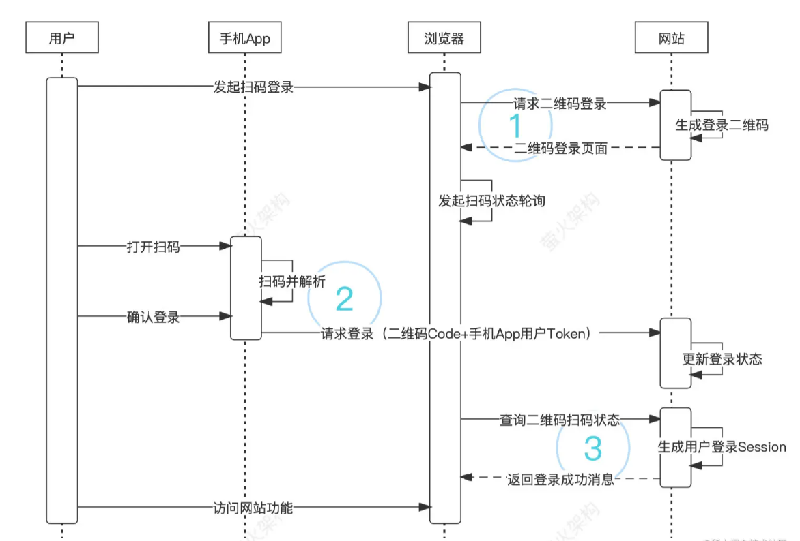
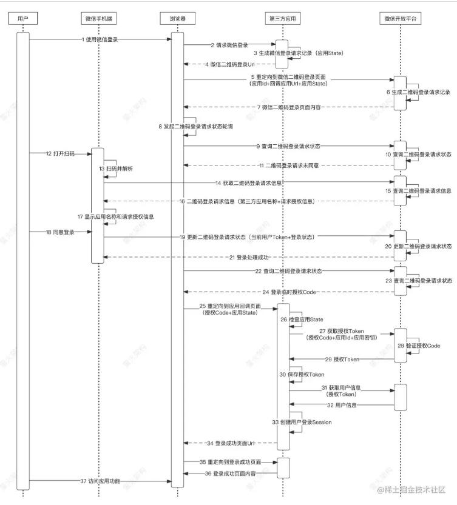

## 一、扫码登录的原理和流程是什么？
<!--more-->
● (1)用户点击PC端扫码登录按钮。
● (2)网站自动生成二维码。
● (3)浏览器每隔一段时间(暂定5分钟)调用一次获取最新二维码(前端)。
● (4)用户使用App扫描二维码。
● (5)App提取并解析二维码中的信息并显示登录确认界面。
● (6)用户在App中的弹出登录确认界面中点击确认按钮。
● (7)解析出来的二维码信息与App携带Token绑定。
● (8)PC端不断轮询请求扫码登录授权接口，查询二维码解析信息是否与App携带的Token绑定成功。
● (9)如果查询绑定成功，扫码登录授权接口中的响应数据会有标记。
● (10)PC端拿到对应的响应数据作为参数去请求统一授权接口。
● (11)统一授权接口验证合法通过后，自动跳转至PC端系统界面。

一共11步，需要前端开发者、后端开发者、App开发者密切配合，由后端开发者主导，前端开发者与App开发者辅助。

这个流程主要参考了以下文章，并结合一些实际情况做了一些调整：
[扫码登录功能如何实现？一文搞懂主流的扫码登录技术原理](https://www.cnblogs.com/huanshilang/p/12365376.html)

[一图搞懂扫码登录的技术原理](https://juejin.cn/post/7056544865647067172)

相关的流程图如下:

不同的流程，分工不一样，架构师需结合实际情况设计和分工！！！

## 二、扫码登录需要注意哪些问题？
- 1.数据交互安全性问题。
- 2.扫码登录失效问题。
- 3.数据交互能否正常绑定问题。

**那么疑问来了，这些问题该如何解决呢？**

### 1.针对数据交互安全性问题
二维码中的数据必须是要加密的，而加密的数据，App端与服务端约定好加解密算法，服务端返回给PC端是加密的，PC端无法解析出来，App端通过密钥可以解析出来，这是一点。但为了尽可能提高安全系数，内部必须有一套针对扫码登录的鉴权机制配合使用，否则很容易造成安全隐患。这里的数据交互安全性问题，很好解决，就是双方约定好加密算法和特定数据解密密钥，密钥定期更换，与系统鉴权配套。

### 2.扫码登录失效问题
由于二维码的时间是有限制的，以五分钟为例，如果五分钟内不扫描对应二维码的话，二维码就会自动失效，这时PC端将会重新请求服务端刷新二维码(获取新的二维码)，从某种程度上也是为了保障安全性。针对这样的问题，在App扫码过程中应当有一个提示，如果当前二维码超过时效期的话，提示，已扫描的二维码已失效，请重新扫码(最常见的微信PC端扫码登录就是这样做的)。

### 3.数据交互能否正常绑定问题
扫码登录最大的问题之一就是最后流程走完了，结果发现登录不了。为什么登录不了，有人疑问，我流程走完了，没问题，但为什么最后不动呢？通常来说问题的原因是绑定失败，绑定失败涉及到数据存储，这时可以通过看系统日志以及中间件日志的方式排查一下数据存储是否有问题。
