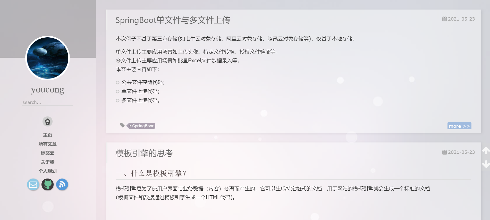
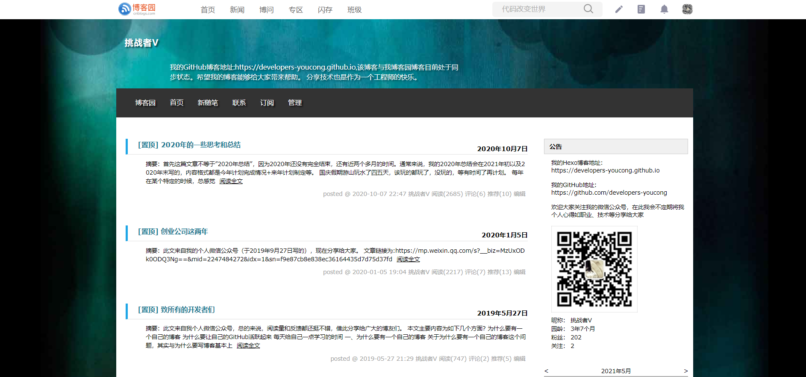
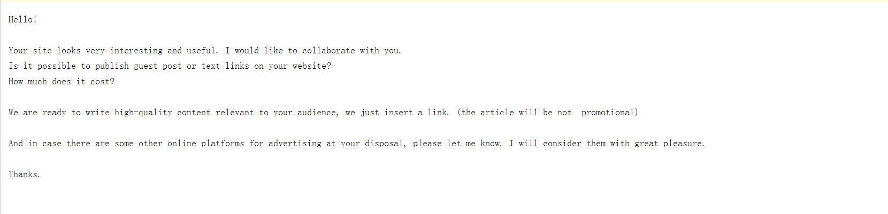
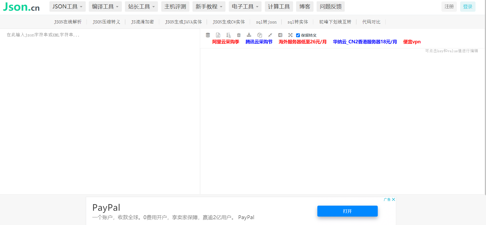
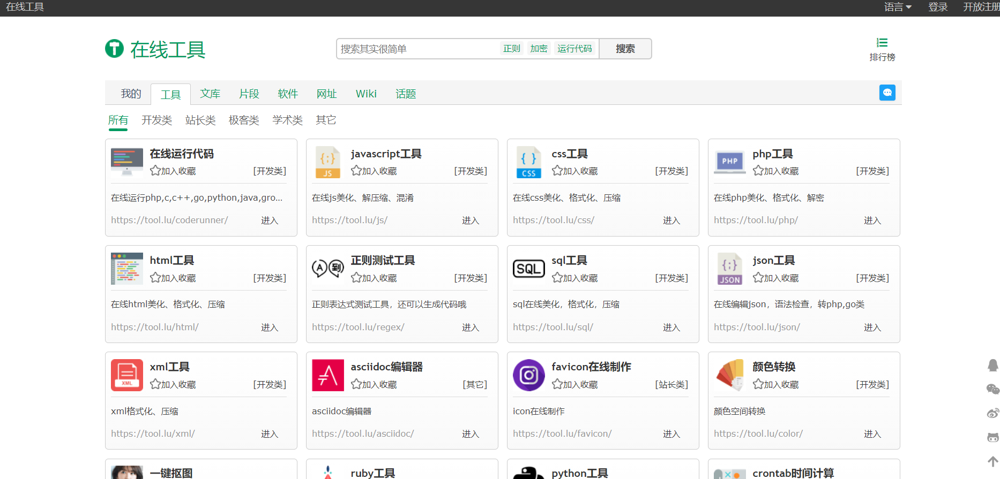
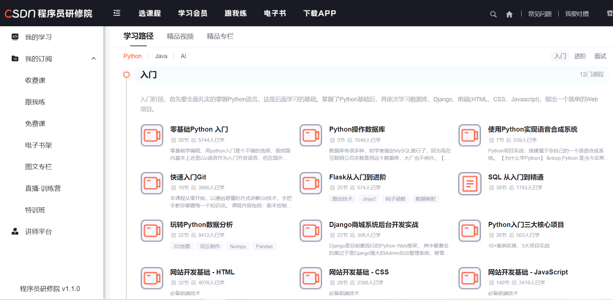
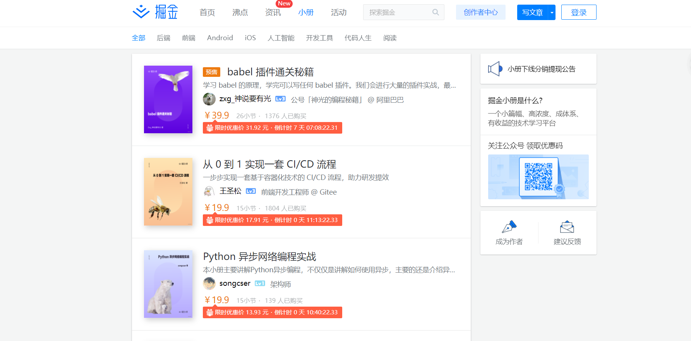
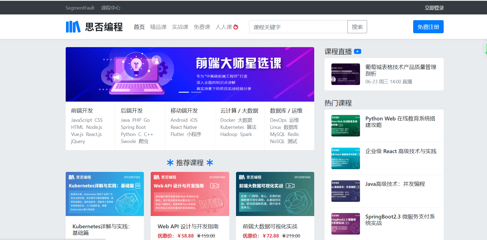
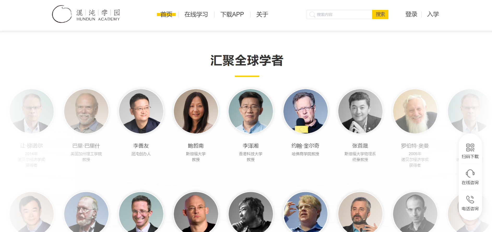

从2018年6月到目前为止，我一直在为一个目标而前进，即如何让自己的未来发展更好顺带着赚更多的钱。为此我做了很多尝试，有过成功，也有过失败，于是便有了这篇文章《技术人对赚钱的思考与摸索》。
**本文主要内容为如下:**
- 自媒体；
- 网站；
- 外包接私活；
- 在线课程；
- 开源项目；
- 网店；
- 写作；
- 投资理财；
- 升职加薪；
- 创业。

<!--more-->

## 一、自媒体
自媒体主要体现是公众号，我于2018年8月底开通公众号(公众号换了两个名字，开始叫ChallengerTech，后来叫youcongtech)。截至目前为止，公众号的粉丝已经有一千多粉丝。中间因为一些意外断断续续出现停更，不过好在它为我也创了不少收入，收入类别为广告、付费文章、读者打赏等，收入每月在100到300这个区间范围内(如果每月文章写的多的话，会超过这个区间范围的最大值)，这笔收入的主要应用范围交通、话费、基金定投、小礼物、一顿丰盛实惠的大餐等。
公众号运营时间算起来有两年零九个月(以2018年8月底开通时间来说)，做到目前的情况，说不上多么成功，更谈不上失败，但教训还是有的。**教训总结如下:**
- **(1)文章排版**(早期排版太过难看)；
- **(2)轻视推广**(不重视其他平台引流和推广手段)；
- **(3)时不时断更**(断更频率高)；
- **(4)没有明确的专注点**(换言之定位是什么，写的太杂，有时搬运他人文章时也搬运的太杂等)。
前两者即(1)和(2)造成粉丝原始积累有限，后两者(3)和(4)造成用户留存率低，四者结合就是我公众号运营了两年多仍然仅仅只有一千多粉丝的重要原因。

2019年的时候，所在创业公司主要方向转向教育，做编程教育相关，在这期间接触了VsCode这个开源项目以及VsCode中文社区的开创者韩骏(当初关于VsCode的二次开发以及插件开发向其请教了不少问题，基本上都得到了答案或是解决问题的思路等)。
韩骏的微信公众号主要为两个，一个是玩转VsCode，另一个是HJ说。他的公众号运营到现在已经有两年零五个月了，从现在看来，他运营成功的原因，**我归纳为如下:**
- (1)**明确定位**(技术相关如VsCode、编程开发等)；
- (2)**重视早期推广**(知乎引流、微信群推广等，他本人在知乎上回答问题很积极)；
- (3)**个人影响力**(很多有名的头衔如微软亚太科技有限公司-软件工程师、一个应用比较广的VsCode插件开源作者、VsCode中文社区的开创者等)；
- (4)**断更频率低**(与我的公众号相比，他的公众号更新很频繁，到了一定的粉丝量，逐渐开始互推以及接一些商业广告等)。

## 二、网站
在个人网站上我主要尝试的方向主要是个人博客，就目前看来个人博客做的还是相对不错。我的两个主流博客分别为如下:
一个是博客园(平台性质):
https://www.cnblogs.com/youcong/
另一个是GitHub Hexo(自建性质):
https://youcongtech.com/

效果图分别为如下:

关于个人博客的好处，我在这篇文章[致所有的开发者们](https://www.cnblogs.com/youcong/p/10933433.html)已较为详细地阐述了，不再赘述。

个人网站以博客性质为例，虽然目前未给我带来金钱上的直接收益，但是它的价值远非金钱所能衡量，这是我个人对于博客网站思考与探索。
最近登录了我的另外一个邮箱，有不少国外的广告商看了我的博客，想要在我的博客挂广告，邮箱内容如图所示(这是其中之一):

除了博客之外我还探索了一条路线，偏工具性质，类似于这些:

工具性质的网站，普遍以广告收入为主(类似一些非付费视频内容网站，收入主要为广告，我一同学的朋友公司就是属于这种性质)。
工具性质网站我目前做的和json.cn网站很相似，我当初做这个的出发点主要是担心在这些网站上黏贴json数据并格式化(数据可能被网站存储，有泄密的隐患)，其次是为了研究这些功能实现过程和提高自己技术能力(借此机会深度研究一些第三方库或Java本身的实现机制)，最后就是为了通过广告来创造"睡后收入"。

## 三、外包接私活
我职业生涯中的第一家公司主要盈利来源就是外包，销售负责在各个外包平台找客户，公司盈利相对可观。
我前教育SaaS公司身边一个做前端的同事，她姐夫和姐姐平时业余时间(周末或下班以后)就去外包私活网站上看看有什么单可接，但因为并非开公司，有的比较大的私活接不了需要有公司外壳(公司与公司之间的合同签订与公司对公账号打款)。
去年有三个月处于自由职业者状态(为了确保社保不断，社保挂在其它公司)，那三个月探索了很多，其中就有通过外包接私活，去不了不少外包接私活网站看了看，也参与不少竞标，最终联系我的寥寥无几，外包接私活持续了半个月，不见任何起色，可能是我过往项目经历写的不够详细还是技术栈方面单一的缘故(主要偏Java)，不过通过这半个月的经历也认识到了我的技术沉淀还不够，还需要不断磨练提升，这半个月算是了解一些外包网站平台和外包私活的市场竞争情况。
**外包接私活注意事项归纳如下(一位前辈总结的):**
- 项目一定要调研得很细，分清哪些能做，哪些不能做(不确定的不做，需求不明确的不做)；
- 项目必须有预付款，不然不接；
- 项目谈好价格再做(千万不要还没谈好就做)，细分每个功能点，做完对应的功能点给多少钱(每个功能点开发-结束时间以及验证日期和交款日期，最好都确定)；
- 明确质量标准(质量标准无法界定的，不要接，主要防止最后交付的时候，在钱上推诿扯皮)；
- 最终成功，一手交钱，一手交货(钱全部到位后，相关源代码和文档才能全部交付出去)；
- 调研需求前，列一个问题清单，面对面与客户沟通时把所有疑问抛给客户(需求不明确或需求疑问得不到解答直接会导致很多无用功)；
- 一定要签合同；
- 工期不能定的太死，一定要留有余地(主要防止一些突发意外和风险)；
- 不要过分压榨自己，也不要允许别人压榨自己(很多发布需求的人普遍压低价格，例如码市某一个发布需求的人，需求如下:仿做一个和省呗上架一模一样的后台，且钱仅给一万)，不要打价格战，价格战最终损害的只会是自己以及这个行业。

## 四、在线课程
在线课程是我一直想尝试过的，但还没落到实处做。
在线课程分为三个方面:
- 音频；
- 视频；
- 文字。

例子有很多(以上三方面排列组合的体现)，如下所示:
### 1.CSDN程序员研修院

### 2.知乎Live

### 3.掘金小册

### 4.思否编程

### 5.极客时间

### 6.混沌大学

以上六个网站以及网站对应的App，大家或多或少都接触过。

## 五、开源项目
做开源项目也是一件非常有收益的事情，这个收益具体体现为这么几个方面:
- 第一、技术能力的提升；
- 第二、影响力的提升；
- 第三、创造非工作收入。

开源项目做的非常成功的例子不胜枚举，这里我仅列举接触过的(太多了，仅列举部分):
- SpringCloud；
- SpringBoot；
- Linux；
- ElasticSearch；
- WordPress；
- Tomcat；
- Spring-Framework；
- MyBatis；

有不少国内开源项目是以上面为基础衍生出来的。

### 1.开源项目是如何盈利的？
常见的盈利模式一共七种，分别为如下:
- **多种产品线**(如MySQL分为开源版本和商业版、Jeesite4分为社区版/免费版和个人版本以及专业版等)；
- **技术服务型**(例如JBoss，应用服务器完全免费，主要盈利是通过技术文档、培训、二次开发支持等技术服务来获得收入)；
- **应用服务托管**(如阿里云RDS云数据库、腾讯云的对象存储等)；
- **软硬件一体化**(IBM和惠普等服务器供应商巨头，通过捆绑免费的 Linux操作系统销售硬件服务器，除此之外，还有Windows)；
- **附属品**(关于开源项目的深入浅出应用层面相关的介绍和例子说明，通常表现形式为书籍出版)；
- **品牌战略、服务至上**(例如Nginx、Redis、MongoDB等)；
- **市场策略**(如Vue.js、layui、WordPress、VsCode等)。

### 2.作为个人如何通过开源项目实现盈利？
也许这样的提问太过功利化，但从我个人的角度来看，做开源的项目的出发点最好不要以赚钱为目的，不然的话会很痛苦的，最好是以解决某一类场景的问题、个人多年研发经验的总结性、对于某一类开源项目的优化和完善、个人的理想、个人的学习等，围绕这五个目的来做开源项目，是能可持续并长期坚持下去的，最后赚钱就是水到渠成的事情。
这样的例子有:MyBatis-Plus、Hutool、Jpress、JavaGuide、Vue.js、t-io等。

### 3.开源项目商业化的搭配有哪些？
- 免费软件+商业硬件；
- 免费知识+收费书籍(培训)；
- 免费程序+收费实施；
- 免费社区版+收费商业版；
- 开源软件+收费企业版；
- 免费软件+收费专业服务。

以WordPress为例，我觉得WordPress在开源项目商业化做的非常不错，值得学习，一方面与时俱进(兼容微信生态等)，另一方面通过插件实现盈利(主题插件、功能插件等)。

### 4.如何长期地坚持做开源项目？
前面我提到过，长期坚持做开源项目，需要确定一个方向，确定了方向并制定计划，踏踏实实的执行就能长期坚持下去。**方向总结性概括如下:**
- 工具型(如EasyPoi、Hutool、jeewx-boot等)；
- 特定领域型(如操作系统鸿蒙、物联网GuiLite、自动驾驶/无人驾驶apollo、建站型WordPress等)；
- 学习型(如JavaGuide)；
- 框架型(如SpringBoot、SpringCloud、Jeecg、Jeesite4、Guns、人人开源、若衣、Jfinal、Vue.js、React.js等)；
- 优化型(如MyBatis-Plus、t-io等)；
- 产品型(如悟空CRM、mall商城、领课教育、禅道等)。

确定了方向后，接下来就是规划时间，制定计划，一步步往下做。最后的结果一定要有一个1.0版，不管好与不好，没有一个开源项目从一开始就能做的非常完美，都是一步步慢慢演化。

我目前自己做的属于闭源项目(GitHub私有，后续时机到了就会开源)，效果图如下:

我的开源项目主要的方向为产品型(包含我过去框架型经验的沉淀)。

之所以要写这个开源项目，答案在这篇文章(本文就不再赘述):
[2020年的一些思考和总结](https://www.cnblogs.com/youcong/p/13779683.html)

## 六、网店
网店的话，在2020年1月份的时候，我在网上开了一个小书店，刚刚登录看了下，至今无任何书籍销售出去，当时开书店，没有做任何的推广，只当作一次新鲜的尝试(我从来没有在网上开过店)，这件事情告诉了我，**"人的精力是有限的，无法把所有的都做了，只能一段时期专注于一件事情，这样才能做好或者是即便没有做好，也没关系，花费的时间仍然不会白费，至少积累了经验，失败的经验是为成功做铺垫"。**

## 七、写作
写作是我认为工作这几年最有价值的事情之一，这样的价值是无法用金钱来衡量的。在基金投资中涉及到一个词叫"复利"，"复利"被巴菲特誉为"世界的第八大奇迹"。
网站，特别是内容网站的基础和核心就是内容以及内容质量，内容多表示网站的东西较为丰富，内容质量高意味着核心竞争力强。不少内容网站运营到现在，能存活的，寥寥无几，博客园属于技术类的内容网站，它没有CSDN的多样化，UI上也没有思否好看，但很多人遇到技术上的问题或者是学习，都喜欢访问博客园，因为博客园网站的技术内容和质量上相对其它两个平台要丰富和高的多。但从盈利类别来看，CSDN以及思否或许要比博客园赚钱的多。
在写作这块，除了博客园之外，我自己还创作过两个作品，一个是我在纵横网平台写的小说，另外一个是在思否上写的专栏。
小说就不方便透露了(请读者朋友理解)，思否写的专栏地址如下:
https://segmentfault.com/blog/mybatis-plus

## 八、投资理财
投资理财可以进行拆分，拆分为投资和理财，投资主要指我个人对于学习方面的投入，这一点我自认为做的还不错，一直不断在充电，理财方面的话，开源节流是主要的手段，同时了拿一小部分资金玩玩股票、基金等之类的。

关于基金定投我写了一篇这样的文章，记录我基金定投的经历，感兴趣的朋友可以看看:
[基金定投经历](https://mp.weixin.qq.com/s?__biz=MzUxODk0ODQ3Ng==&mid=2247485546&idx=1&sn=c8036893c0e3fddf7250aca8df322478&chksm=f9805b79cef7d26ffdd64d1650227aade538e2dd6c553d079ecb1141002c3d6c0d84343cded0&token=2104650779&lang=zh_CN#rd)

## 九、升职加薪
升职加薪是职场人士主要获取更多的钱以及自我/团队肯定的一种方式。但升职加薪并不是一件很容易的事情，《赢》这本书给出了一些方法(这里引用Tracholar WiKi部分内容):
- 没有捷径。
- 一定的运气。
- 更有效的办法是拓展你的工作范围,采取大胆和超出期望的行动。不要只做哪些期望之内的事。
- 最大的敌人是自己,不要在自己的组织里面当刺儿头。
- 寻找导师向其学习；
- 要保持积极向上,并感染他人。技能固然重要,但理想更为关键。
- 不要惧怕挫折。
- 要有晋升的欲望。

其实不管最终能否获得升职加薪，最关键的就是有成长空间和不断进步。
去年国庆假期的最后一天，我就写了这么一篇文章:
[2020年的一些思考和总结](https://www.cnblogs.com/youcong/p/13779683.html)
这篇文章主要的内容为八个思考，分别是技术、学习、工作、理财、学习周报、健康、职业生涯、沟通等，其中我对工作的思考或许对大家可能有所帮助。

## 十、创业
创业是一个非常艰难的事情，太多的变化和不确定性，但如果成功了，财富将以几何级增长，是实现财务自由的有效手段之一，高风险意味着高回报。
我2017年12月中旬加入了一家创业公司，在这家创业公司我不断成长和进步，由一名初级Java开发变为中级Java开发，一年零九个月的时间做了三个领域的东西，分别为物联网领域、电商领域、编程教育领域等。
对我在创业公司感兴趣的朋友可以阅读下面的文章:
[**创业公司这两年**
(简要概括，篇幅不是很长)](https://www.cnblogs.com/youcong/p/12153262.html)

[**一位北漂在创业公司的两年**(详细概括，两万多字)](https://mp.weixin.qq.com/s?__biz=MzUxODk0ODQ3Ng==&mid=2247485439&idx=1&sn=201a791086509ae93a29a669e8d402be&chksm=f98054eccef7ddfac7c6b7d30d40b33a1044cc702850cadf1ee2b0a9b3caca551f56779c719b&token=2104650779&lang=zh_CN#rd)
