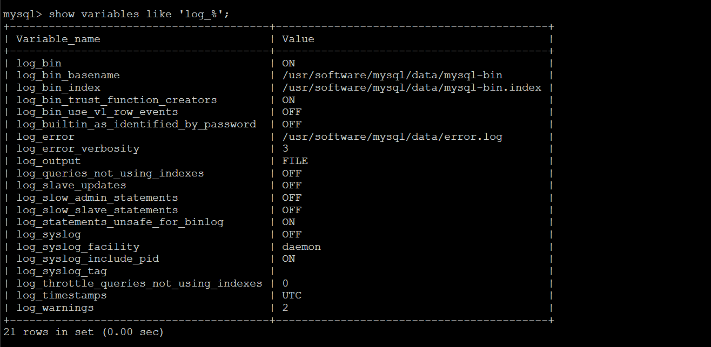

## 一、数据库为什么会被删？
同事小L最近负责整理数据库初始化脚本，在导出演示环境的数据库脚本后，在另外的服务器上执行该数据库脚本，最后由于操作的时候打开的窗口过多，没有注意到环境，当时他打开了很多窗口，有演示环境，也有自己试验环境，也有开发环境，一堆窗口，最后执行的时候发现执行错了，将演示环境给干掉了，演示环境有我们大量的数据，主要用于给客户演示用的，数据非常重要。

<!--more-->
## 二、数据库被删后，第一时间采取的措施是什么？
数据库被删后，第一时间采取的措施是想办法恢复，但由于binlog未开启以及定时备份数据库脚本也没有，最后无法恢复，只得经理采取一些措施来解决这个问题了。

## 三、我的反思以及从中发现存在哪些问题？
虽然说直接责任人并不是我，但我对此也有一定的间接责任。
这次删库事件我发现最大的问题就是数据库安全策略做的不够全面。数据库安全策略包含物理安全、访问控制、数据备份等。

### 1.物理安全
物理安全是安全防范的基本，主要是指保证数据库服务器、数据库所在环境、相关网络的物理安全性。

### 2.访问控制
访问控制是基本安全性的核心。它包括了帐号管理、密码策略、权限控制、用户认证等方面，主要是从与帐号相关的方面来维护数据库的安全性。

### 3.数据备份
定期的进行数据备份是减少数据损失的有效手段，能让数据库遭到破坏(恶意或者误操作)后，恢复数据资源。这也是数据库安全策略的一个重要部分。

这次问题主要出在访问控制和数据备份上面。访问控制没有做好，导致开发人员人人都能对演示环境(演示环境等同于生产环境)、测试环境、开发环境的数据库进行库的CRUD以及库中的表CRUD等。通常来说，数据库以及数据库中的表以及具体字段不能随意进行添加、删除、修改等，特别是对于等同于生产环境的演示环境。

访问控制只是数据库安全策略的一种手段，但这种手段还需与数据备份相结合，才能称的上是双重保障。


## 四、针对发现的问题我的解决办法是什么？
针对访问控制层面，我的解决办法是:
以演示环境(等同于生产环境)为例，**限制数据库为内网访问且对应的用户只能访问所授权的数据库**，命令如下:
```
GRANT ALL PRIVILEGES ON 数据库名称.* TO '数据库特定用户'@'192.168.52.317' IDENTIFIED BY '数据库特定用户密码' WITH GRANT OPTION;

FLUSH PRIVILEGES;

EXIT;
```
如果其它微服务需要连接该数据库但又处于不同的服务器环境下，也可通过上面ip进行控制，只不过需要新建对应的用户。

因为一些需求可能需要公网访问该数据库，也可以采取上面的措施进行，目的是为了更精细化的控制权限。

也许有人觉得敲命令来控制似乎很麻烦，别担心，有一个工具就已经替我们解决了这个问题(数据库访问控制)，那就是phpmyadmin。
关于Linux配置安装phpmyadmin，可以参考我写的如下文章:
[Ubuntu16.04下安装配置phpmyadmin](https://www.cnblogs.com/youcong/p/8645001.html)
[nginx上配置phpmyadmin](https://www.cnblogs.com/youcong/p/10703478.html)
[centos7之安装wordpress（虽然是安装wordpress，不过这里用到的是在phpmyadmin里建库以及添加用户授权等）](https://www.cnblogs.com/youcong/p/9240603.html)

针对数据备份层面，我的解决办法是两个:
第一个，**定期备份**，脚本自动化备份(需结合定时任务)，感兴趣的朋友可以阅读我的这篇文章:[mysql常用备份命令和shell备份脚本](https://www.cnblogs.com/youcong/p/9240618.html)
，
为防止万一加一个定期打包备份的sql脚本并远程传输到另外一台服务器上面，关于远程压缩传输文件可以参考我的这篇文章:
[Linux远程传输文件免密码](https://www.cnblogs.com/youcong/p/10809056.html)
[Linux关于压缩和解压缩实例](https://www.cnblogs.com/youcong/p/9762451.html)
。
第二个，**实时备份**，从数据库本身入手，开启binlog。
在my.conf配置如下即可:
```
[mysqld]
# 开启binlog
log-bin=mysql-bin
server-id=1
binlog_format=ROW
```
修改完配置记得重启mysql。
登录mysql查看binlog是否开启，执行如下命令即可:
```
show variables like 'log_%';
```
效果图如下(说明binlog已开启):


就目前来说，我已经落地了两个，一个是实时备份(开启binlog)，另外一个是定时备份(结合脚本和定时任务)。

## 五、总结
不经意间想起了欧阳修写的《五代史伶官传序》其中有一句我印象很深刻，"夫祸患常积于忽微，而智勇多困于所溺"。在此之前已经就有了一个前车之鉴，一位Java同事的阿里云服务器因数据库密码过于简单被黑客绑架(需要花比特币才能赎回)，当时针对此我采取了一些措施，但措施并不全面，这次删库事件或许就是来自之前的警告。