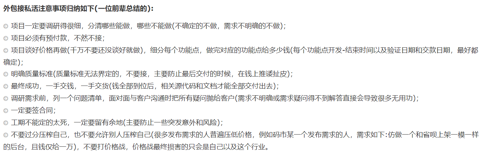

去年的时候写了一篇文章叫[Java程序员的两项通用能力](https://www.cnblogs.com/youcong/p/12963752.html)，这篇文章我提到对于Java程序员而言很重要的两项通用能力(从编程的角度出发)，一是熟练掌握并深入理解Java编程语言，二是数据库。关于深入理解Java编程语言，后续我会有一个专门的wiki来讲这方面的东西，今天主要讲数据库设计方面的。**我个人认为数据库设计是"互联网软件三高架构体系(高并发、高可用、高性能)"的根基**
<!--more-->

## 一、为什么说数据库设计是"互联网软件三高架构体系"的根基？
以我这四年多做的SaaS应用为例，都离不开一个共性，即数据的存储和处理，而数据的存储就涉及到数据库。而数据记录会存储在对应的表中，而表又是数据库中的一个组成部分(表由表名、表的字段、表的记录等构成)。自下而上看，一个良好的数据库设计，是由良好的数据表设计决定的，而一个良好的数据表设计，**它能够有效地达到"三降"目的:**
- (1)降低存储成本；
- (2)降低计算成本；
- (2)降低维护成本。

而"三降"对于"互联网三高架构体系"又显得至关重要。所以我认为数据库设计是"互联网软件三高架构体系"的根基，没有这个根基，一切皆为空中楼阁。

## 二、数据库设计需要考虑哪些方面？

### 1.业务层面
从业务层面出发，数据库的设计必须围绕业务层面进行思考，自顶而下。这里的业务层面，主要是需求层面，弄清楚客户的需求(与自己单干做外包的原理一样)，我在这篇文章提到过[技术人对赚钱的思考与摸索](https://youcongtech.com/2021/05/23/%E6%8A%80%E6%9C%AF%E4%BA%BA%E5%AF%B9%E8%B5%9A%E9%92%B1%E7%9A%84%E6%80%9D%E8%80%83%E4%B8%8E%E6%91%B8%E7%B4%A2/)
，其中一些文字，我用图片表示:

我认为在做数据库设计的思考，有以下这么两点，可以借鉴:
- 项目一定要调研很细，分清哪些能做，哪些不能做(不确定的不做，需求不明确的不做)；
- 调研需求前，列一个问题清单，面对面与客户沟通时，把所有疑问抛给客户(需求不明确或需求疑问得不到解答，直接慧导致很多无用功)。

### 2.架构层面
有人说，IT架构其实是计算、网络、存储。其中数据库就是存储的主要代表。
数据库架构也有四个原则(与互联网三高体系有一定关系):
- 高可用；
- 高性能；
- 一致性；
- 扩展性。

从架构层面上看，常见的方案有如下:
- 主备架构(主库提供读写服务，备库冗余做故障转移)；
- 双主架构(两个主库同时提供服务，负载均衡)；
- 主从架构(一主多从，读写分离)；
- 双主+主从架构(具备双主+主从的特点)。

但每种方案都需要考虑实际情况，能否落地是关键，不能落地的方案都是"空中楼阁"。这里的实际情况指成本高低、与目前的业务是否匹配等。

### 3.规范层面

#### (1)阿里巴巴Java开发手册终极版(1.3.0)

这里我仅仅列举三个，分别为建表规约、索引规约、SQL规约(这三个非常重要)。

##### a.建表规约

###### 表达是与否概念的字段，必须使用 is_xxx 的方式命名，数据类型是 unsigned tinyint（1 表示是，0 表示否）。
说明：任何字段如果为非负数，必须是 unsigned。
注意：POJO 类中的任何布尔类型的变量，都不要加 is 前缀，所以，需要在<resultMap>设置从 is_xxx 到
Xxx 的映射关系。数据库表示是与否的值，使用 tinyint 类型，坚持 is_xxx 的命名方式是为了明确其取值含义与取值范围。

###### 表名、字段名必须使用小写字母或数字，禁止出现数字开头，禁止两个下划线中间只出现数字。数据库字段名的修改代价很大，因为无法进行预发布，所以字段名称需要慎重考虑。
说明：MySQL 在 Windows 下不区分大小写，但在 Linux 下默认是区分大小写。因此，数据库名、表名、
字段名，都不允许出现任何大写字母，避免节外生枝。

###### 表名不使用复数名词。
说明：表名应该仅仅表示表里面的实体内容，不应该表示实体数量，对应于 DO 类名也是单数形式，符合表达习惯。

######  禁用保留字，如 desc、range、match、delayed 等，请参考 MySQL 官方保留字。

###### 主键索引名为 pk_字段名；唯一索引名为 uk_字段名；普通索引名则为 idx_字段名。
说明：pk_ 即 primary key；uk_ 即 unique key；idx_ 即 index 的简称。

###### 小数类型为 decimal，禁止使用 float 和 double。
说明：在存储的时候，float 和 double 都存在精度损失的问题，很可能在比较值的时候，得到不正确的
结果。如果存储的数据范围超过 decimal的范围，建议将数据拆成整数和小数并分开存储。

###### 如果存储的字符串长度几乎相等，使用 char 定长字符串类型。

###### varchar是可变长字符串，不预先分配存储空间，长度不要超过 5000，如果存储长度大于此值，定义字段类型为 text，独立出来一张表，用主键来对应，避免影响其它字段索引效率。

###### 表必备三字段：id, create_time, update_time。
说明：其中 id 必为主键，类型为 bigint unsigned、单表时自增、步长为 1。create_time, update_time
的类型均为 datetime 类型，前者现在时表示主动式创建，后者过去分词表示被动式更新。

###### 表的命名最好是遵循“业务名称_表的作用”。

###### 库名与应用名称尽量一致。

###### 如果修改字段含义或对字段表示的状态追加时，需要及时更新字段注释。

###### 字段允许适当冗余，以提高查询性能，但必须考虑数据一致。冗余字段应遵循：
- 1） 不是频繁修改的字段。
- 2） 不是唯一索引的字段。
- 3） 不是 varchar 超长字段，更不能是 text 字段。

###### 单表行数超过 500 万行或者单表容量超过 2GB，才推荐进行分库分表。
说明：如果预计三年后的数据量根本达不到这个级别，请不要在创建表时就分库分表。

###### 合适的字符存储长度，不但节约数据库表空间、节约索引存储，更重要的是提升检索速度。

##### b.索引规约

###### 业务上具有唯一特性的字段，即使是组合字段，也必须建成唯一索引。
说明：不要以为唯一索引影响了 insert 速度，这个速度损耗可以忽略，但提高查找速度是明显的；另外，
即使在应用层做了非常完善的校验控制，只要没有唯一索引，根据墨菲定律，必然有脏数据产生。

###### 超过三个表禁止 join。需要 join 的字段，数据类型保持绝对一致；多表关联查询时，保证被关联的字段需要有索引。
说明：即使双表 join 也要注意表索引、SQL 性能。

###### 在 varchar 字段上建立索引时，必须指定索引长度，没必要对全字段建立索引，根据实际文本区分度决定索引长度。
说明：索引的长度与区分度是一对矛盾体，一般对字符串类型数据，长度为 20 的索引，区分度会高达 90%以上，可以使用 count(distinct left(列名,索引长度))/count(*)的区分度来确定。

###### 页面搜索严禁左模糊或者全模糊，如果需要请走搜索引擎来解决。
说明：索引文件具有 B-Tree 的最左前缀匹配特性，如果左边的值未确定，那么无法使用此索引。

###### 如果有 order by 的场景，请注意利用索引的有序性。order by 最后的字段是组合索引的一部分，并且放在索引组合顺序的最后，避免出现 file_sort 的情况，影响查询性能。

###### 利用覆盖索引来进行查询操作，避免回表。
说明：如果一本书需要知道第 11 章是什么标题，会翻开第 11 章对应的那一页吗？目录浏览一下就好，这
个目录就是起到覆盖索引的作用。

###### 利用延迟关联或者子查询优化超多分页场景。
说明：MySQL 并不是跳过 offset 行，而是取 offset+N 行，然后返回放弃前 offset 行，返回 N 行，那当
offset 特别大的时候，效率就非常的低下，要么控制返回的总页数，要么对超过特定阈值的页数进行 SQL
改写。

###### SQL 性能优化的目标：至少要达到 range 级别，要求是 ref 级别，如果可以是 consts最好。
说明：
- 1） consts 单表中最多只有一个匹配行（主键或者唯一索引），在优化阶段即可读取到数据。
- 2） ref 指的是使用普通的索引（normal index）。
- 3） range 对索引进行范围检索。

###### 建组合索引的时候，区分度最高的在最左边。
说明：存在非等号和等号混合判断条件时，在建索引时，请把等号条件的列前置。如：where c>? and d=?
那么即使 c 的区分度更高，也必须把 d 放在索引的最前列，即建立组合索引 idx_d_c。

###### 防止因字段类型不同造成的隐式转换，导致索引失效。

###### 创建索引时避免有如下极端误解：
- 1） 索引宁滥勿缺。认为一个查询就需要建一个索引。
- 2） 吝啬索引的创建。认为索引会消耗空间、严重拖慢记录的更新以及行的新增速度。
- 3） 抵制惟一索引。认为惟一索引一律需要在应用层通过“先查后插”方式解决。

##### c.SQL语句

###### 不要使用 count(列名)或 count(常量)来替代 count(*)，count(*)是 SQL92 定义的标准统计行数的语法，跟数据库无关，跟 NULL 和非 NULL 无关。
说明：count(*)会统计值为 NULL 的行，而 count(列名)不会统计此列为 NULL 值的行。

###### count(distinct col) 计算该列除 NULL 之外的不重复行数，注意 count(distinct col1,col2) 如果其中一列全为 NULL，那么即使另一列有不同的值，也返回为 0。

###### 当某一列的值全是 NULL 时，count(col)的返回结果为 0，但 sum(col)的返回结果为NULL，因此使用 sum()时需注意 NPE 问题。

###### 使用 ISNULL()来判断是否为 NULL 值。
说明：NULL 与任何值的直接比较都为 NULL。
1） NULL<>NULL 的返回结果是 NULL，而不是 false。
2） NULL=NULL 的返回结果是 NULL，而不是 true。
3） NULL<>1 的返回结果是 NULL，而不是 true。

###### 代码中写分页查询逻辑时，若 count 为 0 应直接返回，避免执行后面的分页语句。

###### 不得使用外键与级联，一切外键概念必须在应用层解决。
说明：（概念解释）学生表中的 student_id 是主键，那么成绩表中的 student_id 则为外键。如果更新学
生表中的 student_id，同时触发成绩表中的 student_id 更新，即为级联更新。外键与级联更新适用于单机
低并发，不适合分布式、高并发集群；级联更新是强阻塞，存在数据库更新风暴的风险；外键影响数据库
的插入速度。

###### 禁止使用存储过程，存储过程难以调试和扩展，更没有移植性。

###### 数据订正（特别是删除或修改记录操作）时，要先 select，避免出现误删除，确认无误才能执行更新语句。

###### 对于数据库中表记录的查询和变更，只要涉及多个表，都需要在列名前加表的别名（或表名）进行限定。
说明：对多表进行查询记录、更新记录、删除记录时，如果对操作列没有限定表的别名（或表名），并且操作列在多个表中存在时，就会抛异常。

###### SQL 语句中表的别名前加 as，并且以 t1、t2、t3、...的顺序依次命名。
说明：
- 1）别名可以是表的简称，或者是依照表在 SQL 语句中出现的顺序，以 t1、t2、t3 的方式命名。
- 2）别名前加 as 使别名更容易识别。

###### in 操作能避免则避免，若实在避免不了，需要仔细评估 in 后边的集合元素数量，控制在 1000 个之内。

###### 因国际化需要，所有的字符存储与表示，均采用 utf8 字符集，那么字符计数方法需要注意。
说明：
 SELECT LENGTH("轻松工作")； 返回为 12
 SELECT CHARACTER_LENGTH("轻松工作")； 返回为 4
 如果需要存储表情，那么选择 utf8mb4 来进行存储，注意它与 utf8 编码的区别。

###### TRUNCATE TABLE 比 DELETE 速度快，且使用的系统和事务日志资源少，但 TRUNCATE无事务且不触发 trigger，有可能造成事故，故不建议在开发代码中使用此语句。
说明：TRUNCATE TABLE 在功能上与不带 WHERE 子句的 DELETE 语句相同。

#### (2)各博友总结概要

##### a.没有完美的数据库设计，只有符合业务的数据库设计

##### b.在遵守数据库设计三大范式的同时，也要考虑用户体验

##### c.数据库设计时必须要做的两件事情(需求分析、考虑需求可能的变更)

##### d.数据库设计注意事项
- 用户输入不能作为主键；
- 凡是有业务意义的不能作为主键；
- 除非是确定非空字段，其他允许为空(约束简单原则)；
- 不能缺少时间或日期字段，并预留备注字段；
- 业务时效性；
- 数据采集(宁滥勿缺)；
- 预先计划(考虑用户误操作，非物理删除与物理删除)。

##### e.字段是否允许为空(结合业务思考)

##### f.表增加字段不要采用drop table或create table，最好用alter(保留原来的数据)。

##### g.多表操作必须使用事务

##### h.数据库命名
- 使用名词作为表名；
- 相关表采用统一的前缀。

##### i.字段的命名
- 根据动词被动形式+描述性后缀；
- 时间区分当前和未来；
- 使用第三人称复数；
- 区分单数和复数。

##### j.充分利用工具
- Power Design；
- Navicat Data Modeler。

##### k.获取数据模式手册

##### l.做新的数据库设计时，要记住过去的教训，古为今鉴

##### m.在物理实践之前进行逻辑实现

##### n.创建数据字典和ER图表

##### o.有意义的字段命名

##### p.标准化和数据驱动

##### q.标准化不能过头

##### r.小心保留字

##### s.仔细选择数字类型

##### t.避免使用触发器

##### u.文本字段留足量

##### v.采用视图

##### w.用存储过程让系统做活

##### x.创建模式

##### y.报表技巧

##### z.检查各种变化

#### (3)我对规范层面的感受
从外包公司到至今，越来越体会到规范化的重要意义。从数据库设计到编码，简直是一部血泪史。当年在某创业公司的时候，除了写代码随意之外，对于数据库设计更是随意，为了功能更好实现，给数据库对应的表不断增加字段，最终造成大量冗余，数据库字段冗余，对应的Java代码也是如此。而后到某教育Saas公司才明白数据表不可轻易加字段，需要从整体全局考虑，而不是单单从自身功能实现难易考虑。