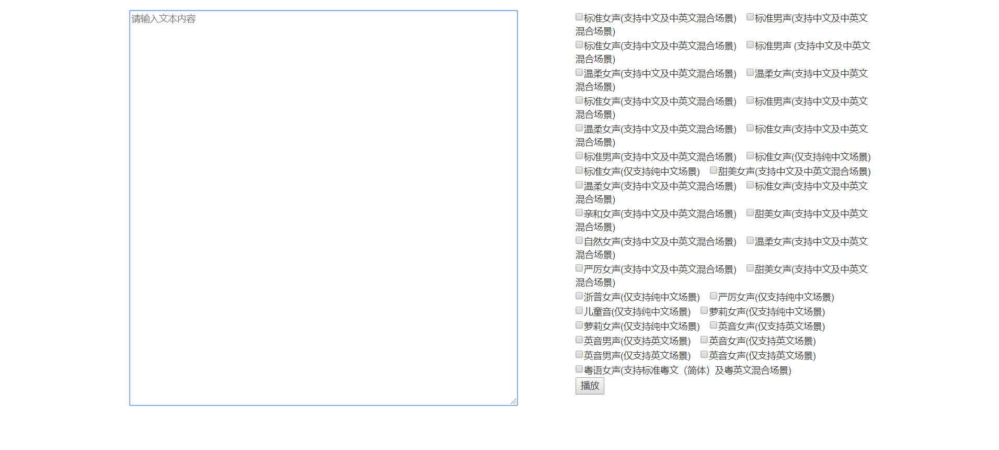

本次用到的是阿里云的智能语音交互，参考文档地址如下:https://help.aliyun.com/product/30413.html?spm=5176.10695662.1157759.3.3ffb16e40gDXyf
<!--more-->
本次示例代码如下:
```
<html>

	<head>
		<link rel="stylesheet" href="https://cdn.staticfile.org/twitter-bootstrap/3.3.7/css/bootstrap.min.css">
		<script src="https://cdn.staticfile.org/jquery/2.1.1/jquery.min.js"></script>
		<script src="https://cdn.staticfile.org/twitter-bootstrap/3.3.7/js/bootstrap.min.js"></script>
	</head>

	<body>
		<br/>
		<div class="container">
			<div class="row">
				<div class="col-xs-5">
					<textarea id="content" rows="30" cols="80" placeholder="请输入文本内容"></textarea>
				</div>
				<div class="col-xs-2">
				</div>
				<div class="col-xs-5">

					<input type="checkbox" name="test" value="Xiaoyun">标准女声(支持中文及中英文混合场景) &nbsp;&nbsp;
					<input type="checkbox" name="test" value="Xiaogang">标准男声(支持中文及中英文混合场景)<br/>
					<input type="checkbox" name="test" value="Xiaomeng">标准女声(支持中文及中英文混合场景) &nbsp;&nbsp;
					<input type="checkbox" name="test" value="Xiaowei">标准男声 (支持中文及中英文混合场景)<br/>
					<input type="checkbox" name="test" value="Ruoxi">温柔女声(支持中文及中英文混合场景) &nbsp;&nbsp;
					<input type="checkbox" name="test" value="Siqi">温柔女声(支持中文及中英文混合场景)<br/>
					<input type="checkbox" name="test" value="Sijia">标准女声(支持中文及中英文混合场景) &nbsp;&nbsp;
					<input type="checkbox" name="test" value="Sicheng">标准男声(支持中文及中英文混合场景)<br/>
					<input type="checkbox" name="test" value="Aiqi">温柔女声(支持中文及中英文混合场景) &nbsp;&nbsp;
					<input type="checkbox" name="test" value="Aijia">标准女声(支持中文及中英文混合场景)<br/>
					<input type="checkbox" name="test" value="Aida">标准男声(支持中文及中英文混合场景) &nbsp;&nbsp;
					<input type="checkbox" name="test" value="Ninger">标准女声(仅支持纯中文场景)<br/>
					<input type="checkbox" name="test" value="Ruilin">标准女声(仅支持纯中文场景) &nbsp;&nbsp;
					<input type="checkbox" name="test" value="Amei">甜美女声(支持中文及中英文混合场景)<br/>
					<input type="checkbox" name="test" value="Xiaoxue">温柔女声(支持中文及中英文混合场景) &nbsp;&nbsp;
					<input type="checkbox" name="test" value="Siyue">标准女声(支持中文及中英文混合场景)<br/>
					<input type="checkbox" name="test" value="Aixia">亲和女声(支持中文及中英文混合场景) &nbsp;&nbsp;
					<input type="checkbox" name="test" value="Aimei">甜美女声(支持中文及中英文混合场景)<br/>
					<input type="checkbox" name="test" value="Aiyu">自然女声(支持中文及中英文混合场景) &nbsp;&nbsp;
					<input type="checkbox" name="test" value="Aiyue">温柔女声(支持中文及中英文混合场景)<br/>
					<input type="checkbox" name="test" value="Aijing">严厉女声(支持中文及中英文混合场景) &nbsp;&nbsp;
					<input type="checkbox" name="test" value="Xiaomei">甜美女声(支持中文及中英文混合场景)<br/>
					<input type="checkbox" name="test" value="Yina">浙普女声(仅支持纯中文场景) &nbsp;&nbsp;
					<input type="checkbox" name="test" value="Sijing">严厉女声(仅支持纯中文场景)<br/>
					<input type="checkbox" name="test" value="Sitong">儿童音(仅支持纯中文场景) &nbsp;&nbsp;
					<input type="checkbox" name="test" value="Xiaobei">萝莉女声(仅支持纯中文场景)<br/>
					<input type="checkbox" name="test" value="Aibao">萝莉女声(仅支持纯中文场景) &nbsp;&nbsp;
					<input type="checkbox" name="test" value="Halen">英音女声(仅支持英文场景)<br/>
					<input type="checkbox" name="test" value="Harry">英音男声(仅支持英文场景) &nbsp;&nbsp;
					<input type="checkbox" name="test" value="Wendy">英音女声(仅支持英文场景)<br/>
					<input type="checkbox" name="test" value="William">英音男声(仅支持英文场景) &nbsp;&nbsp;
					<input type="checkbox" name="test" value="Olivia">英音女声(仅支持英文场景)<br/>
					<input type="checkbox" name="test" value="Shanshan">粤语女声(支持标准粤文（简体）及粤英文混合场景)
					<br/>
					<input type="button" value="播放" id="bf">

				</div>
			</div>
		</div>
		<div>

		</div>

		<iframe id="iframe" style="display:none;">
</iframe>

		<script>
			$("#bf").click(function() {
				var text = $("#content").val();

				var voice = $('input[name="test"]:checked').val();

	
					iframe.src = "https://nls-gateway.cn-shanghai.aliyuncs.com/stream/v1/tts?appkey={appkey}&token={token}&text=" + text + "&format=wav&sample_rate=16000&voice=" + voice;

			});
		</script>

	</body>

</html>

```

代码中的{appkey}和{token}需要替换成自己的。具体可参考上述提到的官方文档。

代码效果如图:


在文本框中输入任意的文字，并选择对应的checkbox，然后点击播放就能有对应类型的语音。

