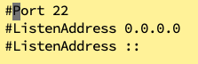

之所以决定写这篇文章，换言之，这篇文章起源于公司自建服务器因为没有开启防火墙被黑客攻击(其中一台公网暴露的情况下)，基于那次有了一些感悟，而后公司的一位女同事的腾讯云服务器因为数据库密码过于简单，数据库被黑客绑架(相当于将库的数据全部清理，最后仅留一下一句话，要xxx比特币赎回...)，这两次黑客的挑衅，让我对服务器安全方面有了更多的感悟。就在今天服务器突然又宕机了，原因还是被黑客攻击了(黑客利用Redis的漏洞进行病毒植入)，我与其作战了一个下午，最初还以为是Redis的原因，最后发现Redis仅仅是表象，再与其更深入地作战过程中，发现其通过Redis的漏洞，安装了两个病毒软件、篡改了ssh密钥、控制了定时任务，一切的目的只为了一个，把你服务器上的所有资源(带宽、CPU、内存等)全部用于挖矿(挖矿是需要巨大的算力)。
<!--more-->

两次与公司服务器相关的黑客攻击，其实是可以避免的，一次麻痹大意，让黑客有了可乘之机，实在是让人气愤。

这次服务器安全策略之思考与实践，总体为以下五个部分:
- 防火墙；
- 用户管理；
- 备份管理；
- 定时更新系统内核；
- 服务管理。

掌握这五个方面，能应对大多数情况的黑客攻击(与掌握和了解法律知识能在大多数情况维护我们的公民权益是相通的)。

## 一、防火墙
防火墙是服务器的第一道防线，虽然不能百分百防护得到，但至少能阻挡大多数黑客的DOS或DDOS以及利用部分开源软件的漏洞进行病毒植入等攻击。这次服务器之所以被黑客植入病毒，在于防火墙的端口被黑客钻了空子，后面会提到针对此如何进行防范。

### 1.防火墙设置开机自启动
```
systemctl enable firewalld

```

### 2.防火墙常用命令

#### (1)防火墙状态查看(开启或关闭)
```
systemctl status firewalld

```

#### (2)开放端口
```
firewall-cmd --permanent --add-port=端口/tcp

```

#### (3)关闭端口
```
firewall-cmd --permanent --remove-port=端口/tcp

```

#### (4)防火墙重启
```
firewall-cmd --reload

```

#### (5)查看防火墙已开放端口
```
firewall-cmd --list-ports

```
**注意:**
无论是服务器开放端口还是关闭端口必须要重启防火墙生效，否则无效。


## 二、用户管理

### 1.ssh端口修改
```
vim /etc/ssh/sshd_config

```
添加一行Port 12593即可，如图所示:


重启sshd:
```
systemctl restart sshd

```

需要开启防火墙：
```
firewall-cmd --permanent --add-port=12593/tcp
firewall-cmd --reload
```


### 2.禁用root远程登录
Ubuntu就是这样设计的，系统安装成功后，不能使用root登录，只能使用系统安装时新建的普通用户来切入到root用户才行，最初我不太理解Ubuntu为什么要这么设计，而后经过一系列的教训后才明白为什么要慎用root或不用root。

修改配置文件:
```
vim /etc/ssh/sshd_config

```

添加如下内容:
```
找到 # PermitRootLogin yus
改为 PermitRootLogin no

```

### 3.创建普通用户授予一定目录的权限
```
useradd blog #添加用户
passwd #重置密码

```

**例如:**
我要将我的blog系统部署在Linux上，我按照上面新建blog用户，将blog系统所需的如JDK、Redis、Nacos、MySQL、ES、MongoDB等软件按照一定的规范进行放置。

## 三、备份管理

### 1.数据备份
编写服务脚本通过scp命令进行远程传输到备份服务器对应的数据备份
目录。
核心命令如下:
```
scp  -r sql_月份或天.zip mysql@ip:/home/mysql/backup 

```

数据备份脚本内容可供参考(可以结合上面的scp命令，实现备份到另外的服务器):
```
#!/bin/bash
base_dir=/home/blog/sql_script
DATE=$(date +%Y%m%d)
time=$(date "+%Y-%m-%d %H:%M:%S")
cd $base_dir
mysqldump -uroot -p123456 --databases wordpress nacos > dump_$DATE.sql

if [ $? -eq 0 ]
then
  echo "成功备份mysql数据库,当前日期为:"$time >> /home/blog/mysql_dump.log

else

  echo "备份mysql数据库失败:当前日期为:"$time>> /home/blog/mysql_dump.log

fi

```

### 2.程序日志备份
目前日志主要存储在/home/blog/dev/log目录下。
核心命令如下(可写入shell脚本定时执行):
```
scp -r server_log_月份或天.zip server@ip:/home/server/backup

```

### 3.系统日志备份(针对服务器所产生的系统日志)
一般日志主要存储在/var/log下。
核心命令如下(可写入shell脚本定时执行):
```
scp -r system_log_月份或天.zip system@ip:/home/system/backup

```

因为之前经历过数据库被删，总结了相关教训，写下了另外一篇文章，感兴趣的朋友可以阅读:
[数据库被删之反思](https://youcongtech.com/2021/05/22/%E6%95%B0%E6%8D%AE%E5%BA%93%E8%A2%AB%E5%88%A0%E4%B9%8B%E5%8F%8D%E6%80%9D/)


## 四、定期更新系统内核

也许有朋友疑问为什么要定期更新系统内核？**我归纳为如下四点:**
- 硬件兼容性更好(支持更多的硬件)；
- 修复原有内核系统漏洞(有的黑客会以原有系统漏洞来达到攻击服务器的目的)，提升系统稳定性；
- 系统将拥有更多的内存(内核部分将不会被交换到虚拟内存中，这也是不少朋友感觉服务器内存虽然16G，实际能用的可能只有12~13G左右)；
- 更多的新功能和特性，提高效率，减少运维工作量(站在巨人的肩上)。

**要特别注意一点:**
要按照实际情况更新系统内核，切不可随意更新，更新前一定要有充足的准备，防止更新以后出现不兼容性问题导致影响巨大(特别是生产环境，要特别小心，可以事先做试验更新确保问题，同时也把坑给踩了)。


### 1.更新yum源仓库
```
yum -y update

```

### 2.启用 ELRepo 仓库
```
rpm --import https://www.elrepo.org/RPM-GPG-KEY-elrepo.org

```

### 3.安装ELRepo仓库的yum源
```
yum install
https://www.elrepo.org/elrepo-release-7.el7.elrepo.noarch.rpm

```

### 4.查询可用的系统内核包
```
yum --disablerepo="*" --enablerepo="elrepo-kernel" list available

```

### 5.安装最新版本内核
```
yum --enablerepo=elrepo-kernel install kernel-ml

```

### 6.设置新的内核为grub2的默认版本
```
grub2-set-default 0

```

### 7.生成 grub 配置文件并重启
```
grub2-mkconfig -o /boot/grub2/grub.cfg (必须等待该命令执行完毕后才执行reboot重启服务器)

reboot

```

### 8.验证新内核
```
uname -r

```

## 五、服务管理

### 1.应用软件

#### (1)MySQL

##### a.避免使用默认端口3306；

##### b.如需对外暴露，限制IP；

##### c.对外连接账户，密码设置复杂且做严格库表权限控制；

##### d.不使用根用户运行MySQL。

#### (2)Redis

##### a.禁止监听公网；

##### b.禁止使用root用户启动；

##### c.限制Redis配置文件访问权限(chmod 600 redis.conf)

##### d.修改默认端口(最好不要为6379)；

##### e.打开保护模式；

##### f.开启账号密码认证模式；

##### g.数据加密，开启SSL代理。

#### (3)Nginx

##### a.隐藏版本号(防止黑客针对版本漏洞进行攻击)；

##### b.开启HTTPS；

##### c.开启黑白名单；

##### d.添加账号认证(一般为basic，双重认证的体系)；

##### e.限制请求方法；

##### f.拒绝User-Agent和Header头设置；

##### g.图片防盗链；

##### h.控制并发连接数；

##### i.限制缓冲区大小(防止缓冲区溢出攻击)。

### 2.微服务

#### (1)通过网关代理访问，仅暴露网关(网关处于公网下，一般Nginx代理网关，网关处于内网)。

#### (2)各个微服务处于内网，通过注册中心建立联系，如涉及集群，可通过Nginx负载均衡策略实现请求分发。

## 六、总结
按照上面的原则执行，基本上出问题的概率非常低，此次被黑客攻击，就是因为违背上面的原则导致的(如假定Redis不在公网公开，或者是在公网公开并设置严格的认证模式，或许不会被攻击)，此次攻击已知的病毒为networkservice和sysupdate，可能存在一些未知的病毒，最后系统因为某种原因崩溃，不得不重装。一次又一次的惨痛经历，此文一方面有总结笔者我在服务器安全策略的思考与实践，另外一方面也有算作记录这次惨痛教训，最后一方面希望广大的朋友以此为鉴。再次验证了那句话，**"祸患常积于忽微，而智勇多困于所溺"。**

**今年服务器运维的相关总结教训如下:**
[数据库被删之反思](https://youcongtech.com/2021/05/22/%E6%95%B0%E6%8D%AE%E5%BA%93%E8%A2%AB%E5%88%A0%E4%B9%8B%E5%8F%8D%E6%80%9D/)
[ssh问题之复盘](https://youcongtech.com/2021/01/05/ssh%E9%97%AE%E9%A2%98%E4%B9%8B%E5%A4%8D%E7%9B%98/)
[Linux设备上没有空间之复盘](https://youcongtech.com/2021/01/04/Linux%E8%AE%BE%E5%A4%87%E4%B8%8A%E6%B2%A1%E6%9C%89%E7%A9%BA%E9%97%B4%E4%B9%8B%E5%A4%8D%E7%9B%98/)
