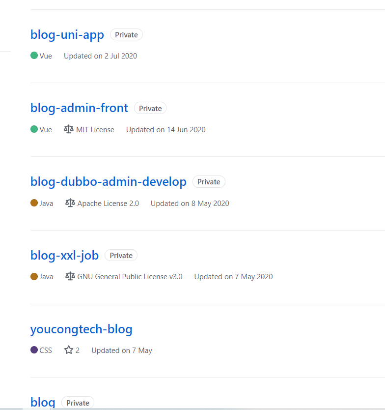

因为某种机缘与杨二前辈近距离的接触，杨二前辈一些分享给了我以下几点启发。
<!--more-->

## 一、编程来源于现实(开源的项目Idea)
这些年我也写了不少开源项目如blog-job、blog-cxf、mybatis-plus-tutorial、DroolsSpringBootExample、blog-springcloud-pro-demo、jfinal-task-sys、AlgorithmOfhomework、SmallDemo、DesignPatternLeanring、SpringBoot-Learning、SymfonyLearning、ThinkPHPLearning、blog-manage-system、acs-login、vscode-extension-dev、Metronic_Template等18个开源项目，除此之外还有几十个闭源项目，这些闭源项目有的是来自于一些开源项目的灵感，有的是基于已有的开源项目进行二次开发，还有的是基于生活中的如我的记账后台和记账小程序以及工作中的json在线格式化、SQL格式化、解密和加密等。

杨二前辈也写了不少有趣的开源项目，感兴趣的朋友可以访问如下地址:
https://yangerxiao.com/works

下面图中是我部分闭源项目：

## 二、自主创作提高了能力
杨二前辈认为自主创作可以提高如下几个能力？
- 沉淀开发流程；
- 扩展技术视野；
- 锻炼产品思维。

我个人非常赞同如上三点，因为正是因为业余时间不断编码折腾，在创业公司的时候，我基于过去业余折腾的经验，把运维部署与监控实现脚本化用来提高效率，因为公司产品需要的缘故，接触了PHP和Python等相关的开源项目，对于接触较为陌生的编程语言领域，每个人或多或少都会有点恐惧，但我不恐惧，因为在业余早已折腾这相关的，至于锻炼产品思维这大概是我那个时候的硬伤，写出来的东西只管实现就行，而不从用户的角度考虑易用性和美观，以至于时不时就返工重写(那个时候在创业公司的时候，前后端以及运维都做)。

从创业公司到B2B零售，再由B2B零售到教育Saas，最后从教育SaaS到现在，流程、视野、产品思维等形成的复利深刻着影响着我。

## 三、如何成为独立开发者
杨二前辈认为如下三点:
- 兴趣使然；
- 不设限；
- 积累与坚持。

其实我能从一名后端开发人员到半个全栈(H5、小程序、PC端、后端API、测试、运维等)，仔细想来与上面三点不无关系。

兴趣很重要，我喜欢阅读各种各样的书籍，每天上下班的地铁以及睡前我都会阅读，阅读于我而言，既是一种兴趣，也是生活方式的一种体现。同样，当某种灵感产生，如编码灵感，我会持续专注的写好几个小时，有的时候不经意间就通宵了，写作也是如此。但是这些最终都离不开一点，那就是持之以恒的坚持，长久的坚持会形成复利，这种复利就是积累。

## 四、总结
我问了杨二前辈一个问题，为什么我写了一百多个开源或闭源的项目，都称不上成功呢？因为这一百多个开源或闭源的项目，有的形同烂尾楼，有的勉强过去，还有的做事做一半，再有的就是在人家已有的基础上增加几点新功能搞一些创新。杨二前辈怎么回答的，我记不清了，但后来我想了想，也许写开源或闭源项目的结果让我很不满意，但是在这个过程中我还是学到了不少，我想这或许是一种另类成功吧。

