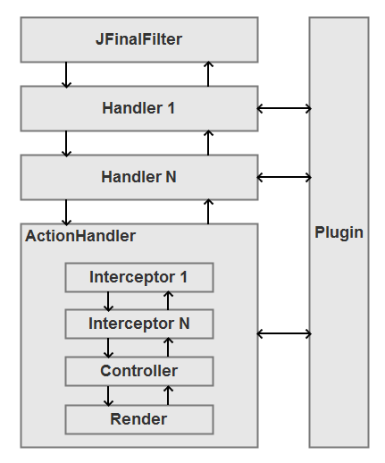
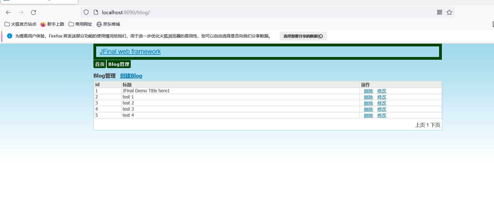

## 一、Jfinal是什么？
JFinal 是基于 Java 语言的极速 WEB + ORM 框架，其核心设计目标是开发迅速、代码量少、学习简单、功能强大、轻量级、易扩展、Restful。在拥有Java语言所有优势的同时再拥有Ruby、Python 等动态语言的开发效率！为您节约更多时间，去陪恋人、家人和朋友)。
<!--more-->

## 二、Jfinal具有哪些特点？
- 1.MVC 架构，设计精巧，使用简单。
- 2.遵循 COC 原则，支持零配置，无 XML。
- 3.独创 Db + Record 模式，灵活便利。
- 4.ActiveRecord 支持，使数据库开发极致快速。
- 5.极简、强大、高性能模板引擎 Enjoy，十分钟内掌握 90% 用法。
- 6.自动加载修改后的 Java 文件，开发过程中无需重启服务。
- 7.AOP支持，拦截器配置灵活，功能强大。
- 8.Plugin 体系结构，扩展性强。
- 9.多视图支持，支持 Enjoy、FreeMarker、JSP。
- 10.强大的 Validator 后端校验功能。
- 11.功能齐全，拥有传统 SSH 框架的绝大部分核心功能。
- 12.体积小仅 832 KB，并且无第三方依赖。

## 三、关于Jfinal的学习资料有哪些？
Github源代码:
https://github.com/jfinal/jfinal

官方文档:
https://jfinal.com/doc

官方文档的重点内容主要为如下14个方面？

- 1.快速上手
- 2.JFinalConfig
- 3.Controller
- 4.AOP
- 5.ActiveRecord
- 6.Enjoy 模板引擎
- 7.EhCachePlugin
- 8.RedisPlugin
- 9.Cron4jPlugin
- 10.Validator
- 11.国际化
- 12.Json 转换
- 13.Jfinal架构及扩展
- 14.升级到5.0.3

## 四、Jfinal的顶层架构图是怎样的？

## 五、有关Jfinal的开源项目有哪些？
- 1.jfinal-weixin(微信生态)
- 2.jfinal cms(内容管理平台)
- 3.JFinal-layui(基于layui)
- 4.72crm-9.0-Jfinal(基于悟空CRM开源)
- 5.jfinal-admin(后台脚手架)
- 6.jfinal-cms-shop(商城)

## 六、如何使用Jfinal？

可以使用官方网站提供的示例来帮助你进行学习！！！

官方网站示例:

JFinal Blog 5.0.0:
https://jfinal.com/download/now?file=jfinal-blog-5.0.0.zip

JFinal demo for maven 5.0.0:
https://jfinal.com/download/now?file=jfinal_demo_for_maven-5.0.0.zip

以Jfinal demo for maven为例，导入Idea中，配置好对应的数据库执行DemoConfig.java类即可，效果图如下所示:

