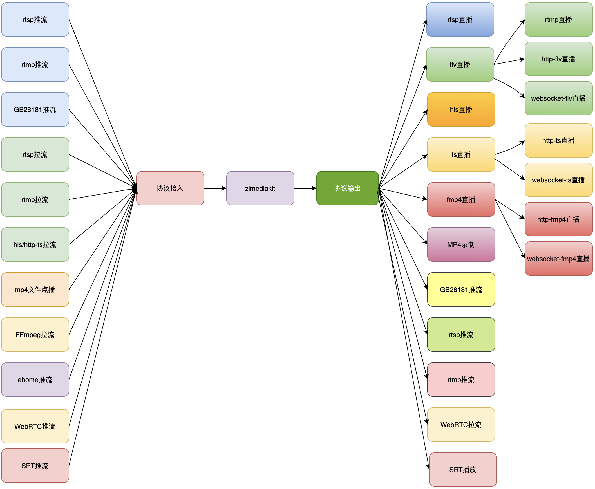
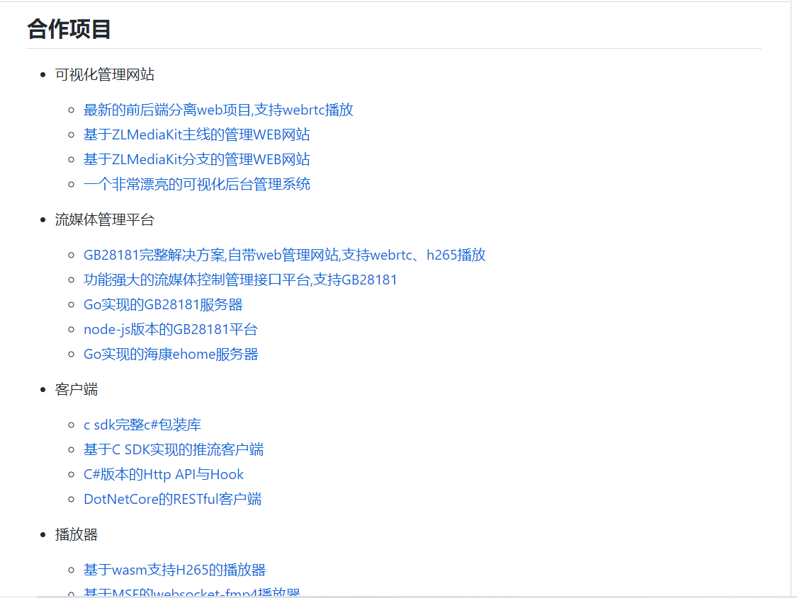

## 一、SRS
SRS是一个简单高效的实时视频服务器，支持RTMP、WebRTC、HLS、HTTP-FLV、SRT等多种实时流媒体协议。
<!--more-->

SRS官网:
https://ossrs.net/lts/zh-cn/

SRS架构图:

SRS文档:
https://ossrs.net/lts/zh-cn/docs/v4/doc/getting-started

SRS Github源代码:
https://github.com/ossrs/srs

## 二、ZLM
ZLM,全名称为ZLMediaKit。它是一个基于C++11的高性能运营级流媒体服务框架。

### 1.ZLM具有哪些特点？
- (1)基于C++11开发，避免使用裸指针，代码稳定可靠，性能优越。
- (2)支持多种协议(RTSP/RTMP/HLS/HTTP-FLV/WebSocket-FLV/GB28181/HTTP-TS/WebSocket-TS/HTTP-fMP4/WebSocket-fMP4/MP4/WebRTC),支持协议互转。
- (3)使用多路复用/多线程/异步网络IO模式开发，并发性能优越，支持海量客户端连接。
- (4)代码经过长期大量的稳定性、性能测试，已经在线上商用验证已久。
- (5)支持linux、macos、ios、android、windows全平台。
- (6)支持画面秒开、极低延时(500毫秒内，最低可达100毫秒)。
- (7)提供完善的标准C API,可以作SDK用，或供其他语言调用。
- (8)提供完整的MediaServer服务器，可以免开发直接部署为商用服务器。
- (9)提供完善的restful api以及web hook，支持丰富的业务逻辑。
- (10)打通了视频监控协议栈与直播协议栈，对RTSP/RTMP支持都很完善。
- (11)全面支持H265/H264/AAC/G711/OPUS。
- (12)功能完善，支持集群、按需转协议、按需推拉流、先播后推、断连续推等功能。
- (13)极致性能，单机10W级别播放器，100Gb/s级别io带宽能力。
- (14)极致体验，独家特性。
- (15)全面支持ipv6网络。

### 2.ZLM的项目定位是什么？
- (1)移动嵌入式跨平台流媒体解决方案。
- (2)商用级流媒体服务器。
- (3)网络编程二次开发SDK。

### 3.ZLM的功能清单是怎样的？

### 4.有关ZLM的合作项目有哪些？

访问ZLM对应的Github开源仓库地址即可，这些合作项目均开源的！！！

### 5.有关ZLM的资料有哪些？
Github 源代码:
https://github.com/ZLMediaKit/ZLMediaKit

Gitee 源代码:
https://gitee.com/xia-chu/ZLMediaKit

wiki(对应的指导文档):
https://github.com/ZLMediaKit/ZLMediaKit/wiki/%E5%BF%AB%E9%80%9F%E5%BC%80%E5%A7%8B

## 三、Node-Media-Server
Node-Media-Server一个 Node.js 实现的RTMP/HTTP/WebSocket/HLS/DASH流媒体服务器。

### 1.Node-Media-Server具有哪些特点？
- (1)跨平台支持 Windows/Linux/Unix。
- (2)支持的音视频编码 H.264/H.265/AAC/SPEEX/NELLYMOSER
- (3)支持缓存最近一个关键帧间隔数据，实现RTMP协议秒开。
- (4)支持RTMP直播流转LIVE-HTTP/WS-FLV流,支持 NodePlayer.js 播放。
- (5)支持星域CDN风格的鉴权。
- (6)支持事件回调。
- (7)支持https/wss加密传输。
- (8)支持服务器和流媒体信息统计。
- (9)支持RTMP直播流转HLS,DASH直播流。
- (10)支持RTMP直播流录制为MP4文件并开启faststart。
- (11)支持RTMP/RTSP中继。
- (12)支持API控制中继。
- (13)支持实时多分辨率转码。

### 2.有关Node-Media-Server的资料有哪些？
文档:
https://github.com/illuspas/Node-Media-Server/blob/master/README_CN.md

Github源代码:
https://github.com/illuspas/Node-Media-Server

## 四、EasyDarwin
EasyDarwin是一个高性能开源RTSP流媒体服务器，基于go语言研发，维护和优化：RTSP推模式转发、RTSP拉模式转发、录像、检索、回放、关键帧缓存、秒开画面、RESTful接口、WEB后台管理、分布式负载均衡。

### 1.EasyDarwin的功能特性有哪些？
- (1)基于Golang开发维护；
- (2)支持Windows、Linux、macOS平台；
- (3)支持RTSP推流分发（推模式转发）；
- (4)支持RTSP拉流分发（拉模式转发）；
- (5)服务端录像；
- (6)服务端录像检索与回放；
- (7)关键帧缓存；
- (8)秒开画面；
- (9)Web后台管理；
- (10)分布式负载均衡。

### 2.有关EasyDarwin的相关资料有哪些？
官方网站:
http://www.easydarwin.org/

Github源代码:
https://github.com/EasyDarwin/EasyDarwin

## 五、Monibuca
Monibuca是一个开源的Go语言开发的流媒体服务器开发框架。它基于go1.18+，此外并无任何其他依赖构建，并提供了一套插件式的二次开发模型，帮助你高效地开发流媒体服务器，你既可以直接使用官方提供的插件，也可以自己开发插件扩展任意的功能，所以Monibuca是可以支持任意流媒体协议的框架。

官方网站:
https://m7s.live/

官方文档:
https://m7s.live/guide/introduction.html

Github 核心代码库和插件代码库:
https://github.com/Monibuca/
