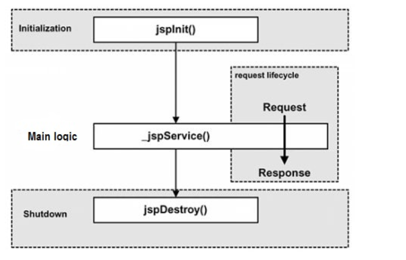

本文主要围绕如下几个方面?
1. 什么是JSP，它可以做什么及其它的生命周期是什么
2. JSP的九大内置对象
3. JSP的四大作用域
<!--more-->

## 什么是JSP，它可以做什么
JSP是Java Server Page的缩写，翻译过来的意思是Java服务器页面。

**它可以做什么呢?**
(1)处理表单提交;
(2)数据渲染;
(3)页面逻辑处理;

一句话，只有想不到没有做不到。

比如html+js+JavaWeb结合一起开发，这样开发的好处在于可以前后端分离，不必担心像jsp那样，页面上全部都是<%%>之类的标签，年头久了，会增加维护的困难。当然了，之所以维护困难，也是因为开发者没有约定好一些规范。使用html+js+JavaWeb一套，比较麻烦的就是需要写较多的js，js是一个让人又爱又恨的家伙。让人爱，是因为它很强大可以做很多事情，让人恨是因为，一旦开发者粗心一点，就会报错，一旦报错就得浏览器调试，有的时候还得考虑浏览器缓存问题，比如明明已经改了但是还是报错，这时清理一下浏览器缓存就好。

**JSP的生命周期**
(1)servlet容器编译Servlet源文件，生成Servlet类(**编译阶段**);
(2)加载与JSP对应的Servlet类，创建其实例，并调用它的初始化方法(**初始化阶段**);
(3)调用与JSP对应的Servlet实例的服务方法(**执行阶段**);
(4)调用与JSP对应的Servlet实例的销毁方法，然后销毁Servlet实例(**销毁阶段**);

如图所示(图更能生动的表现):



## JSP的九大内置对象

### request对象
request 对象是 javax.servlet.httpServletRequest类型的对象。 该对象代表了客户端的请求信息，主要用于接受通过HTTP协议传送到服务器的数据。（包括头信息、系统信息、请求方式以及请求参数等）。request对象的作用域为一次请求。

*request的应用场景有哪些?*
(1)接收参数
(2)设置编码(比如jsp中post请求乱码)
(3)页面转发

简单举个例子:
login.jsp
```
<%@ page language="java" contentType="text/html; charset=UTF-8"
    pageEncoding="UTF-8"%>
<!DOCTYPE html PUBLIC "-//W3C//DTD HTML 4.01 Transitional//EN" "http://www.w3.org/TR/html4/loose.dtd">
<html>
<head>
<meta http-equiv="Content-Type" content="text/html; charset=UTF-8">
<title>Insert title here</title>
</head>
<body>
<form action="login_handle.jsp" method="post">
	用户名:<input type="text" name="username">
	<br/>
	密码:<input type="password" name="password">
    <br/>
    <input type="submit" value="登录">
</form>
</body>
</html>

```

login_hanglde.jsp:
```
<%@ page language="java" contentType="text/html; charset=UTF-8"
    pageEncoding="UTF-8"%>
<!DOCTYPE html PUBLIC "-//W3C//DTD HTML 4.01 Transitional//EN" "http://www.w3.org/TR/html4/loose.dtd">
<html>
<head>
<meta http-equiv="Content-Type" content="text/html; charset=UTF-8">
<title>Insert title here</title>
</head>
<body>
<%
request.setCharacterEncoding("UTF8");
String username = request.getParameter("username");
String password = request.getParameter("password");

out.println("username:"+username);
out.println("password:"+password);
%>
</body>
</html>

```
从上面例子可以看到request.getParameter主要用于接收数据，而其中的request.setCharacterEncoding("UTF8")用来修正字符编码。

关于request，我认为有必要看看看它的源码实现，首先基于request对象属于HttpServletRequest类型的对象，所以我们要看源码的话就先去看HttpServletRequest的源码。在这里我就不列出源码了，大家可以自己去看，特别是使用maven来构建项目的，阅读源码更加方便。


### response对象
response 代表的是对客户端的响应，主要是将JSP容器处理过的对象传回到客户端。response对象也具有作用域，它只在JSP页面内有效。

*response对象的应用场景有哪些?*
(1)重定向
(2)刷新页面

在这里我要说下面试常考题之一:

重定向：
　　(1)发送了一次新的请求，之前的数据是不存在的，发生在客户端
　　(2)浏览器的地址是重定向的页面的地址

转发：
　　(1)没有开启新的请求，原来请求的数据一并传递过来，发生在服务器端。
　　(2)浏览器的地址栏不会发生改变

建议还不明白的可以自己可以写一个简单的例子，其实以我上面的例子就可以比较出去，只需在login_handle.jsp中的<%%>里面添加如下代码即可比较出来:
```
response.sendRedirect("index.jsp");
request.getRequestDispatcher("index.jsp").forward(request, response);

```
注意:如果要以转发做实验，请注释掉重定向，如果以重定向做实验请注释掉转发。

### session对象
session 对象是由服务器自动创建的与用户请求相关的对象。服务器为每个用户都生成一个session对象，用于保存该用户的信息，跟踪用户的操作状态。session对象内部使用Map类来保存数据，因此保存数据的格式为 “Key/value”。 session对象的value可以使复杂的对象类型，而不仅仅局限于字符串类型。

session与cookie是web开发常用的，通常像cookie的话，以电商项目为例，用作购物车比较多，但是像保存用户关键信息的话还是用session比较靠谱。

关于session会话，个人建议最好自己模拟一个登陆，然后用户在里面实现好几个页面跳转等之类的，这样能够更好的理解这个会话。

### application对象
application 对象可将信息保存在服务器中，直到服务器关闭，否则application对象中保存的信息会在整个应用中都有效。与session对象相比，application对象生命周期更长，类似于系统的“全局变量”。

*应用场景如下:*
(1)统计网站访问量;
(2)解决硬编码问题;

举个例子说明一下:
common.jsp
```
<%@page import="cn.jdbc.simple.UserServiceImpl"%>
<%@page import="cn.jdbc.simple.UserService"%>
<%@ page language="java" contentType="text/html; charset=UTF-8"
    pageEncoding="UTF-8"%>
<%! int i;  
    %>  
    <!-- 将i值自加后放入application的变量内 -->  
    <%application.setAttribute("counter",String.valueOf(++i));%>  
    <!-- 直接输出application变量值 -->  
    <%=application.getAttribute("counter") %> 

```
将common.jsp引进任意一个jsp，最好是首页index.jsp。

只需将如下代码
```
 <%=application.getAttribute("counter") %> 

```

引入其它页面即可实现实时统计

### out对象
out 对象用于在Web浏览器内输出信息，并且管理应用服务器上的输出缓冲区。在使用 out 对象输出数据时，可以对数据缓冲区进行操作，及时清除缓冲区中的残余数据，为其他的输出让出缓冲空间。待数据输出完毕后，要及时关闭输出流。

### pageContext对象
pageContext 对象的作用是取得任何范围的参数，通过它可以获取 JSP页面的out、request、reponse、session、application 等对象。pageContext对象的创建和初始化都是由容器来完成的，在JSP页面中可以直接使用 pageContext对象。
例如:
```
<%
    String path = request.getContextPath();
    String basePath = request.getScheme()+"://"+request.getServerName()+":"+request.getServerPort()+path+"/";
%>

```

*应用场景*
获取项目路径，主要用于解决路径问题

### config对象
config 对象的主要作用是取得服务器的配置信息。通过 pageConext对象的 getServletConfig() 方法可以获取一个config对象。当一个Servlet 初始化时，容器把某些信息通过config对象传递给这个 Servlet。 开发者可以在web.xml 文件中为应用程序环境中的Servlet程序和JSP页面提供初始化参数。
*应用场景*
获取配置信息


### page对象
page 对象代表JSP本身，只有在JSP页面内才是合法的。 page隐含对象本质上包含当前 Servlet接口引用的变量，类似于Java编程中的 this 指针。

### exception对象
exception 对象的作用是显示异常信息，只有在包含 isErrorPage="true" 的页面中才可以被使用，在一般的JSP页面中使用该对象将无法编译JSP文件。excepation对象和Java的所有对象一样，都具有系统提供的继承结构。exception 对象几乎定义了所有异常情况。在Java程序中，可以使用try/catch关键字来处理异常情况； 如果在JSP页面中出现没有捕获到的异常，就会生成 exception 对象，并把 exception 对象传送到在page指令中设定的错误页面中，然后在错误页面中处理相应的 exception 对象。

举例说明:
test.jsp
```

<%@page import="cn.jdbc.simple.User"%>
<%@page import="java.util.List"%>
<%@ page language="java" contentType="text/html; charset=UTF-8"
    pageEncoding="UTF-8" errorPage="error.jsp"%>
<!DOCTYPE html PUBLIC "-//W3C//DTD HTML 4.01 Transitional//EN" "http://www.w3.org/TR/html4/loose.dtd">
<html>
<head>
<meta http-equiv="Content-Type" content="text/html; charset=UTF-8">
<title>Insert title here</title>
</head>
<body>
<%
     	System.out.println(100/0);
      %>

</body>
</html>

```

error.jsp
```
<%@ page language="java" contentType="text/html; charset=UTF-8"
    pageEncoding="UTF-8" isErrorPage="true"%>
<!DOCTYPE html PUBLIC "-//W3C//DTD HTML 4.01 Transitional//EN" "http://www.w3.org/TR/html4/loose.dtd">
<html>
<head>
<meta http-equiv="Content-Type" content="text/html; charset=UTF-8">
<title>Insert title here</title>
</head>
<body>
异常信息：<%=exception.getMessage() %><br>
  异常信息String描述：<%=exception.toString() %>
</body>
</html>

```

## JSP的四大作用域

### page作用域
代表变量只能在当前页面上剩下些

### request作用域
代表变量能在一次请求中生效，一次请求可能包含一个页面，也可能包含多个页面，比如页面A请求转发页面B

### session作用域
代表变量能在一次会话中生效，基本上就是能在web下项目下都有效，session的使用与cookie也有很大关系，一般来说，只要浏览器不关闭，cookie就会一直生效，cookie生效，session的使用就不会受到影响

### application作用域
代表变量能在一个应用下(多个会话)，在服务器下的多个项目之间都能够使用。

参考资料如下:
[jsp 九大内置对象和其作用详解](https://www.cnblogs.com/leirenyuan/p/6016063.html)
[jsp菜鸟教程](https://www.runoob.com/jsp/jsp-tutorial.html)

