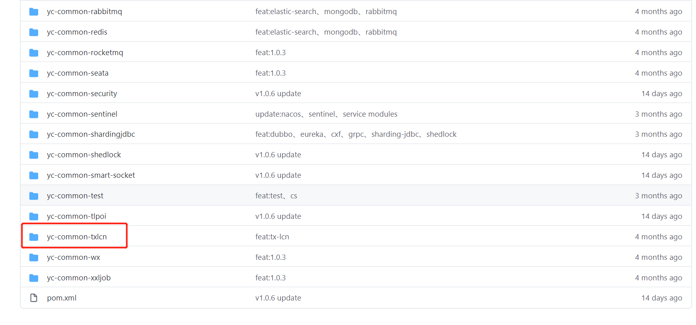

## 一、Tx-LCN是什么？
TX-LCN分布式事务框架，LCN并不生产事务，LCN只是本地事务的协调工，LCN是一个高性能的分布式事务框架，兼容Dubbo、SpringCloud框架，支持RPC框架拓展，支持各种ORM框架、NoSQL、负载均衡、事务补偿。
<!--more-->

## 二、Tx-LCN有哪些特性？
- 1、一致性，通过TxManager协调控制与事务补偿机制确保数据一致性；
- 2、易用性，仅需要在业务方法上添加@TxTransaction注解即可；
- 3、高可用，项目模块不仅可高可用部署，事务协调器也可集群化部署；
- 4、扩展性，支持各种RPC框架扩展，支持通讯协议与事务模式扩展。

## 三、Tx-LCN的事务控制原理是什么？

**核心步骤如下:**

**1.创建事务组**
是指在事务发起方开始执行业务代码之前先调用TxManager创建事务组对象，然后拿到事务标示GroupId的过程。

**2.加入事务组**
添加事务组是指参与方在执行完业务方法以后，将该模块的事务信息通知给TxManager的操作。

**3.通知事务组**
是指在发起方执行完业务代码以后，将发起方执行结果状态通知给TxManager,TxManager将根据事务最终状态和事务组的信息来通知相应的参与模块提交或回滚事务，并返回结果给事务发起方。

## 四、我在实际中如何应用Tx-LCN？
我之前写过有关于Tx-LCN的一些文章，文章列表如下:
[TX-LCN分布式事务框架使用](https://youcongtech.com/2020/09/19/TX-LCN%E5%88%86%E5%B8%83%E5%BC%8F%E4%BA%8B%E5%8A%A1%E6%A1%86%E6%9E%B6%E4%BD%BF%E7%94%A8/)

[LCN 错误: attempts to join the non-existent transaction group](https://youcongtech.com/2020/09/22/LCN-%E9%94%99%E8%AF%AF-attempts-to-join-the-non-existent-transaction-group/)

[There is no normal TM](https://youcongtech.com/2020/09/22/There-is-no-normal-TM/)

## 五、我个人自研的YC-Framework是否支持Tx-LCN?
当然支持，YC-Framework已经很好封装了，如图所示:

源代码示例如下:
https://github.com/developers-youcong/yc-framework/tree/main/yc-example/yc-example-txlcn
