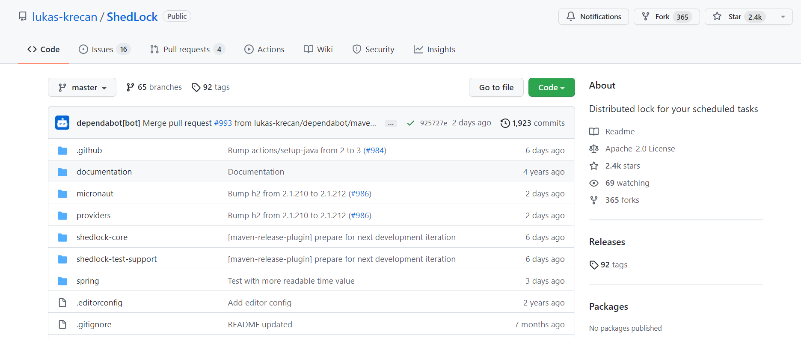

## 一、什么是ShedLock?
ShedLock是一个在分布式环境中使用的定时任务框架，用于解决在分布式环境中的多个实例的相同定时任务在同一时间点重复执行的问题，解决思路是通过对公用的数据库中的某个表进行记录和加锁，使得同一时间点只有第一个执行定时任务并成功在数据库表中写入相应记录的节点能够成功执行而其他节点直接跳过该任务。目前所支持的已经不仅仅只是数据库，还包括MongoDB、Zookeeper、Redis、Hazelcast、Couchbase、ElasticSearch、Neo4j、Etcd等。
<!--more-->


## 二、ShedLock的组成部分有哪些？
一共三部分，分别为如下:

- 1.核心：锁定机制；
- 2.集成：使用 Spring AOP、Micronaut AOP 或手动代码与你的应用程序集成；
- 3.锁提供者：使用 SQL 数据库、Mongo、Redis 等外部进程提供锁。

## 三、ShedLock的开源情况如何？


从上图所见，该开源贡献者每隔一段时间，就会提交代码，修复问题或新增功能，属于比较活跃的那种，可以作为分布式定时任务的技术选型。

## 四、ShedLock的原理是怎样的？
这些图，十分清晰易懂！！！

### 1.基于DB


### 2.基于Redis


### 3.基于Zookeeper


## 五、使用

### 1.导入Maven依赖
```
<!-- 分布式定时任务锁 -->
   <!-- https://mvnrepository.com/artifact/net.javacrumbs.shedlock/shedlock-spring -->
   <dependency>
       <groupId>net.javacrumbs.shedlock</groupId>
       <artifactId>shedlock-spring</artifactId>
       <version>4.0.4</version>
   </dependency>
   <!-- 使用redis做分布式任务 -->
   <dependency>
       <groupId>net.javacrumbs.shedlock</groupId>
       <artifactId>shedlock-provider-redis-spring</artifactId>
       <version>2.5.0</version>
   </dependency>
   <!-- redis组件 -->
   <dependency>
       <groupId>org.springframework.boot</groupId>
       <artifactId>spring-boot-starter-data-redis</artifactId>
   </dependency>

```

### 2.编写配置类
```
@Configuration
@EnableSchedulerLock(defaultLockAtMostFor = "PT30M")
public class ShedLockConfig {

    @Bean
    public LockProvider lockProvider(RedisTemplate redisTemplate) {
        return new RedisLockProvider(redisTemplate.getConnectionFactory());

    }

}

```

### 3.编写具体定时任务
```
@Component
public class TaskSchedule {

    /**
     * 每分钟执行一次
     * [秒] [分] [小时] [日] [月] [周] [年]
     */
    @Scheduled(cron = "1 * * * * ?")
    @SchedulerLock(name = "synchronousSchedule")
    public void SynchronousSchedule() {
        
        System.out.println("Start run schedule to synchronous data:" + new Date());

    }
}

```

我个人自创的[分布式微服务框架](https://mp.weixin.qq.com/s?__biz=MzUxODk0ODQ3Ng==&mid=2247485813&idx=1&sn=daa6e8447409672c28f07dbe094c4f28&chksm=f9805a66cef7d37061b15154a900c840da4bfdedd77cd0ea5865aee740bd1f2c01bb5cc37127&scene=21#wechat_redirect)已经集成ShedLock，感兴趣的朋友，可以研究学习，代码样例地址为:
https://github.com/developers-youcong/yc-framework/tree/main/yc-example/yc-example-shedlock


