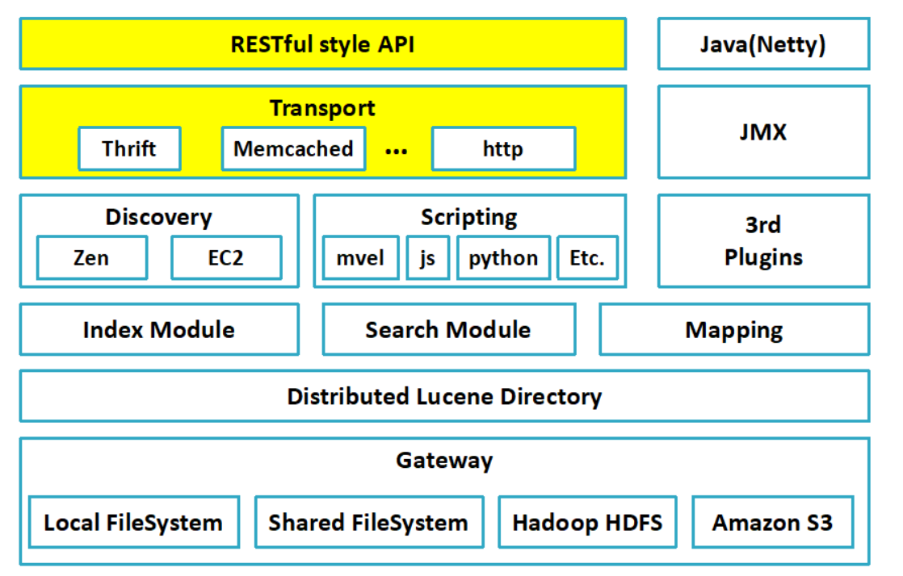

## 一、什么是Elastic Search?
Elasticsearch 是一个分布式、RESTful 风格的搜索和数据分析引擎，能够解决不断涌现出的各种用例。 作为 Elastic Stack 的核心，它集中存储您的数据，帮助您发现意料之中以及意料之外的情况。
<!--more-->

## 二、使用Elastic Search能解决哪些问题？
换句话说，它的应用场景是什么，我归类如下8类:

- 1.维基百科；
- 2.国内外新闻；
- 3.论坛
- 4.GitHub众多的代码仓库；
- 5.日志数据采集与分析；
- 6.站内搜索；
- 7.BI系统；
- 8.电商网站。

## 三、Elastic Search架构原理图


## 四、安装Elastic Search

### 1.去官网下载elastic-search安装包并上传到Linux上

### 2.解压
```
tar -xzvf elasticsearch-7.4.0-linux-x86_64.tar.gz


```

### 3.启动
```
cd /home/tech/elasticsearch-7.4.0
./elasticsearch -d


```

### 五、整合样例(基于SpringBoot整合Elastic-Search)

#### 1.导入Maven依赖
```
<dependency>
    <groupId>org.springframework.boot</groupId>
    <artifactId>spring-boot-starter-data-elasticsearch</artifactId>
</dependency>

```

#### 2.配置文件
```
# Tomcat
server:
  tomcat:
    uri-encoding: UTF-8
    #最小线程数
    min-spare-threads: 500
    #最大线程数
    max-threads: 2500
    #最大连接数
    max-connections: 5000
    #最大等待队列长度
    accept-count: 1000
    #请求头最大长度kb
    max-http-header-size: 1048576
    #启动APR(非阻塞IO)
    protocol: org.apache.coyote.http11.Http11AprProtocol
  port: 7012

# Spring
spring:
  application:
    # 应用名称
    name: elastic-search-demo
  elasticsearch:
    rest:
      uris: http://127.0.0.1:9200

```


#### 3.核心配置类
```
@Configuration
public class ElasticsearchRestTemplateConfig extends AbstractElasticsearchConfiguration {
    @Value("${spring.elasticsearch.rest.uris}")
    private String uris;

    @Override
    public RestHighLevelClient elasticsearchClient() {
        ClientConfiguration configuration = ClientConfiguration.builder()
                .connectedTo(uris)
                .build();
        return RestClients.create(configuration).rest();
    }
}

```

#### 4.相关代码

**PostEntity.java**
```
@Data
@EqualsAndHashCode(callSuper = false)
//indexName 索引库名次，mysql中数据库的概念
//type 类型
//shards 默认分片数
//replicas 默认副本数量
@Document(indexName = "cms", type = "post", shards = 1, replicas = 0)
public class PostEntity implements Serializable {

    private static final long serialVersionUID = -1L;

    @Id
    private String ID;

    @Field(type = FieldType.Keyword)
    private String postTitle;

    @Field(type = FieldType.Keyword)
    private String postAuthor;

}

```


**PostRepository.java**
```
@Repository
public interface PostRepository extends ElasticsearchRepository<PostEntity, String> {
}

```

**PostController.java**
```
@RestController
public class PostController {

    @Autowired
    private PostRepository postRepository;

    @GetMapping("/add")
    public PostEntity add() {
        PostEntity entity = new PostEntity();
        entity.setID("1");
        entity.setPostAuthor("yc");
        entity.setPostTitle("it is a test");
        return postRepository.save(entity);
    }

    @GetMapping("/del")
    public void del(String ID) {
        postRepository.deleteById(ID);
    }

    @GetMapping("/list")
    public Iterable<PostEntity> list() {
        return postRepository.findAll();
    }
}

```