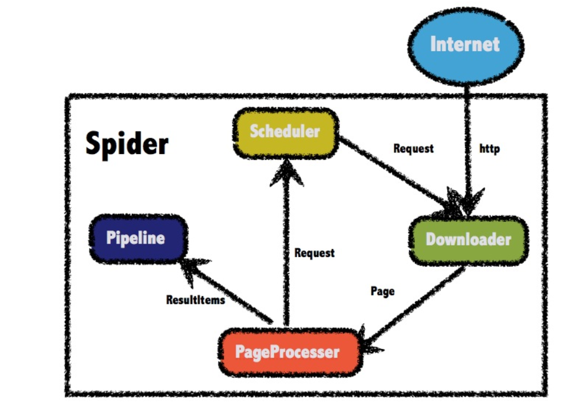
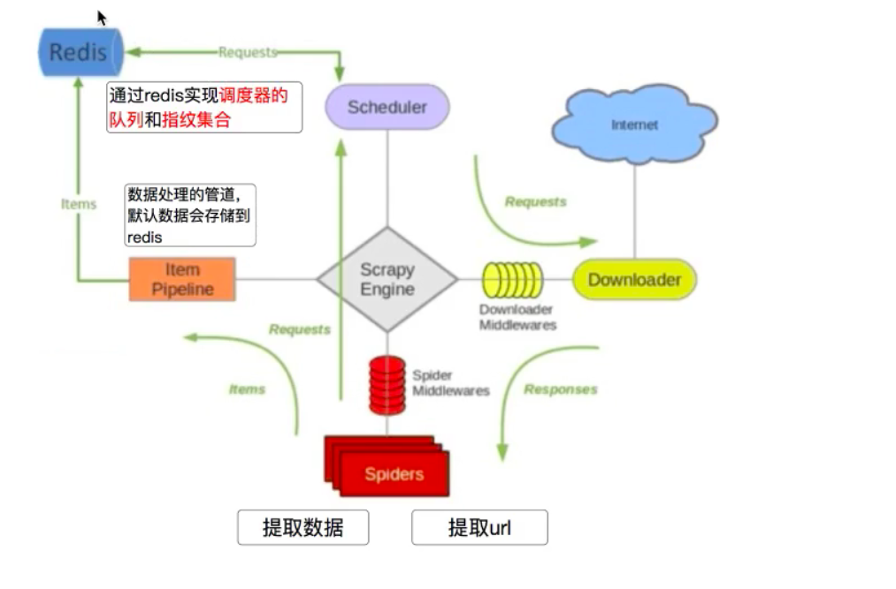

## 一、WebMagic是什么？
WebMagic是一个简单灵活的Java爬虫框架。基于WebMagic，你可以快速开发出一个高效、易维护的爬虫。
<!--more-->

## 二、它的特性有哪些？
- 1.简单的API，可快速上手；
- 2.模块化的结构，可轻松扩展；
- 3.提供多线程和分布式支持。

## 三、关于它的相关资料有哪些？
官方文档：http://webmagic.io/docs/zh/

源代码地址:
https://git.oschina.net/flashsword20/webmagic
https://github.com/code4craft/webmagic


## 四、它的总体架构是什么？


## 四、案例
以爬取博客园文章为例，核心代码如下:
```
import com.blog.springboot.dto.CnBlogModelDTO;
import us.codecraft.webmagic.Page;
import us.codecraft.webmagic.Site;
import us.codecraft.webmagic.Spider;
import us.codecraft.webmagic.pipeline.ConsolePipeline;
import us.codecraft.webmagic.processor.PageProcessor;
import us.codecraft.webmagic.selector.Selectable;


public class WebMagicJunitTest implements PageProcessor {
    private Site site = Site.me()
            .setDomain("https://www.cnblogs.com/")
            .setSleepTime(1000)
            .setUserAgent("Mozilla/5.0 (Windows NT 10.0; Win64; x64) AppleWebKit/537.36 (KHTML, like Gecko) Chrome/67.0.3396.99 Safari/537.36");


    @Override
    public void process(Page page) {


        Selectable obj = page.getHtml().xpath("//div[@class='post']");
        Selectable title = obj.xpath("//h1[@class='postTitle']//a");
        Selectable content = obj.xpath("//div[@class='blogpost-body']");

        System.out.println("title:" + title.replace("<[^>]*>", ""));
        System.out.println("content:" + content);


    }

    @Override
    public Site getSite() {
        return site;
    }


    public static void importSinglePost(String url) {
        Spider.create(new WebMagicJunitTest())
                .addUrl(url)
                .addPipeline(new ConsolePipeline())
                .run();
    }
    public static void main(String[] args) {

        WebMagicJunitTest.importSinglePost("https://www.cnblogs.com/youcong/p/9404007.html");
    }

```

## 五、如何实现分布式爬取？

分布式爬虫原理架构图如下:


WebMagic开源作者在2013年的时候就已经给出基于WebMagic实现分布式爬虫的核心代码了，如下所示:
```
<!-- lang: java -->
public class RedisScheduler implements Scheduler{

    private JedisPool pool;

    private static final String QUEUE_PREFIX = "queue_";

    private static final String SET_PREFIX = "set_";

    public RedisScheduler(String host){
        pool = new JedisPool(new JedisPoolConfig(), host);
    }

    @Override
    public void push(Request request, Task task) {
        Jedis jedis = pool.getResource();
          //使用SortedSet进行url去重
        if (jedis.zrank(SET_PREFIX+task.getUUID(),request.getUrl())==null){
            //使用List保存队列
            jedis.rpush(QUEUE_PREFIX+task.getUUID(),request.getUrl());
            jedis.zadd(SET_PREFIX+task.getUUID(),System.currentTimeMillis(),request.getUrl());
        }
    }

    @Override
    public Request poll(Task task) {
        Jedis jedis = pool.getResource();
        String url = jedis.lpop(QUEUE_PREFIX+task.getUUID());
            if (url==null) {
                return null;
            }
        return new Request(url);
    }
}

```

## 六、我对爬虫的一些思考
以前写过这样的文章[爬虫与反爬虫策略思考](https://mp.weixin.qq.com/s?__biz=MzUxODk0ODQ3Ng==&mid=2247485781&idx=1&sn=8fe614256137e36b6f4defd06eca0e62&chksm=f9805a46cef7d350915b60efa281b92ef6b3c94cd769867ec8ec73ecc583e769f9ec16f76b71&token=143028030&lang=zh_CN#rd)，大家不妨读一读，读完以后，我相信你会对爬虫和反爬虫有更深入的认识。
