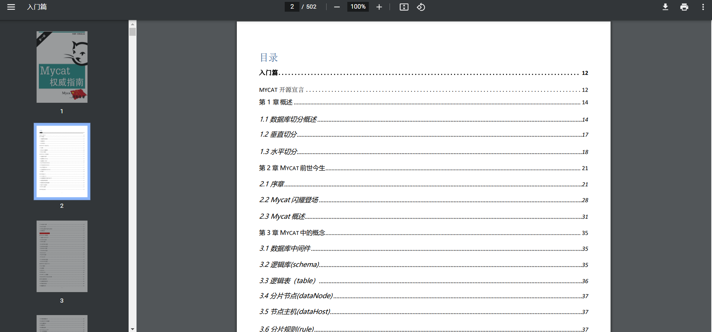

## 一、什么是分库分表?
分库分表就是按照一定的规则，对原有的数据库和表进行拆分，把原本存储于一个库的数据分块存储到多个库上，把原本存储于一个表的数据分块存储到多个表上。
<!--more-->

## 二、为什么要分库分表？
随着时间和业务的发展，数据库中的数据量增长是不可控的，库和表中的数据会越来越大，随之带来的是更高的磁盘、IO、系统开销，甚至性能上的瓶颈，而一台服务的资源终究是有限的，因此需要对数据库和表进行拆分，从而更好的提供数据服务。


## 三、分库分表的方式有哪些？
- 1.垂直分库分表；
- 2.水平分库分表。


### 1.垂直分库分表


#### (1)定义
垂直划分数据库是根据业务进行划分，例如将商品库中涉及商品、订单、用户的表分别划分出成一个库，通过降低单库（表）的大小来提高性能，但这种方式并没有解决高数据量带来的性能损耗。同样的，分表的情况就是将一个大表根据业务功能拆分成一个个子表，例如用户表可根据业务分成基本信息表和详细信息表等。

#### (2)优缺点分析
**优点：**

- a.拆分后业务清晰，达到专库专用。
- b.可以实现热数据和冷数据的分离，将不经常变化的数据和变动较大的数据分散再不同的库/表中。
- c.便于维护

**缺点：**

- a.不解决数据量大带来的性能损耗，读写压力依旧很大
- b.不同的业务无法跨库关联（join），只能通过业务来关联

### 3.水平分库分表

#### (1)定义
水平划分是根据一定规则，例如时间或id序列值等进行数据的拆分。比如根据年份来拆分不同的数据库。每个数据库结构一致，但是数据得以拆分，从而提升性能。又比如根据用户id的值，根据规则分成若干个表。每个表结构一致。

#### (2)优缺点分析
**优点：**

- a.单库（表）的数据量得以减少，提高性能
- b.提高了系统的稳定性和负载能力
- c.切分出的表结构相同，程序改动较少


**缺点：**

- a.拆分规则较难抽象
- b.数据分片在扩容时需要迁移
- c.维护量增大
- d.依然存在跨库无法join等问题，同时涉及分布式事务，数据一致性等问题。


## 四、什么是MyCat?
MyCat是一个开源的分布式数据库系统，是一个实现了MySQL协议的服务器，前端用户可以把它看作是一个数据库代理，用MySQL客户端工具和命令行访问，而其后端可以用MySQL原生协议与多个MySQL服务器通信，也可以用JDBC协议与大多数主流数据库服务器通信，其核心功能是分表分库，即将一个大表水平分割为N个小表，存储在后端MySQL服务器里或者其他数据库里。

## 五、MyCat相关参考资料
MyCat官网: 
http://www.mycat.org.cn/

MyCat文档(支持在线阅读): 
http://dl.mycat.org.cn/mycat-definitive-guide.pdf

MyCat源代码: 
https://github.com/MyCATApache/Mycat-Server

MyCat问题列表: 
https://github.com/MyCATApache/Mycat-Server/issues

MyCat文件下载服务：
http://dl.mycat.org.cn/

虽然目前已经出了MyCat2.x版本，就于稳定性而言，我更倾向于MyCat1.x版本。

## 六、MyCat搭建

### 1.下载
```
wget http://dl.mycat.org.cn/1.6.7.6/20220221174943/Mycat-server-1.6.7.6-release-20220221174943-linux.tar.gz

```

### 2.解压
```
tar -xzvf Mycat-server-1.6.7.6-release-20220221174943-linux.tar.gz


```

### 3.启动
```
./mycat start

```

关于各种使用详情，这里不再说明，可访问如下网址获取文档:
http://dl.mycat.org.cn/mycat-definitive-guide.pdf

文档效果图:
