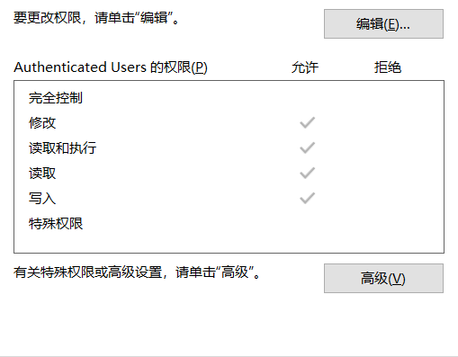
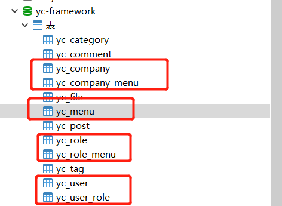

任何一套商业系统的设计都离不开权限管理模型的设计，不论是哪种设计，均可归纳为四种经典权限模型中（自主访问控制、强制访问控制、基于角色访问控制、基于属性访问控制等）。

从本质来说，无论哪种类型的权限管理模型均能抽象出三个基本的要素：用户(USER)、系统／应用(SYSTEM/APPLICATION)、策略(POLICY)。

<!--more-->

**相关术语补说明:**

- 1.用户：发起操作的主体；
- 2.对象：指操作所针对的客体对象，比如订单数据或数据文件；
- 3.角色：赋予用户某种身份；
- 4.权限控制表(ACL: Access Control List)：用来描述权限规则或用户和权限之间关系的数据表；
- 5.权限(Permission)：用来指代对某种对象的某一种操作，例如“添加文章的操作”；
- 6.权限标识：权限的代号，例如用“ARTICLE_ADD”来指代“添加文章”的操作权限。

## 一、经典的权限管理模型包含哪些？

### 1.自主访问控制（又称DAC）
自主访问控制(DAC: Discretionary Access Control)模型，系统会识别用户，然后根据被操作对象(Subject)的权限控制列表(ACL: Access Control List)或者权限控制矩阵(ACL: Access Control Matrix)的信息来决定用户是否能对其进行哪些操作，例如读取或修改。而拥有对象权限的用户，又可以将该对象的权限分配给其他用户，所以称之为“自主(Discretionary)”控制。

这种设计最常见的应用就是文件系统的权限设计，如微软的NTFS。

**示例如下:**

DAC最大的缺陷就是对权限控制比较分散，不便于管理，比如无法简单地对一组文件设置统一的权限并开放给指定的一群用户。

## 2.强制访问控制（MAC）
强制访问控制模型(MAC: Mandatory Access Control)，MAC是为了弥补DAC权限控制过于分散的问题而诞生的。在MAC的设计中，每一个对象都有一些权限标识，每个用户同样也会有一些权限标识，而用户能否对该对象进行操作取决于双方权限标识的关系，这个关系的判断通常是由系统硬性限制的。比如在影视作品中我们经常能看到特工在查询机密文件时，屏幕提示“无法访问，需要一级安全许可”。这个例子中，文件上就有“一级安全许可”的权限标识，而用户并不具有。
MAC非常适合机密机构或者其他等级观念强烈的行业，但对于类似商业服务系统，则因为不够灵活而不能适用。

## 3.基于角色访问控制（RBAC）
基于角色的访问控制模型(RBAC: Role-Based Access Control)，顾名思义，给用户定义角色，通过角色来控制权限。目前来说基于角色的访问控制模型是应用较广的一个，特别是To B方向 SAAS领域，应用尤其常见。

RBAC在发展过程中分为以下几个版本：RBAC0、RBAC1、RBAC2、RBAC3。RBAC1、RBAC2、RBAC3都是对RBAC0的扩展与补充，正因为有了RBAC1、RBAC2、RBAC3，RBAC才更加完善与强大。

### (1)RBAC1
RBAC1，基于RBAC0的优化，增加了角色的分层（即子角色），子角色可以继承父角色的所有权限。这种设计可以给角色分组和分层，一定程度简化了权限管理工作。

### (2)RBAC2
RBAC2，职责分离扩展版的RBAC，为了避免用户拥有过多权限而产生利益冲突。例如一个足球运动员同时拥有裁判的权限。

**职责分离有两种模式：**

- a.静态职责分离(Static Separation of Duty)：用户无法同时被赋予有冲突的角色。
- b.动态职责分离(Dynamic Separation of Duty)：用户在一次会话(Session)中不能同时激活自身所拥有的、互相有冲突的角色，只能选择其一。

### (3)RBAC3
RBAC3，最复杂也是最全面的RBAC模型，它在RBAC0的基础上，将 RBAC1和RBAC2中的优化部分进行了整合，可以认为是RBAC0、RBAC1、RBAC2的集大成者。

### 4.基于属性的访问控制模型（ABAC）
基于属性的访问控制模型(ABAC: Attribute-Based Access Control)，被一些人称为是权限系统设计的未来。
不同于常见的将用户通过某种方式关联到权限的方式，ABAC则是通过动态计算一个或一组属性是否满足某种条件来进行授权判断（可以编写简单的逻辑）。属性通常来说分为四类：用户属性（如用户年龄），环境属性（如当前时间），操作属性（如读取）和对象属性（如一篇文章，又称资源属性），所以理论上能够实现非常灵活的权限控制，几乎能满足所有类型的需求。

## 二、上述对应的权限管理模型有哪些开源项目可供参考的呢？

### 1.guns
Guns是一个现代化的Java应用开发基础框架，基于主流技术Spring Boot2，Guns的核心理念是提高开发人员开发效率，降低企业信息化系统的开发成本，提高企业开发人员水平。

Gitee地址：
https://gitee.com/stylefeng/guns

Github地址:
https://github.com/stylefeng/Guns

### 2.若依生态
若依生态涵盖从单体服务到分布式微服务。

Gitee地址：
https://gitee.com/y_project

### 3.renren-security
采用SpringBoot2、MyBatis-Plus、Shiro框架，开发的一套权限系统，极低门槛，拿来即用。设计之初，就非常注重安全性，为企业系统保驾护航，让一切都变得如此简单。

Gitee地址:
https://gitee.com/renrenio/renren-security

### 4.jeecg-boot
「企业级低代码平台」前后端分离架构SpringBoot 2.x，SpringCloud，Ant Design&Vue，Mybatis，Shiro，JWT。强大的代码生成器让前后端代码一键生成，无需写任何代码! 引领新的开发模式OnlineCoding->代码生成->手工MERGE，帮助Java项目解决70%重复工作，让开发更关注业务，既能快速提高效率，帮助公司节省成本，同时又不失灵活性。

Github地址:
https://github.com/jeecgboot/jeecg-boot

### 5.jeesite4
JeeSite 快速开发平台，不仅仅是一个后台开发框架，它是一个企业级快速开发解决方案，采用经典开发模式，提供 Spring Boot 在线代码生成功能。包括模块如：组织角色用户、菜单及按钮授权、数据权限、内容管理、工作流等。模块增减便捷；众多安全设置，密码策略；文件在线预览；消息推送；第三方登录；在线定时任务；支持集群、多租户、多数据源、读写分离、分库分表、Cloud 微服务，无用户限制。

Gitee地址:
https://gitee.com/thinkgem/jeesite4

上述基于Java生态热门的开源项目的权限管理设计均可作为参考对象，其中大多基于RBAC模型相关。

## 三、YC-Framework是基于怎样的权限模型呢？
YC-Framework主要基于RBAC模型，涉及相关表如下图所示:

分别涉及yc_company、yc_company_menu、yc_menu、yc_role、yc_role_menu、yc_user、yc_user_role等七张表。

**关于YC-Framework更多信息可访问官网了解：**
https://framework.youcongtech.com

## 四、Java生态中有哪些技术有助于实现权限模型？
如果是二次开发，可以参考前面的开源项目如guns、若依、renren-security、jeecg-boot、jeesite4等。

如果是从0到1的话，可以参考如下:

- 1.Spring Security。
- 2.Apache Shiro。
- 3.Sa-Token。
- 4.基于Java中的拦截器、过滤器自己写一个。
- 5.基于Spring AOP。

这五个均可在我的博客网站中找到，大家可根据自己需要查找：

**我主要的两个博客地址为：**

定期更新： https://youcongtech.com/

历史数据： https://www.cnblogs.com/youcong/
