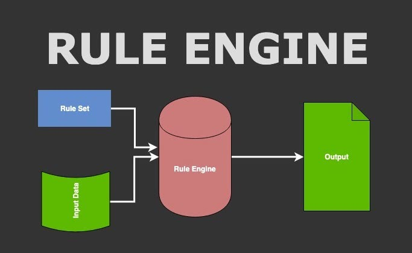
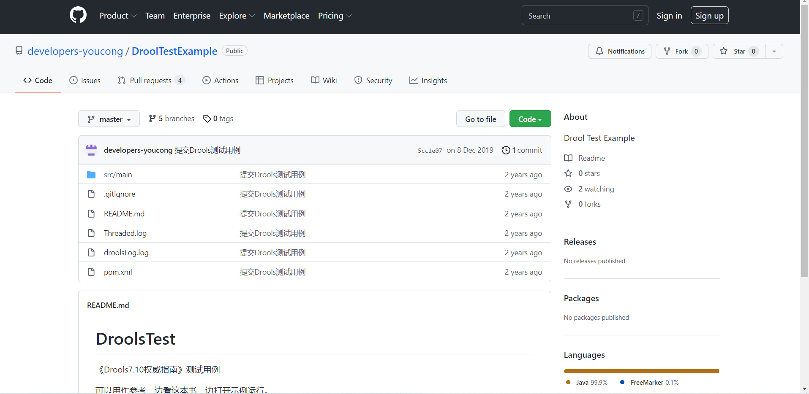

本文主要内容如下:

- 1.什么是规则引擎；
- 2.为什么要使用规则引擎；
- 3.规则引擎的应用场景有哪些；
- 4.规则引擎的技术选型有哪些；
- 5.规则引擎的原理又是怎样的；
- 6.我对规则引擎有哪些实践经验；
- 7.以Drools为例的代码示例；
- 8.总结。

<!--more-->

## 一、什么是规则引擎？
规则引擎是用于自动管理某些高度可变过程的模块，其基本概念包含将过程中涉及的对象与实现这些过程的逻辑分离。

逻辑通过编写规则进行定义。对于每个过程，规则引擎将识别要应用的规则以及要对其执行操作的对象。如果逻辑发生了变化，那么可以更改规则而不必干预系统体系结构。

简而言之，**规则引擎是一种可降低复杂业务逻辑组件复杂性、降低应用程序的维护和可扩展性成本的组件。**

## 二、为什么要使用规则引擎？
规则引擎可以很好地诠释一点，**“专业的人，做专业的事情”**(即业务人员和研发人员各司其职，各自做好在各自领域所擅长的事情)。

**除此之外，还有如下优点:**

- 1.业务规则与数据分离；
- 2.速度和可扩展性；
- 3.业务知识集中化；
- 4.解释能力；
- 5.可理解的规则。

缺点的话，我觉得最大的缺点:**“就是为了规则引擎而规则引擎，忽略真实的应用场景(是否刚需)。”**

## 三、规则引擎的应用场景有哪些？
- 1.流程分支非常复杂，规则变量庞大；
- 2.有不确定性的需求，变更频率较高；
- 3.需要快速做出响应和决策；
- 4.规则变更期望脱离于开发人员，脱离coding。

适用行业领域(很多领域)，例如工业、电商、金融证券、物联网、外卖等。

## 四、规则引擎的技术选型有哪些？
- Drools；
- Easy-Rules；
- QLExpress；
- Ilog JRules；
- OpenL Tablets；
- RuleBook；
- URule。

上述规则引擎的技术选型，大部分基于Java开源生态。从我个人的经验角度出发，规则引擎的技术选型我比较倾向于使用Drools。因为它符合我在[从单体架构到分布式微服务架构的思考](https://mp.weixin.qq.com/s?__biz=MzUxODk0ODQ3Ng==&amp;mid=2247485665&amp;idx=1&amp;sn=cc5ed01f671790ed9b3ac92a2f5c0aef&amp;chksm=f9805bf2cef7d2e4ed5ebda401c4e9dda708125ff6c0a77d77fe1a155666851e7e1ba0c3130c&token=1876237229&lang=zh_CN#rd)提到的需要注重的因素。

## 五、规则引擎的原理又是怎样的？


一句话描述:**即输入的数据匹配对应的规则、规则引擎处理、最终输出等**。

理解了这张图，如公司的性质不允许使用国外或其它公司的规则引擎框架的话，可自行编写规则引擎框架。因为所谓的规则引擎框架核心即两点:

- 1.规则与数据分离；
- 2.输入、处理、输出。

理解了这两点，开发起来并不难，难得是最终的处理效率(涉及性能，需要你懂一些算法和计算机相关的基础知识)。

## 六、我对规则引擎有哪些实践经验？
职业生涯中在三家公司进行实践:

- 1.创业公司基于智能酒店系统的优惠劵；
- 2.教育Saas公司中的培训机构的动态配置；
- 3.M2公司的多企业数据计算规则处理。


## 七、以Drools为例编写对应的示例
我个人开发的YC-Framework支持规则引擎，YC-Framework官方网站:
http://framework.youcongtech.com/#/

为了更好地让大家理解，这里提供了一个简单的代码例子(基于SpringBoot整合Drools)。

### 1.导入Maven依赖
```
<properties>
<drools.version>7.14.0.Final</drools.version>
</properties>

<!-- drools -->
<dependency>
    <groupId>org.drools</groupId>
    <artifactId>drools-compiler</artifactId>
    <version>${drools.version}</version>
</dependency>

```

### 2.编写配置类
```
package com.springcloud.blog.admin.config;

import org.kie.api.KieBase;
import org.kie.api.KieServices;
import org.kie.api.builder.*;
import org.kie.api.runtime.KieContainer;
import org.kie.api.runtime.KieSession;
import org.kie.internal.io.ResourceFactory;
import org.springframework.context.annotation.Bean;
import org.springframework.context.annotation.Configuration;
import org.springframework.core.io.Resource;
import org.springframework.core.io.support.PathMatchingResourcePatternResolver;
import org.springframework.core.io.support.ResourcePatternResolver;

import java.io.IOException;


@Configuration
public class KiaSessionConfig {

    private static final String RULES_PATH = "rules/";

    @Bean
    public KieFileSystem kieFileSystem() throws IOException {
        KieFileSystem kieFileSystem = getKieServices().newKieFileSystem();
        for (Resource file : getRuleFiles()) {
            kieFileSystem.write(ResourceFactory.newClassPathResource(RULES_PATH + file.getFilename(), "UTF-8"));
        }
        return kieFileSystem;
    }

    private Resource[] getRuleFiles() throws IOException {

        ResourcePatternResolver resourcePatternResolver = new PathMatchingResourcePatternResolver();
        final Resource[] resources = resourcePatternResolver.getResources("classpath*:" + RULES_PATH + "**/*.*");
        return resources;

    }

    @Bean
    public KieContainer kieContainer() throws IOException {

        final KieRepository kieRepository = getKieServices().getRepository();
        kieRepository.addKieModule(new KieModule() {
            public ReleaseId getReleaseId() {
                return kieRepository.getDefaultReleaseId();
            }
        });

        KieBuilder kieBuilder = getKieServices().newKieBuilder(kieFileSystem());
        kieBuilder.buildAll();
        return getKieServices().newKieContainer(kieRepository.getDefaultReleaseId());

    }

    private KieServices getKieServices() {
        return KieServices.Factory.get();
    }

    @Bean
    public KieBase kieBase() throws IOException {
        return kieContainer().getKieBase();
    }

    @Bean
    public KieSession kieSession() throws IOException {
        return kieContainer().newKieSession();
    }
}

```

### 3.编写实体类
```
package com.springcloud.blog.admin.drools;

public class People {
    private int sex;

    private String name;

    private String drlType;

    public int getSex() {
        return sex;
    }

    public void setSex(int sex) {
        this.sex = sex;
    }

    public String getName() {
        return name;
    }

    public void setName(String name) {
        this.name = name;
    }

    public String getDrlType() {
        return drlType;
    }

    public void setDrlType(String drlType) {
        this.drlType = drlType;
    }
}

```
### 4.resources目录新建rules目录

### 5.编写规则文件
```
package com.springcloud.blog.admin.drools
import com.springcloud.blog.admin.drools.People
dialect  "java"

rule "man"
    when
        $p : People(sex == 1 && drlType == "people")
    then
        System.out.println($p.getName() + "是男孩");
end

```

### 6.编写单元测试
```
package com.springcloud.blog.base.controller.test.task;

import com.springcloud.blog.admin.BlogAdminApplication;
import com.springcloud.blog.admin.drools.People;
import org.junit.Test;
import org.junit.runner.RunWith;
import org.kie.api.KieBase;
import org.kie.api.runtime.KieSession;
import org.springframework.beans.factory.annotation.Autowired;
import org.springframework.boot.test.context.SpringBootTest;
import org.springframework.test.context.junit4.SpringRunner;

@RunWith(SpringRunner.class)
@SpringBootTest(classes = BlogAdminApplication.class, webEnvironment = SpringBootTest.WebEnvironment.RANDOM_PORT)
public class DroolsJunitTest {

    @Autowired
    private KieSession session;

    @Test
    public void people() {

        People people = new People();
        people.setName("YC");
        people.setSex(1);
        people.setDrlType("people");
        session.insert(people);//插入
        session.fireAllRules();//执行规则
    }


}

```
最终输出结果:
```
YC是男孩

```

### 7.关于Drools相关资料分享


源代码:
https://github.com/developers-youcong/DroolTestExample

相关博客阅读笔记:
https://www.cnblogs.com/youcong/category/1223348.html

## 八、总结
编程的很多东西都是相通，理解了原理，不仅可以更好地利用轮子提高效率，还可以自造轮子避免被卡脖子(“科学无国界”仅仅是一句空话，打铁还需自身硬)。