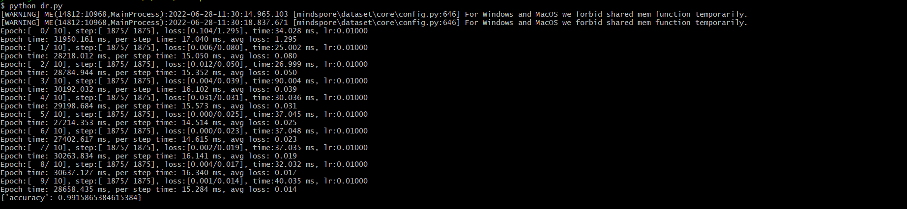
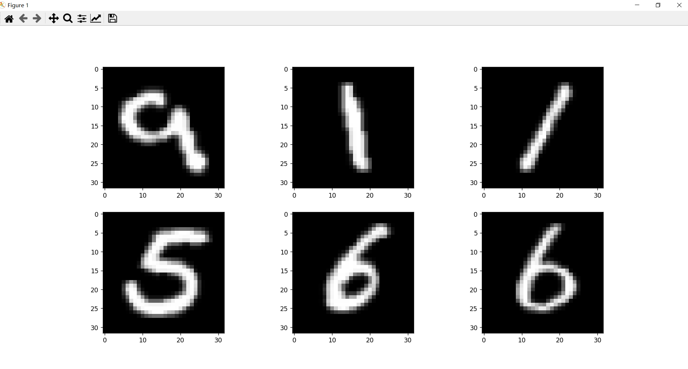

## 一、介绍
昇思MindSpore是一个全场景深度学习框架，旨在实现易开发、高效执行、全场景覆盖三大目标。

其中，易开发表现为API友好、调试难度低；高效执行包括计算效率、数据预处理效率和分布式训练效率；全场景则指框架同时支持云、边缘以及端侧场景。

<!--more-->

## 二、架构图


- 1.ModelZoo（模型库）：ModelZoo提供可用的深度学习算法网络，也欢迎更多开发者贡献新的网络(ModelZoo地址)。
- 2.Extend（扩展库）：昇思MindSpore的领域扩展库，支持拓展新领域场景，如GNN/深度概率编程/强化学习等，期待更多开发者来一起贡献和构建。
- 3.Science（科学计算）：MindScience是基于昇思MindSpore融合架构打造的科学计算行业套件，包含了业界领先的数据集、基础模型、预置高精度模型和前后处理工具，加速了科学行业应用开发（了解更多）。
- 4.Expression（全场景统一API）：基于Python的前端表达与编程接口。同时未来计划陆续提供C/C++、华为自研编程语言前端-仓颉（目前还处于预研阶段）等第三方前端的对接工作，引入更多的第三方生态。
- 5.Data（数据处理层）：提供高效的数据处理、常用数据集加载等功能和编程接口，支持用户灵活的定义处理注册和pipeline并行优化。
- 6.Compiler（AI编译器）：图层的核心编译器，主要基于端云统一的MindIR实现三大功能，包括硬件无关的优化（类型推导、自动微分、表达式化简等）、硬件相关优化（自动并行、内存优化、图算融合、流水线执行等）、部署推理相关的优化（量化、剪枝等）。
- 7.Runtime（全场景运行时）：昇思MindSpore的运行时系统，包含云侧主机侧运行时系统、端侧以及更小IoT的轻量化运行时系统。
- 8.Insight（可视化调试调优工具）：昇思MindSpore的可视化调试调优工具，能够可视化地查看训练过程、优化模型性能、调试精度问题、解释推理结果（了解更多)。
- 9.Armour（安全增强库）：面向企业级运用时，安全与隐私保护相关增强功能，如对抗鲁棒性、模型安全测试、差分隐私训练、隐私泄露风险评估、数据漂移检测等技术（了解更多）。

## 三、执行流程


## 四、设计理念
- 1.支持全场景协同
- 2.提供Python编程范式，简化AI编程
- 3.提供动态图和静态图统一的编码方式
- 4.采用函数式可微分编程架构，使用户聚焦于模型算法的数学原生表达
- 5.统一单机和分布式训练的编码方式

## 五、安装
```
pip install mindspore

```

验证是否安装成功：
```
import numpy as np
import mindspore.context as context
import mindspore.nn as nn
from mindspore import Tensor
from mindspore.ops import operations as P

context.set_context(mode=context.GRAPH_MODE, device_target="CPU")

class Mul(nn.Cell):
    def __init__(self):
        super(Mul, self).__init__()
        self.mul = P.Mul()

    def construct(self, x, y):
        return self.mul(x, y)

x = Tensor(np.array([1.0, 2.0, 3.0]).astype(np.float32))
y = Tensor(np.array([4.0, 5.0, 6.0]).astype(np.float32))

mul = Mul()
print(mul(x, y))

```

输出结果如下:
```
[ 4. 10. 18.]

```

## 六、手写数字识别

dr.py(包含下载数据集、创建模型、定义损失函数与优化器、训练及保存模型、加载模型等):
```

from mindvision.dataset import Mnist

from mindvision.classification.models import lenet

import mindspore.nn as nn

from mindspore.train.callback import ModelCheckpoint, CheckpointConfig

from mindvision.engine.callback import LossMonitor

from mindspore.train import Model

from mindspore import load_checkpoint, load_param_into_net

# 下载并处理MNIST数据集
download_train = Mnist(path="./mnist", split="train", batch_size=32, repeat_num=1, shuffle=True, resize=32, download=True)

download_eval = Mnist(path="./mnist", split="test", batch_size=32, resize=32, download=True)

dataset_train = download_train.run()
dataset_eval = download_eval.run()

network = lenet(num_classes=10, pretrained=False)

# 定义损失函数
net_loss = nn.SoftmaxCrossEntropyWithLogits(sparse=True, reduction='mean')

# 定义优化器函数
net_opt = nn.Momentum(network.trainable_params(), learning_rate=0.01, momentum=0.9)

# 设置模型保存参数，模型训练保存参数的step为1875
config_ck = CheckpointConfig(save_checkpoint_steps=1875, keep_checkpoint_max=10)

# 应用模型保存参数
ckpoint = ModelCheckpoint(prefix="lenet", directory="./lenet", config=config_ck)

# 初始化模型参数
model = Model(network, loss_fn=net_loss, optimizer=net_opt, metrics={'accuracy'})

# 训练网络模型，并保存为lenet-1_1875.ckpt文件
model.train(10, dataset_train, callbacks=[ckpoint, LossMonitor(0.01, 1875)])


acc = model.eval(dataset_eval)

print("{}".format(acc))

# 加载已经保存的用于测试的模型
param_dict = load_checkpoint("./lenet/lenet-1_1875.ckpt")
# 加载参数到网络中
load_param_into_net(network, param_dict)


```

输出结果如下:



verify_model.py(验证模型核心代码):
```
from mindvision.dataset import Mnist
import numpy as np
from mindspore import Tensor
import matplotlib.pyplot as plt
from mindspore.train import Model
from mindvision.classification.models import lenet
import mindspore.nn as nn

mnist = Mnist("./mnist", split="train", batch_size=6, resize=32)
dataset_infer = mnist.run()
ds_test = dataset_infer.create_dict_iterator()
data = next(ds_test)
images = data["image"].asnumpy()
labels = data["label"].asnumpy()

plt.figure()
for i in range(1, 7):
    plt.subplot(2, 3, i)
    plt.imshow(images[i-1][0], interpolation="None", cmap="gray")
plt.show()

network = lenet(num_classes=10, pretrained=False)

# 定义损失函数
net_loss = nn.SoftmaxCrossEntropyWithLogits(sparse=True, reduction='mean')

# 定义优化器函数
net_opt = nn.Momentum(network.trainable_params(), learning_rate=0.01, momentum=0.9)

# 使用函数model.predict预测image对应分类
model = Model(network, loss_fn=net_loss, optimizer=net_opt, metrics={'accuracy'})
output = model.predict(Tensor(data['image']))
predicted = np.argmax(output.asnumpy(), axis=1)


# 输出预测分类与实际分类
print(f'Predicted: "{predicted}", Actual: "{labels}"')


```
运行效果:


输出结果:
```
Predicted: "[9 6 6 4 4 9]", Actual: "[9 1 1 5 6 6]"

```
