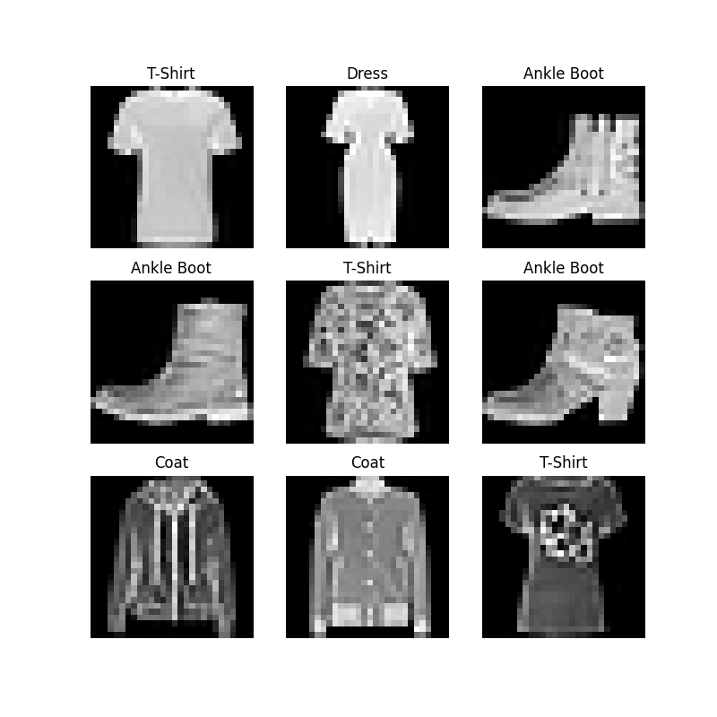

## 一、什么是Pytorch?
PyTorch是由Facebook开发，基于Torch开发，从并不常用的 Lua 语言转为Python语言开发的深度学习框架，Torch是TensorFlow开源前非常出名的一个深度学习框架，而PyTorch在开源后由于其使用简单，动态计算图的特性得到非常多的关注，并且成为了Tensorflow的 最大竞争对手。目前star已经57.5k。
<!--more-->

## 二、Pytorch与TensorFlow对比有哪些优点？
- 1.Pytorch学习曲线相对Tensorflow更简单。
- 2.Pytorch为动态图，可以随时改变模型，灵活且方便调试，而Tensorflow采用的是静态图，需要定义好之后调用session来执行图。
- 3.Pytorch可以用matplotlib进行数据的可视化化，而Tensorflow可以是用自带的工具TensorBoard可视化，可视化效果很好。

## 三、关于Pytorch的一些基础例子有哪些？
下面例子均来自[Pytorch官方文档](https://pytorch.org/)

pytorch_dd.py:
```
import torch
from torch.utils.data import Dataset
from torchvision import datasets
from torchvision.transforms import ToTensor
import matplotlib.pyplot as plt


training_data = datasets.FashionMNIST(
    root="data",
    train=True,
    download=True,
    transform=ToTensor()
)

test_data = datasets.FashionMNIST(
    root="data",
    train=False,
    download=True,
    transform=ToTensor()
)

labels_map = {
    0: "T-Shirt",
    1: "Trouser",
    2: "Pullover",
    3: "Dress",
    4: "Coat",
    5: "Sandal",
    6: "Shirt",
    7: "Sneaker",
    8: "Bag",
    9: "Ankle Boot",
}
figure = plt.figure(figsize=(8, 8))
cols, rows = 3, 3
for i in range(1, cols * rows + 1):
    sample_idx = torch.randint(len(training_data), size=(1,)).item()
    img, label = training_data[sample_idx]
    figure.add_subplot(rows, cols, i)
    plt.title(labels_map[label])
    plt.axis("off")
    plt.imshow(img.squeeze(), cmap="gray")
plt.show()

```

代码执行后，展示效果如下:

