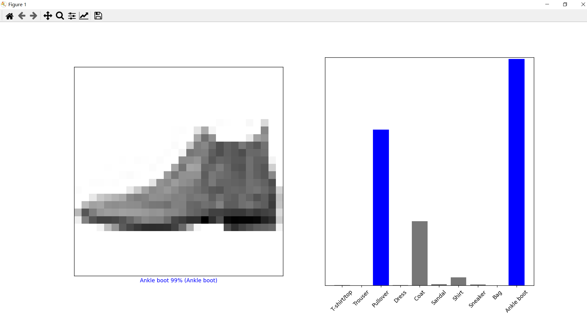
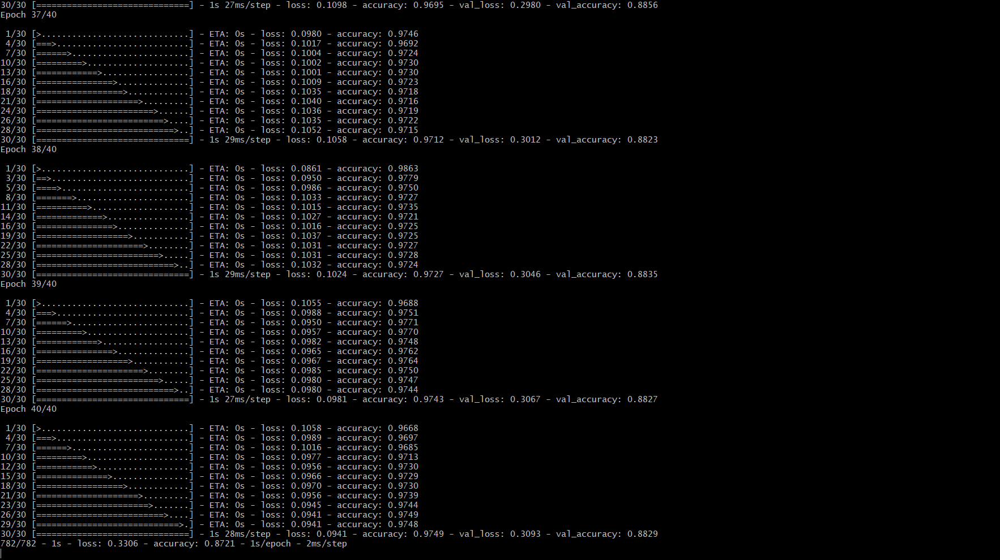
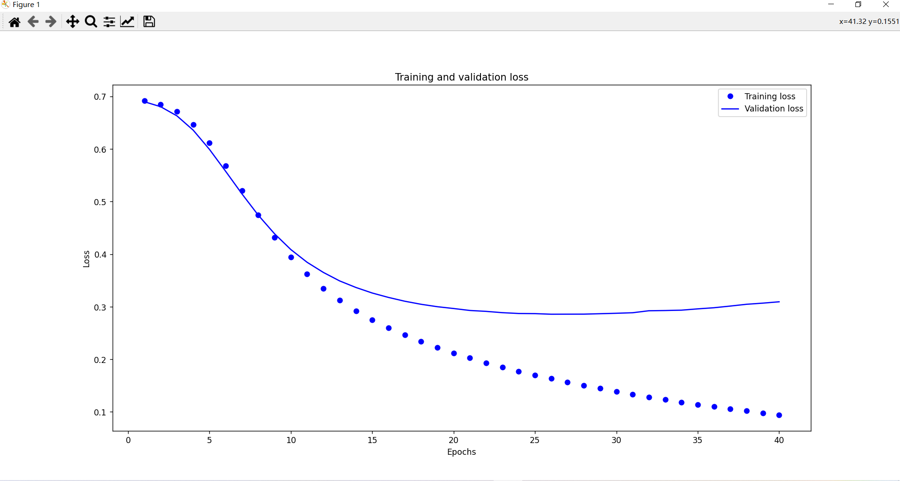
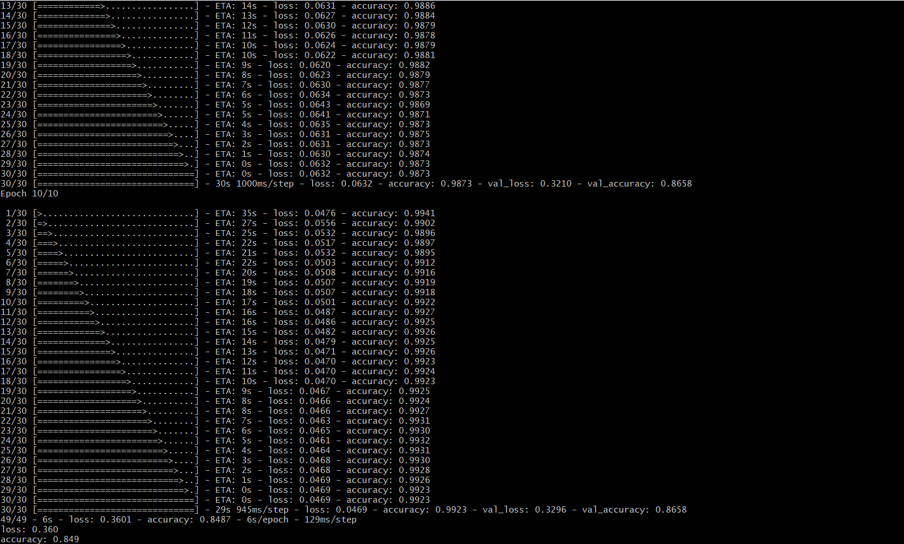

## 一、介绍
TensorFlow是用于机器学习的端到端开源平台。它拥有一个由 工具、 库和 社区资源组成的全面、灵活的生态系统，让研究人员能够推动 ML 的最新技术，开发人员可以轻松构建和部署基于 ML 的应用程序。

<!--more-->

TensorFlow最初是由Google机器智能研究组织内的Google Brain团队的研究人员和工程师开发的，用于进行机器学习和深度神经网络研究。该系统具有足够的通用性，也适用于各种其他领域。

TensorFlow提供稳定的Python和C++ API，以及对 其他语言的非保证向后兼容API。

## 二、安装

```
pip install tensorflow

```

或

```
pip install tensorflow-cpu

```

## 三、第一个例子

新建hello.py，内容如下：

```
import tensorflow as tf
import os

os.environ['TF_CPP_MIN_LOG_LEVEL'] = '2'
hello = tf.constant('Hello, TensorFlow!')
print(hello.numpy())

```

执行如下并输出对应的结果：

```
$ python hello.py
b'Hello, TensorFlow!'

```

## 四、Tensorflow相关资料
源代码：
https://github.com/tensorflow/tensorflow 
(包含Tensorflow各种各样的资料)


## 五、基本图像分类
参考资料链接(均来自官方网站，官方网站均有详细介绍，这里不再赘述)：
https://www.tensorflow.org/tutorials/keras/classification

以下核心Python代码(包含导入Fashion MNIST 数据集、预处理数据、构建模型、训练模型、进行预测、验证预测结果等)：

```

import tensorflow as tf
import matplotlib.pyplot as plt
import numpy as np
from tensorflow import keras

#导入 Fashion MNIST 数据集
fashion_mnist = keras.datasets.fashion_mnist
(train_images, train_labels), (test_images, test_labels) = fashion_mnist.load_data()

class_names = ['T-shirt/top', 'Trouser', 'Pullover', 'Dress', 'Coat',
'Sandal', 'Shirt', 'Sneaker', 'Bag', 'Ankle boot']

train_images.shape

#构建模型
model = keras.Sequential([

keras.layers.Flatten(input_shape=(28, 28)),

keras.layers.Dense(128, activation='relu'),

keras.layers.Dense(10)

])

#编译模型
model.compile(optimizer='adam',
loss=tf.keras.losses.SparseCategoricalCrossentropy(from_logits=True),
metrics=['accuracy'])

#向模型馈送数据
model.fit(train_images, train_labels, epochs=10)

#评估准确率
test_loss, test_acc = model.evaluate(test_images,  test_labels, verbose=2)
print('\nTest accuracy:', test_acc)


#进行预测
probability_model = tf.keras.Sequential([model,

tf.keras.layers.Softmax()])

predictions = probability_model.predict(test_images)

print(predictions[0])

def plot_image(i, predictions_array, true_label, img):

predictions_array, true_label, img = predictions_array, true_label[i], img[i]

plt.grid(False)

plt.xticks([])

plt.yticks([])

plt.imshow(img, cmap=plt.cm.binary)

predicted_label = np.argmax(predictions_array)

if predicted_label == true_label:

	color = 'blue'

else:

	color = 'red'


plt.xlabel("{} {:2.0f}% ({})".format(class_names[predicted_label],

100*np.max(predictions_array),

class_names[true_label]),

color=color)


def plot_value_array(i, predictions_array, true_label):

predictions_array, true_label = predictions_array, true_label[i]

plt.grid(False)

plt.xticks(range(10))

plt.yticks([])

thisplot = plt.bar(range(10), predictions_array, color="#777777")

plt.ylim([0, 1])

predicted_label = np.argmax(predictions_array)


thisplot[predicted_label].set_color('red')

thisplot[true_label].set_color('blue')

img = test_images[1]

print(img.shape)

img = (np.expand_dims(img,0))

print(img.shape)

predictions_single = probability_model.predict(img)

print(predictions_single)

#验证预测结果
i = 0

plt.figure(figsize=(6,3))

plt.subplot(1,2,1)

plot_image(i, predictions[i], test_labels,test_images)

plt.subplot(1,2,2)

plot_value_array(i, predictions[i],  test_labels)

plot_value_array(1, predictions_single[0], test_labels)

_ = plt.xticks(range(10), class_names, rotation=45)

plt.show()


```


运行效果图如下:




## 六、电影评论文本分类

text.py核心代码如下：

```

import tensorflow as tf

from tensorflow import keras

import numpy as np

import matplotlib.pyplot as plt

#下载数据集
imdb = keras.datasets.imdb
(train_data, train_labels), (test_data, test_labels) = imdb.load_data(num_words=10000)

# 探索数据
print("Training entries: {}, labels: {}".format(len(train_data), len(train_labels)))

# 一个映射单词到整数索引的词典
word_index = imdb.get_word_index()

# 保留第一个索引
word_index = {k:(v+3) for k,v in word_index.items()}
word_index["<PAD>"] = 0
word_index["<START>"] = 1
word_index["<UNK>"] = 2  # unknown
word_index["<UNUSED>"] = 3

reverse_word_index = dict([(value, key) for (key, value) in word_index.items()])

def decode_review(text):

    return ' '.join([reverse_word_index.get(i, '?') for i in text])

decode_review(train_data[0])

# 准备数据
train_data = keras.preprocessing.sequence.pad_sequences(train_data,value=word_index["<PAD>"],
padding='post',
maxlen=256)


test_data = keras.preprocessing.sequence.pad_sequences(test_data,value=word_index["<PAD>"],padding='post',
maxlen=256)


#获取样本长度
print(len(train_data[0]), len(train_data[1]))

#获取首条评论
print(train_data[0])

# 构建模型

# 输入形状是用于电影评论的词汇数目（10,000 词）
vocab_size = 10000

model = keras.Sequential()

model.add(keras.layers.Embedding(vocab_size, 16))

model.add(keras.layers.GlobalAveragePooling1D())

model.add(keras.layers.Dense(16, activation='relu'))

model.add(keras.layers.Dense(1, activation='sigmoid'))

model.summary()


# 优化器与损失函数
model.compile(optimizer='adam',

loss='binary_crossentropy',

metrics=['accuracy'])


# 验证集
x_val = train_data[:10000]

partial_x_train = train_data[10000:]

y_val = train_labels[:10000]

partial_y_train = train_labels[10000:]


# 训练模型
history = model.fit(partial_x_train,

partial_y_train,

epochs=40,

batch_size=512,

validation_data=(x_val, y_val),

verbose=1)

# 评估模型
results = model.evaluate(test_data,  test_labels, verbose=2)
print(results)

# 创建一个准确率（accuracy）和损失值（loss）随时间变化的图表
history_dict = history.history

history_dict.keys()

acc = history_dict['accuracy']

val_acc = history_dict['val_accuracy']

loss = history_dict['loss']

val_loss = history_dict['val_loss']

epochs = range(1, len(acc) + 1)


# “bo”代表 "蓝点"
plt.plot(epochs, loss, 'bo', label='Training loss')

# b代表“蓝色实线”
plt.plot(epochs, val_loss, 'b', label='Validation loss')

plt.title('Training and validation loss')

plt.xlabel('Epochs')

plt.ylabel('Loss')

plt.legend()

plt.show()

```


代码执行，控制台输出：



最终展示效果如下：




## 七、使用 Keras 和 Tensorflow Hub 对电影评论进行文本分类 
核心代码：
```
import numpy as np

import tensorflow as tf

#!pip install tensorflow-hub
#!pip install tfds-nightly
import tensorflow_hub as hub
import tensorflow_datasets as tfds

print("Version: ", tf.__version__)
print("Eager mode: ", tf.executing_eagerly())
print("Hub version: ", hub.__version__)
print("GPU is", "available" if tf.config.experimental.list_physical_devices("GPU") else "NOT AVAILABLE")


#下载 IMDB 数据集
train_data, validation_data, test_data = tfds.load(
    name="imdb_reviews", 
    split=('train[:60%]', 'train[60%:]', 'test'),
    as_supervised=True)

#探索数据
train_examples_batch, train_labels_batch = next(iter(train_data.batch(10)))
train_examples_batch

#构建模型
embedding = "https://tfhub.dev/google/nnlm-en-dim50/2"
hub_layer = hub.KerasLayer(embedding, input_shape=[],
                           dtype=tf.string, trainable=True)
hub_layer(train_examples_batch[:3])

model = tf.keras.Sequential()
model.add(hub_layer)
model.add(tf.keras.layers.Dense(16, activation='relu'))
model.add(tf.keras.layers.Dense(1))

model.summary()

#损失函数与优化器
model.compile(optimizer='adam',
              loss=tf.keras.losses.BinaryCrossentropy(from_logits=True),
              metrics=['accuracy'])
#训练模型
history = model.fit(train_data.shuffle(10000).batch(512),
                    epochs=10,
                    validation_data=validation_data.batch(512),
                    verbose=1)

#评估模型
results = model.evaluate(test_data.batch(512), verbose=2)

for name, value in zip(model.metrics_names, results):
  print("%s: %.3f" % (name, value))


```

效果图如下:
