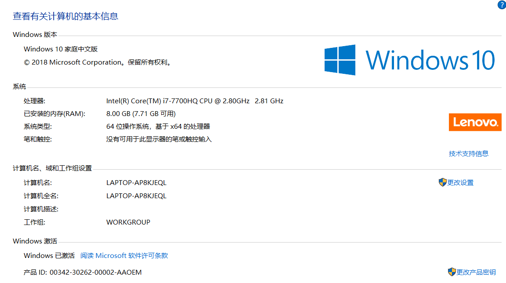

效果图如下:

从中我们可以get到处理器、内存、系统类型、系统版本等信息。

联系到实际这些信息有什么用呢？
<!--more-->
## 1.处理器
从上图中我们看到其处理器是英特尔公司的，英特尔公司是美国一家主要以研制CPU处理器的公司，是全球最大的个人计算机零件和CPU制造商，它成立于1968年，具有50年产品创新和市场领导的历史。

**2.80GHZ表示的又是什么意思呢而且还有两个**？
首先说明是双核的，一核的主频为2.80GHZ，另外一核主频为2.81GHZ。

通常来说，主频越高，处理能力越强。从理论上看是这样，实际上并不如此。
主频越高，功耗和发热量也会有所增加，电脑也就会过热。**过热对电脑有如下影响**:
(1)运行速度慢，打开程序反应迟钝;
(2)经常出去蓝屏死机现象;
(3)电脑整机和零件寿命变短;
(4)出现突然关机无法启动;
(5)出现烧毁主板或者CPU现象；

**那么导致电脑过热的原因有哪些?**
(1)灰尘过多(灰尘过多会堵塞电脑的散热孔，从而导致电脑内部空气流通不畅，无法将电脑内部的热量散出来，同时灰尘也会粘连在电脑的散热风扇上，从而导致电脑风扇的散热效率降低，影响电脑的正常散热);
(2)运行程序过多(当电脑的运行程序过多，电脑的CPU、内存、显卡、硬盘、主板以及电源的使用率会非常高，而当这些部件使用率高的时候会散出大量的热，从而使得电脑的整体会出现过热);
(3)使用环境(电脑使用环境温度过高，电脑的发热量会增加，同时散热效率相对会降低，电脑的摆放位置也会影响电脑的散热，从而导致电脑的温度过热)

**联系实际**
电脑过热，会影响软件开发的效率，比如我的笔记本电脑过热的原因，通常是因为运行程序过多，过多导致部件使用率高，然后电脑就会发出声音，通常这种声音持续一段时间，有的时候直接就会导致我的电脑出现卡死情况(突然一下黑屏了，或者是卡顿)。出现这种情况后，直接就会影响到我开发的效率，一般会持续5到6分钟，甚至更长。所以理解处理器、主频对于程序开发也是很有帮助的。再比如如果你要自己买个主机弄成服务器，如果你不理解上述的知识话，很难搞的好，记得在上家公司的时候，公司的机房通常是在比较阴暗的地方(不表示潮湿，潮湿也会影响电脑)，因为服务器温度过高会导致我在前面说的过热对电脑的影响，其中一条会烧毁主板或CPU，烧毁主板和CPU，意味着这台电脑彻底挂了，一旦挂了肯定会影响软件对外的服务(这也是一些稍有规模的公司，通常有自己独立的机房，机房里一般都有空调，空调的目的就是为了防止温度过高烧毁服务器影响服务)。

## 2.内存
内存是计算机中重要的部件之一，它是与CPU进行沟通的桥梁。计算机中所有程序的运行都是在内存中进行的，因此内存的性能对计算机的影响非常大。内存也被称作为内存储器和主存储器，其作用是暂时存放CPU中的运算数据，以及与硬盘等外部存储器交换的数据。只要计算机在运行中，CPU就会把需要运算的数据调到内存中进行运算，当运算完成后CPU再将结果传送出来，内存的运行也决定计算机的稳定运行。

**内存不足会对电脑造成哪些影响?**
最直观的表现就是你的电脑会非常卡,无法运行比较大的软件。

如果是在服务器上，你将会发现你发送的请求迟迟无法得到服务器的响应。

**是什么原因造成电脑的内存不足呢？**
(1)运行程序过多(前面说过，计算机中所有的程序运行都是在内存中进行的);
(2)电脑中毒(受到黑客恶意攻击);
(3)内存太小了(特别是站长同志们，比如在自己的服务器上运营好几个网站，特别是其中一个博客网站每天访问量非常高，访问量高，代表与后台数据交互的频率越高，后台数据库也是需要占用内存的,如果内存不足直接就会影响到用户的正常访问，造成的影响就是用户体验不佳，用户体验不佳的影响就不多说了)

**联系实际**
为什么说数据结构和算法很重要呢？
良好的数据结构和算法，使得程序的运行效率大大提升，大大提升意味着减少可用内存容量，把富余的内存以备不时之需，比如应对高并发。
一个程序员具有数据结构和算法功底扎实写出的代码质量将会非常高，同时也在一定程度上替公司降低成本。
看过一篇文章，该文章作者这样说:***现在的软件工程充斥着大量的过度设计、资源浪费，实际上已经到了硬件承受不了的地步了。学好数据结构和算法，能够从根本上去避免这些问题***
这篇文章的标题叫做[算法与数据结构对程序员的重要性](https://blog.csdn.net/bingguang1993/article/details/81048022)，开发者们都可以去看看这篇文章，很有启发意义。
最后补充一点，良好的数据结构和算法会提高内存利用率，让你写出来的软件更加优美。
最近我在思考，我最近写的一个博客项目出现了一种情况，那就是有的时候访问，数据会显示不全，布局也会有问题，然后刷新一下就好了，我在想是不是我的js写的有问题，我打算参考《高性能网站建设》这本书先做一部分优化，不过在优化前，我还是得做做压测看看现在的数据是怎样的，有数据就方便到时优化前后的对比。

## 3.系统类型
从图上可以获取我电脑上的系统类型为64位操作系统，基于x64的处理器。

在此提出一个常见问题，64位系统和32位有什么区别?
(1)设计初衷不同。64位操作系统的设计初衷是:满足机械设计和分析、三维动画、视频编辑和创作，以及科学计算和高性能计算应用等领域中需要大量内存和浮点性能的客户需求。而32位操作系统是为普通用户设计的。
(2)要求配置不同。64位操作系统只能安装64位电脑上(CPU必须是64位的)。同时需要安装64位常用软件以发挥64位(x64)的最佳性能。32位操作系统则可以安装在32位(32位CPU)或64位(64位CPU)电脑上。当然，32位操作系统安装在64位电脑上，其硬件恰似“大牛拉小车":64位效能会大打折扣。
(3)运算速度不同。64位CPU的GPRS的数据宽度为64位，64位指令集可以运行64位数据指令，也就是说处理器一次可提取64位数据(只要两个指令，一次提取8个字节的数据)比32位(需要四个指令，一次提取4个字节的数据)提高一倍，理论上性能会相应提升1倍。
(4)寻址能力不同。64位处理器的优势还体现在系统对内存的控制上。由于地址使用的是特殊的整数，因此一个ALU(算术逻辑运算器)和寄存器可以处理更大的整数，也就是更大的地址。
(5)软件普及不同。64位常用软件比32位常用软件，要少得很多。道理很简单:使用64位操作系统的用户相对较少。因此软件开发商必须考虑“投入产出比"
,将有限资金投入到更多使用群体的软件之中。这也是为什么64位软件价格相对昂贵的重要原因(将成本摊入较少的发售中)。

64位操作系统可以安装32位软件，那是设计上的"向下兼容"。

**联系实际**
这让我不仅联想到vscode打包，打包后的也是32位而非64位，我想这也是32位比较普及的原因之一。
另外再联想到Linux上，比如CentOS和Ubuntu16.04，它们的区别就可大(关于它们的区别我在此就不说了，感兴趣的朋友自己实践就知道了)。

## 4.系统版本
根据不同的系统版本安装不同软件，比如有的软件适用于Win7并不适合Win8。这就需要平时的计算机爱好者或者经常使用计算机软件完成工作的朋友要了解。
作为程序员一定是要知道的。

