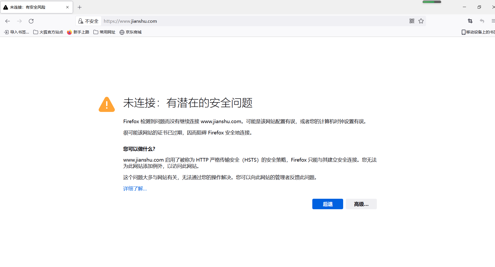
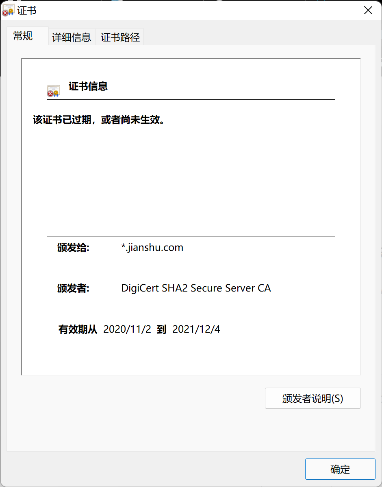

今天因为参考一些资料的需要，访问了简书，点击对应的链接，居然访问不了，出现如图所示:
<!--more-->

然后查看相应证书，出现如图所示:

这让我有些疑惑，像简书这样的大型内容网站，证书居然一年一续，以及SSL证书过期很长时间居然没人处理。

正常来说，证书续费一般两到三年左右，即便是一年一续费，也应该不能影响用户的正常使用。

我以前做过运维，对于运维而言，最重要的就是7x24保障服务的可用性。即便是周末，运维人员也会轮流值班，确保不会出现网站访问不了的问题。即便遇到这样的问题，我们将在短时间内马上恢复网站，确保给用户的影响降到最低。

