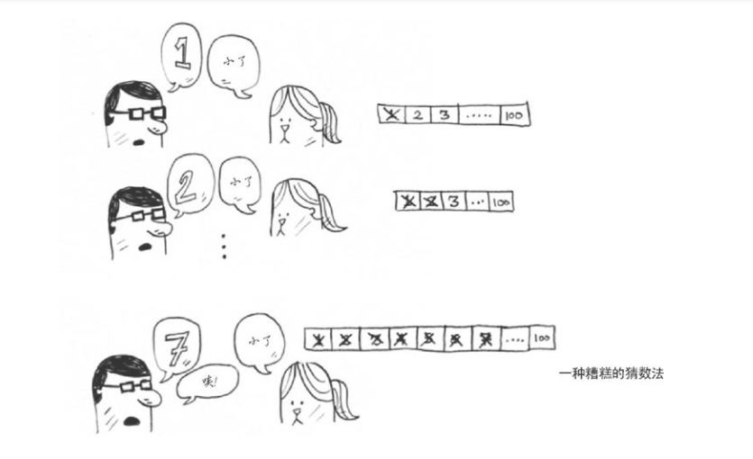
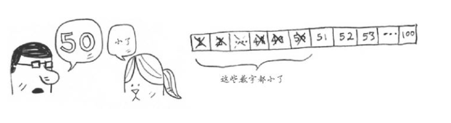

简单查找，如下图:



从图可知那个眼镜男从1开始猜，猜到100，大家都知道这种猜法最终都会得到答案，就是时间问题而已。100毕竟是这个列表的最大长度。但是换言之，如果是一万、百万、上千亿呢？那么这种猜法虽然能够得到答案，但是时间方面的成本将会非常大。于是二分法应需而生。
<!--more-->
二分法，如下图:


从图可知这次眼镜男学聪明了，从中间入手一分为二。以100为例猜大小，假定要猜的数字为65，这时眼镜男说50，于是小姐姐说小了，眼镜男再猜70，小姐姐说大了，这时眼镜男可以肯定的范围应该在51~69这个范围内，相比简单查找，这种方式效率要高的多。最终眼镜男肯定会猜到正确的数字，花费的时间与简单查找相比，花费时间肯定是很少的。

二分法也有其局限性，局限性就是必须要确保列表是有序的才行。

以代码来讲解:
简单查找，以数组为例，索引从0开始
```
@Test
		public void testSelect() throws Exception {
			
			int [] num = new int[] {1,2,3,4,5,6};
			for (int i = 0; i < num.length; i++) {
				System.out.println(num[i]);
			}
			
			
		}

```

二分法，例子如下:
```
@Test
		public void testSelect() throws Exception {
			
			int[] num = new int[] {1,3,5,7,9,11};
			
			int start = 0;
			
			int end = num.length - 1;
			int i = 14;
			
			while(true) {
				int mid = (start+end) / 2;
				
				if(i == num[mid]) {
					System.out.println("index:"+mid);
					break;
				}else {
					if(i < num[mid]) {
						end = mid - 1;
					}else {
						start = mid + 1;
					}
				}
				
				if(start > end) {
					System.out.println("no find,will insert in:"+start);
					break;
				}
			}
			
			
		}


```