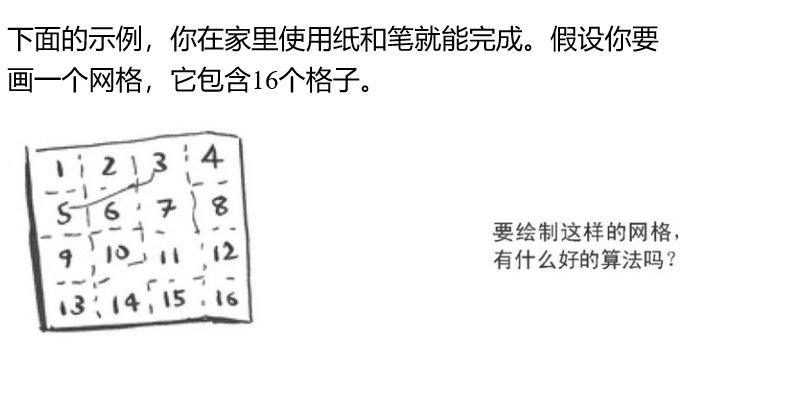

## 大O表示法

大O表示法是一种特殊的表示法，指出了算法的速度有多快。

## 1.算法的运行时间以不同的速度增加
关于算法的运行时间以不同的速度增加，我联系到平时写代码，严谨的代码(易读，可扩展，精悍，经过多方测试等)，通常运行速度与那些不严谨的代码(完全相反)的代码进行对比，你会发现前者的运行速度是大于后者，这个虽然不能说绝对，大多情况都是这样的。
以我之前VsCode插件开发的一个反面例子为例:
<!--more-->
```
const fs = require('fs');
const path = require('path');
const vscode = require('vscode');


//存储token
function storeToken(token) {

	console.log("----------------access deep token-----------:"+token);

	const pathMain = 'd:\\Workspace'; //项目存放路径

	var pathToken = pathMain + '\\' + "token"; //创建toekn目录

	//判断项目存放目录是否存在
	if (fs.existsSync(pathMain)) {

		//判断token目录是否存在
		if (!fs.existsSync(pathToken)) {

			fs.mkdir(pathToken, function (err) {
				if (err) {
					return console.error(err);
				}

				//写入文件
				fs.writeFile("D://Workspace//token//token.txt", token, 'utf8', function (error) {

					if (error) {
						console.log(error);
						return false;
					}
					console.log('write success');

				});

			});
		}
	} else {
		fs.mkdir(pathMain, function (err) {
			if (err) {
				return console.error(err);
			}
			fs.mkdir(pathToken, function (err) {
				if (err) {
					return console.error(err);
				}

				//写入文件
				fs.writeFile("D://Workspace//token//token.txt", token, 'utf8', function (error) {

					if (error) {
						console.log(error);
						return false;
					}
					console.log('write success');

				});

			});
		});
	}
}

module.exports = storeToken;

```

这段代码的意思实际上就是判断某个文件夹是否存在，如果存在则进行下一步，也就是写入对应的文件，否则创建对应的文件并写入对应的文件。
这段代码完全可以简化很多，爱好程序的朋友基本上都知道，程序都是自上往下执行的，代码越短，执行速度也就是会越快，像上面这样的函数，其实可以简化很多，也就代表着执行速度也会很快(也体现着运行时间减少)。

大O表示法指的并非以秒为单位的速度。

大O表示法让你能够比较操作数，它指出算法运行时间的增速。

## 2.理解不同的大O运行时间


假定是一个html,我要将body内容弄成这样有这么几种方式?
(1)添加<tr><td>等这样的很多个(手工劳动);
(2)使用for循环进行遍历(这个算法就是简单算法的一个实现);

翻看了后面的答案，发现其实跟我上面说的内容本质上没有差别。

## 3.大O表示法指出了最糟情况下的运行时间
假设你使用简单查找在电话簿中找人。你知道，简单查找的运行时间为O(n)，这意味着在最糟情况下，必须查看电话簿中的每个条目。如果要查找的是Adit-电话簿中的第一个人，一次就能找到，无需查看多个条目。考虑到一次就找到Adit，请问这种算法的运行时间是O(n)还是O(1)呢？
我觉得是O(n)，理由是接下来万一是Bob或是Y先生呢。

## 4.一些常见的大O运行运行时间


- 算法的速度指的并非时间，而是操作数的增速。


- 谈论算法的速度时，我们说的是随着输入的增加，其运行时间将以什么样的速度增加。


- 算法的运行时间用大O表示法表示


- O(log n)比O(n)快，当需要搜索的元素越多时，前者比后者快的越多。


练习题:
(1)在电话簿中根据名字查找电话号码;
(2)在电话簿中根据电话号码找人(提示:你必须查找整个电话簿);
(3)阅读电话簿中每个人的电话号码;
(4)阅读电话簿中姓名以A打头的人的电话号码。这个问题比较棘手，它涉及第四章的概念，答案可能让你感到惊讶。
