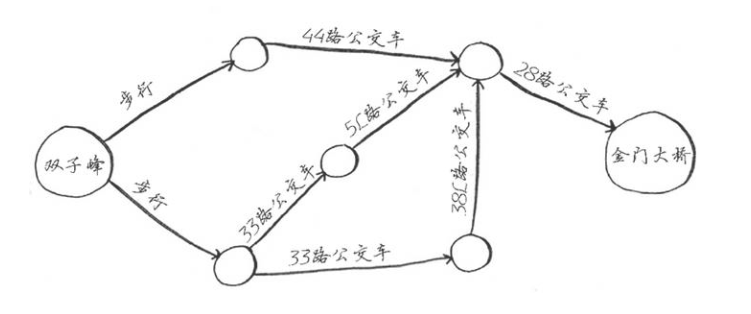
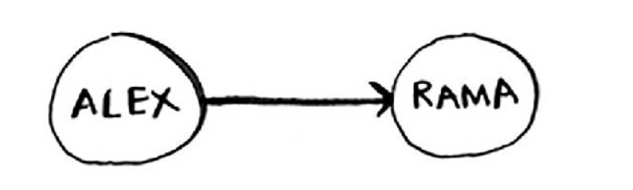
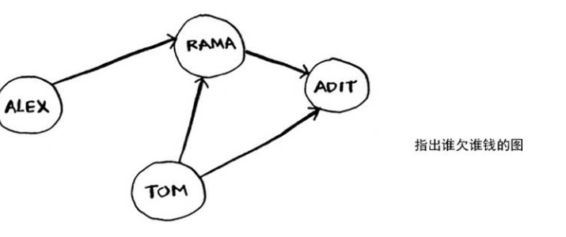
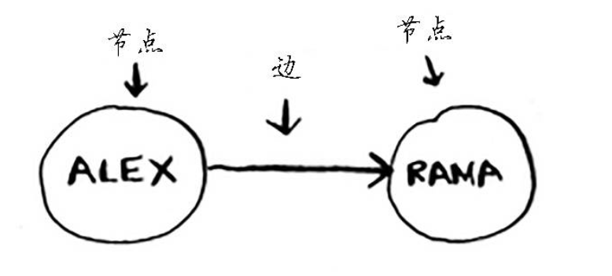
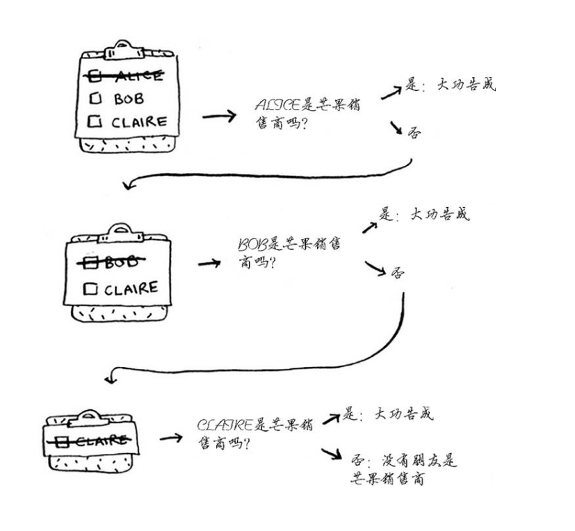
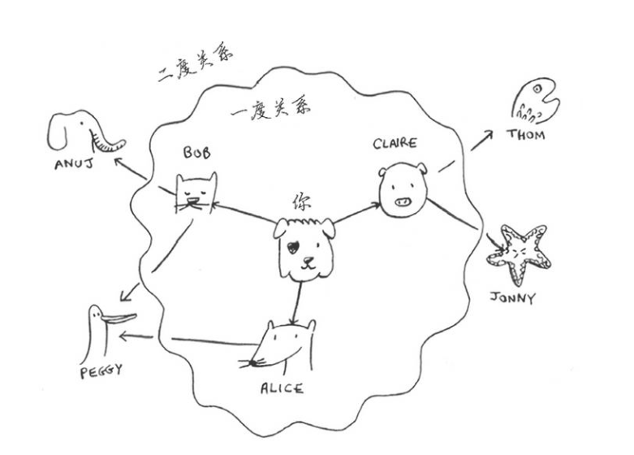
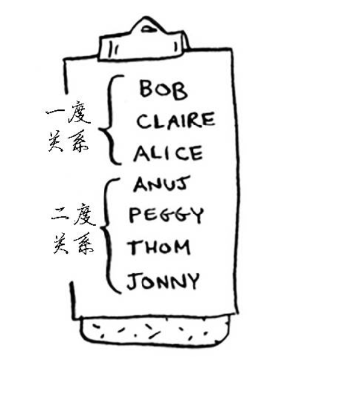
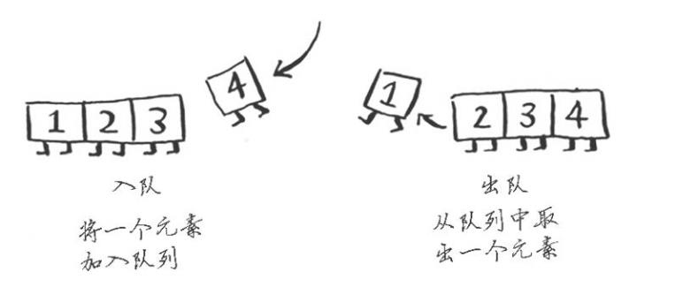
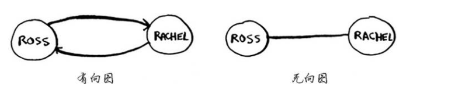

广度优先搜索的应用场景，如下:
(1)编写国际跳棋AI，计算最少走多少步就可获胜;
(2)编写拼写检查器，计算最少编辑多个地方就可将错拼的单词改为正确的单词，如将READED改为READER需要编辑一个地方;
(3)根据你的人际关系网络找到关系最近的医生;
<!--more-->
## 图简介

假设你居住在旧金山，要从双子峰前往金门大桥。你想乘公交车前往，并希望换乘最少。可乘坐的公交车如下:

由图可知，换乘最少的路线是:步行->44路公交车->28路公交车(一共三步,这种问题也被称作为最短路径问题，解决最短路径问题的算法，又称广度优先搜索)

要确定如何从双子峰前往金门大桥，需要两个步骤:
(1)使用图来建立问题模型;
(2)使用广度优先搜索解决问题;

## 什么是图
图模拟一组连接。

例如，假设你与朋友玩牌，并要模拟谁欠谁钱，可像下面这样指出Alex欠Rama前，如图:

完整的欠钱图可能类似于下面这样。

Alex欠Rama钱、Tom欠Adit钱，等等。

图由节点和边组成，如图所示:

一个节点可能与众多节点直接相连，这些节点被称为邻居。
在起前面的欠钱图中，Rama是Alex的邻居。Adit不是Alex的邻居，因为他们不直接相连。但Adit既是Rama的邻居，又是Tom的邻居。

图用于模拟不同的东西是如何相连的。

联系工程研发:
通常研发工程师面对业务需求，需要画流程图帮助自己梳理一下业务流程，减少编码过程中的不必要的错误(这个不必要主要包含业务理解等)。
业务流程图其实也相当于在模拟业务在实际中是如何运作的。

## 广度优先搜索
广度优先搜索是一种用于图的查找算法，可帮助回答两类问题:
- 第一类问题:从节点A出发，前往节点B的路径
- 第二类问题:从节点A出发，前往节点B的哪条路径最短

### 查找最短路径问题
这个图主要反映的是解决第一类问题看你周围的朋友有哪些是芒果商。

第二类问题，主要强调是是哪个芒果商与你的关系最近。例如，朋友是一度关系，朋友的朋友是二度关系。

下图可形象生动的表现出来:

搜索范围从起点开始逐渐向外延伸，即先检查一度关系，再检查二度关系。
首先按照顺序检查名单中的每个人，看看他是否是芒果销售商。这将在一度关系种查找，再在二度关系中查找，因此找到的是关系最近的芒果销售商。广度优先搜索不仅查找从A到B的路径，而且找到的是最短的路径。

如图分析:

注意,只有按添加顺序查找时，才能实现这样的目的。换句话说，如果Claire先于Anuj加入名单，就需要先检查Claire，再检查Anuj。如果Claire和Anuj都是芒果销售商，而你先检查Anuj再检查Claire，结果将如何呢？找到的芒果销售商并非是与你关系最近的，因为Anuj是你朋友的朋友，而Claire是你的朋友。因此，你需要按添加顺序进行检查。有一个可实现这种目的的数据结构，那就是队列。

### 队列

队列的工作原理与现实生活中的队列完全相同。

假设你与朋友一起在公交车站排队，如果你排在他的前面，你将先上车。队列的工作原理与此相同。队列类似于栈。你不能随机地访问队列中的元素。队列只支持两种操作:入队和出队。

如果你将两个元素加入队列，先加入的元素将在后加入的元素之前出队。因此，你可使用队列来表示查找名单。这样，先加入的人将先出队并先被检查。

队列是一种先进先出的数据结构，而栈是一种后进先出的数据结构，如图:

## 实现图
图由多个节点组成。

每个节点都与邻近节点相连，如果表示类似于"you->Bob”这样的关系，可以使用散列表。

关于有向图和无向图，如下所示:

关于运行时间:
如果你在你的整个人际关系网中搜索芒果销售商，就意味着你将沿每条边前行(记住，边是从一个人到另外一个人的箭头或连接)，因此运行时间至少为O(边数)

你还使用了一个队列，其中包含要检查的每个人。将一个人添加到队列需要的时间是固定的，即为O(1)，因此对每个人都这样做需要的总时间为O(人数)。所以，广度优先搜索的运行时间为O(人数+边数)，这通常写作O(V+E),其中V为顶点数，E为边数。

