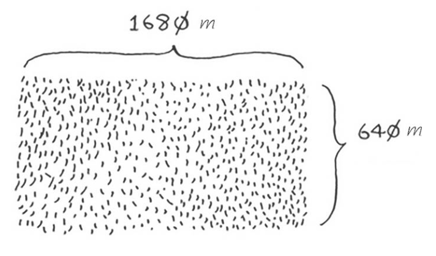

## 分而治之(又称D&C)
书中举了一个例子，假设你是农场主，有一块土地，如图所示:

你要将这块地均匀分成方块，且分出的方块要尽可能大。


从图上看，显然是不符合预期结果的。
<!--more-->
那么如何将一块地均匀分成方块，并确保分出的方块是最大的呢？使用D&C策略。

(1)D&C算法是递归的;
(2)使用D&C解决问题的过程包括两个步骤:
a.找出基线条件，这种条件必须尽可能简单;
b.不断将问题分解(或者说缩小规模)，直到符合基线条件;

就如何保证分出的方块是最大的呢？《算法图解》中的快速排序一章提到了欧几里得算法。

什么是欧几里得算法?
欧几里得算法又称辗转相除法，是指用于计算两个正整数a,b的最大公约数。
应用领域有数学和计算机两个方面。

举个代码例子说一下欧几里得算法:
```
package cn.pratice.simple;

public class Euclid {

	
	public static void main(String[] args) {
		int m = 63;
		int n = 18;
		int remainer = 0;
		while(n!=0) {
			remainer = m % n;
			m = n;
			n = remainer;
		}
		
		System.out.println(m);
	}
}


```
最终的结果是9，正好63和18的最大公因数也是9.
其中也体现着分而治之的思想。记住，分而治之并非可用于解决问题的算法而是一种解决问题的思路。

再举个例子说明，如图所示:

需要将这些数字相加，并返回结果，使用循环很容易完成这种任务，以Java为例:
```
package cn.pratice.simple;

public class Euclid {

	
	public static void main(String[] args) {
		int []num = new int[] {2,4,6};
		int total = 0;
		for (int i = 0; i < num.length; i++) {
			total += num[i];
					
		}
		System.out.println(total);
	}
}


```

## 快速排序
快速排序是一种常用的排序算法，比选择排序快的多。
代码示例如下(快速排序):
```
package cn.pratice.simple;

public class QuickSort {
	
    //声明静态的 getMiddle() 方法，该方法需要返回一个 int 类型的参数值，在该方法中传入 3 个参数
	public static int getMiddle(int[] list,int low,int high) {
		
		int tmp = list[low];//数组的第一个值作为中轴(分界点或关键数据)
		
		while(low<high) {
			
			while(low<high && list[high]>tmp) {
				high--;
			}
			
			list[low] = list[high];//比中轴小的记录移到低端
			
			while(low<high&&list[low]<tmp) {
				low++;
			}
			
			list[high]=list[low];//比中轴大的记录移到高端
		}
		
		list[low] = tmp;//中轴记录到尾
		
		return low;
	}
	
	//创建静态的 unckSort() 方法，在该方法中判断 low 参数是否小于 high 参数，如果是则调用 getMiddle() 方法，将数组一分为二，并且调用自身的方法进行递归排序
	public static void unckSort(int[] list,int low,int high) {
		
		if(low<high) {
			
			int middle = getMiddle(list,low,high);//将list数组一分为二
			unckSort(list,low,middle-1);//对低字表进行递归排序
			unckSort(list,middle+1,high);//对高字表进行递归排序
		}
	}
	
	//声明静态的 quick() 方法，在该方法中判断传入的数组是否为空，如果不为空，则调用 unckSort() 方法进行排序
	public static void quick(int[] str) {
		if(str.length>0) {
			//查看数组是否为空
			unckSort(str,0,str.length-1);
		}
	}
	
	//测试
	public static void main(String[] args) {
		
		int[] number = {13,15,24,99,14,11,1,2,3};
		System.out.println("排序前:");
		for (int i : number) {
			System.out.print(i+" ");
		}
		
		quick(number);
		
		System.out.println("\r排序后:");
		for (int i : number) {
			System.out.print(i+" ");
		}
	}
}


```
此示例来自[Java数组排序：Java快速排序（Quicksort）法](http://c.biancheng.net/view/929.html)

没有什么比代码示例来的直接痛快。

## 再谈大O表示法
快速排序的独特之处在于，其速度取决于选择的基准值。

常见的大O运行时间图，如下:

上述图表中的时间是基于每秒执行10次操作计算得到的。这些数据并不准确，这里提供它们只是想让你对这些运行时间的差别有大致认识。实际上，计算机每秒执行的操作远远不止10次。

在该节中，作者说合并排序比选择排序要快的多。合并排序，用数学公式表示为O(n log n)，而选择排序为O(n的2次方)。
合并代码排序例子如下:
```
package cn.pratice.simple;

import java.util.Arrays;

public class MergeSort {


    private static void mergeSort(int[] original) {
        if (original == null) {
            throw new NullPointerException("The array can not be null !!!");
        }
        int length = original.length;
        if (length > 1) {
            int middle = length / 2;
            int partitionA[] = Arrays.copyOfRange(original, 0, middle);// 拆分问题规模
            int partitionB[] = Arrays.copyOfRange(original, middle, length);
            // 递归调用
            mergeSort(partitionA);
            mergeSort(partitionB);
            sort(partitionA, partitionB, original);
        }
    }

    private static void sort(int[] partitionA, int[] partitionB, int[] original) {
        int i = 0;
        int j = 0;
        int k = 0;
        while (i < partitionA.length && j < partitionB.length) {
            if (partitionA[i] <= partitionB[j]) {
                original[k] = partitionA[i];
                i++;
            } else {
                original[k] = partitionB[j];
                j++;
            }
            k++;
        }
        if (i == partitionA.length) {
            while (k < original.length) {
                original[k] = partitionB[j];
                k++;
                j++;
            }
        } else if (j == partitionB.length) {
            while (k < original.length) {
                original[k] = partitionA[i];
                k++;
                i++;
            }
        }
    }

    private static void print(int[] array) {
        if (array == null) {
            throw new NullPointerException("The array can not be null !!!");
        }
        StringBuilder sb = new StringBuilder("[");
        for (int element : array) {
            sb.append(element + ", ");
        }
        sb.replace(sb.length() - 2, sb.length(), "]");
        System.out.println(sb.toString());
    }
    
    public static void main(String[] args) {
    	long startTime = System.currentTimeMillis();    //获取开始时间

    	int original[] = new int[] { 13,15,24,99,14,11,1,2,3 };
    	for (int i = 0; i < original.length; i++) {
			System.out.print(original[i]+" ");
		}
        mergeSort(original);
        print(original);
    	long endTime = System.currentTimeMillis();    //获取结束时间

    	System.out.println("程序运行时间：" + (endTime - startTime) + "ms");    //输出程序运行时间
        
    }
}


```
此示例来自[
java实现合并排序算法](https://blog.csdn.net/hjxaslzyy/article/details/61463470)

## 比较快速排序与合并排序

还是以上面的代码例子为例:
快速排序代码例子，如下:
```
package cn.pratice.simple;

public class QuickSort {
	
    //声明静态的 getMiddle() 方法，该方法需要返回一个 int 类型的参数值，在该方法中传入 3 个参数
	public static int getMiddle(int[] list,int low,int high) {
		
		int tmp = list[low];//数组的第一个值作为中轴(分界点或关键数据)
		
		while(low<high) {
			
			while(low<high && list[high]>tmp) {
				high--;
			}
			
			list[low] = list[high];//比中轴小的记录移到低端
			
			while(low<high&&list[low]<tmp) {
				low++;
			}
			
			list[high]=list[low];//比中轴大的记录移到高端
		}
		
		list[low] = tmp;//中轴记录到尾
		
		return low;
	}
	
	//创建静态的 unckSort() 方法，在该方法中判断 low 参数是否小于 high 参数，如果是则调用 getMiddle() 方法，将数组一分为二，并且调用自身的方法进行递归排序
	public static void unckSort(int[] list,int low,int high) {
		
		if(low<high) {
			
			int middle = getMiddle(list,low,high);//将list数组一分为二
			unckSort(list,low,middle-1);//对低字表进行递归排序
			unckSort(list,middle+1,high);//对高字表进行递归排序
		}
	}
	
	//声明静态的 quick() 方法，在该方法中判断传入的数组是否为空，如果不为空，则调用 unckSort() 方法进行排序
	public static void quick(int[] str) {
		if(str.length>0) {
			//查看数组是否为空
			unckSort(str,0,str.length-1);
		}
	}
	
	//测试
	public static void main(String[] args) {
		long startTime = System.currentTimeMillis();    //获取开始时间

		int[] number = { 13,15,24,99,14,11,1,2,3,2,32,4321,432,3,14,153,23,42,12,34,15,312,12,43,3214,43214,43214,43214,12,2432,12,34,24,4532,1234};

		quick(number);
		
	
		for (int i : number) {
			System.out.print(i+" ");
		}
		long endTime = System.currentTimeMillis();    //获取结束时间

		System.out.println("程序运行时间：" + (endTime - startTime) + "ms");    //输出程序运行时间
		
	}
}


```

输出结果，如图:


半天看不到输出结果，而程序仍在运行中。如果将数组中的元素还原为原来那几个，则很快看到结果。

合并代码例子，如下:
```
package cn.pratice.simple;

import java.util.Arrays;

public class MergeSort {


    private static void mergeSort(int[] original) {
        if (original == null) {
            throw new NullPointerException("The array can not be null !!!");
        }
        int length = original.length;
        if (length > 1) {
            int middle = length / 2;
            int partitionA[] = Arrays.copyOfRange(original, 0, middle);// 拆分问题规模
            int partitionB[] = Arrays.copyOfRange(original, middle, length);
            // 递归调用
            mergeSort(partitionA);
            mergeSort(partitionB);
            sort(partitionA, partitionB, original);
        }
    }

    private static void sort(int[] partitionA, int[] partitionB, int[] original) {
        int i = 0;
        int j = 0;
        int k = 0;
        while (i < partitionA.length && j < partitionB.length) {
            if (partitionA[i] <= partitionB[j]) {
                original[k] = partitionA[i];
                i++;
            } else {
                original[k] = partitionB[j];
                j++;
            }
            k++;
        }
        if (i == partitionA.length) {
            while (k < original.length) {
                original[k] = partitionB[j];
                k++;
                j++;
            }
        } else if (j == partitionB.length) {
            while (k < original.length) {
                original[k] = partitionA[i];
                k++;
                i++;
            }
        }
    }

    private static void print(int[] array) {
        if (array == null) {
            throw new NullPointerException("The array can not be null !!!");
        }
        StringBuilder sb = new StringBuilder("[");
        for (int element : array) {
            sb.append(element + ", ");
        }
        sb.replace(sb.length() - 2, sb.length(), "]");
        System.out.println(sb.toString());
    }
    
    public static void main(String[] args) {
    	long startTime = System.currentTimeMillis();    //获取开始时间

    	int original[] = new int[] { 13,15,24,99,14,11,1,2,3,2,32,4321,432,3,14,153,23,42,12,34,15,312,12,43,3214,43214,43214,43214,12,2432,12,34,24,4532,1234};
    	for (int i = 0; i < original.length; i++) {
			System.out.print(original[i]+" ");
		}
        mergeSort(original);
        print(original);
    	long endTime = System.currentTimeMillis();    //获取结束时间

    	System.out.println("程序运行时间：" + (endTime - startTime) + "ms");    //输出程序运行时间
        
    }
}


```

输出结果，如图:


通过两者对比，我们很容易得出合并排序比快速排序快。

参考这个[合并排序和快速排序执行时间比较](https://www.cnblogs.com/stwzhong/p/3380395.html)

作者通过实验得出一个结论:**当数据量较小的时候，快速排序比合并排序运行时间要短，运行时间短就表示快，但是当数据量大的时候，合并排序比快速排序运行时间要短**。
由此通过我上述的代码实验和该文章作者试验，可证实这个结论。