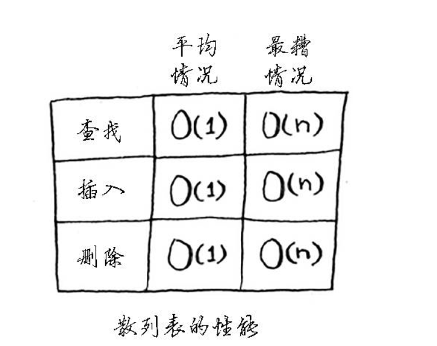
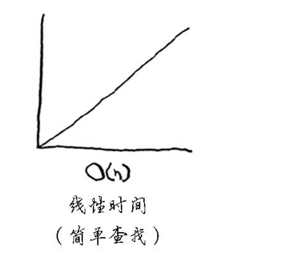
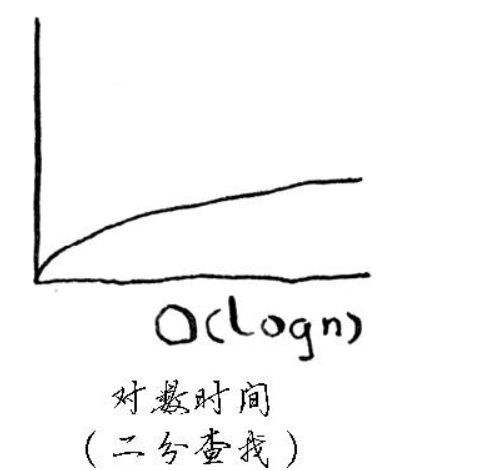
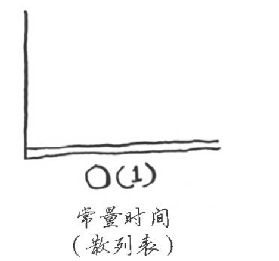
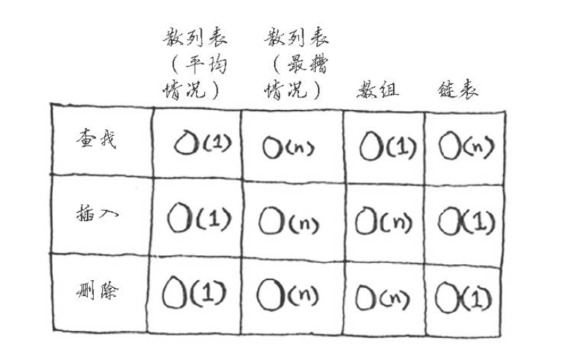

## 散列函数
专业术语表述，"将输入映射到数字"。

散列函数具有如下要求:
(1)它必须是一致的。
如你输入blog得到的是wordpress，那么每次输入blog，得到的都必须为wordpress。

(2)它应将不同的输入映射到不同的数字。
如，如果一个散列函数不管输入是什么都返回1，它就不是好的散列函数。最理想的情况是，将不同的输入映射到不同的数字。
<!--more-->
Java中简单例子(散列表):
```
package cn.pratice.simple;

import java.util.Hashtable;

public class HashTableTest {

	public static void main(String[] args) {
		Hashtable<String, String> program = new Hashtable<String,String>();
	
		program.put("JAVA", "高斯林");
		program.put("Python", "龟叔");
		program.put("C++", "本贾尼");
		
		String key = program.get("C++");
		
		System.out.println(key);
		
	}

}


```

最后控制台的输出结果是本贾尼。


## 应用案例

(1)散列表用于查找(DNS解析就用它);

(2)防止重复(投票选举);

(3)将散列表用作缓存;

## 冲突
主要体现在:给两个键分配的位置相同。

最简单解决的办法是:如果两个键映射到了同一个位置，那么就在这个位置存储一个链表。

办法虽然简单，但是造成的后果是将会严重，主要体现是散列表的速度会很慢。

经验教训:
(1)散列函数很重要。前面的散列函数将所有的键都映射到一个位置，而最理想的情况是，散列函数将键均匀地映射到散列表的不同位置。
(2)如果散列表存储的链表很长，散列表的速度将急剧下降。然而，如果使用的散列函数很好，这些链表就不会很长。


## 性能
如图:

在平均情况下，散列表执行各种操作的时间都为O(1)。O(1)被称为常量时间。你以前没有见过常量时间，它并不意味着马上，而是说不管散列表多大，所需的时间都相同。

比较一下简单查找、二分查找、散列表的运行时间:





不管数组多大，从中获取一个元素所需的时间都是相同的。在平均情况下，散列表的速度确实很快。



在平均情况下，散列表的查找(获取给定索引处的值)速度与数组一样快，而插入和删除速度与链表一样快，因此它兼具两者的优点。但是在最糟的情况下，散列表的各种操作的速度读很慢。因此，在使用散列表时，避开最糟的情况至关重要。为此，需要避免冲突，而要避免的冲突,需要有:
(1)较低的填装因子;
(2)良好的散列函数;