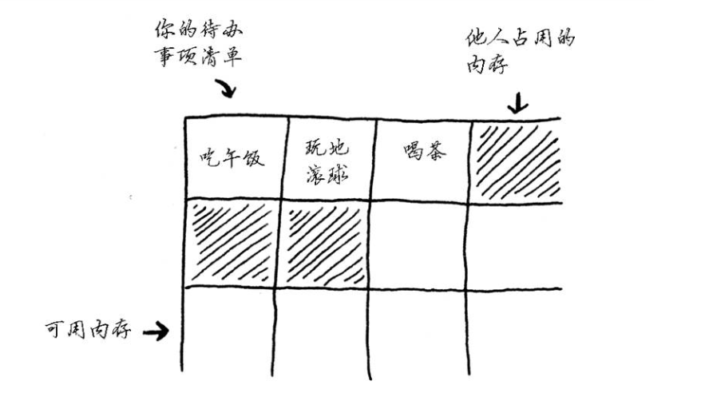
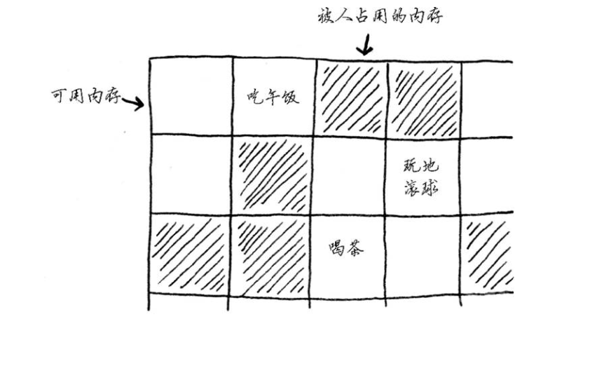
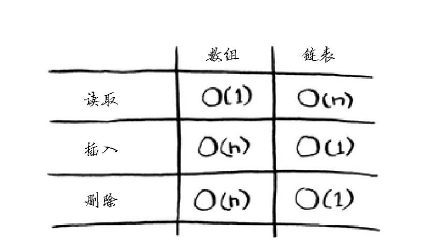

## 数组和链表

### 1.数组
以添加第四个待办事项为例，但后面的那个抽屉已经放了别人的东西

这就像你与朋友去看电影，找到地方就坐后又来了一位朋友，但原来坐的地方没有空位置，只得再找一个方可坐下所有人的地方。在这种情况下，你需要请求计算机重新分配一块可容纳4个待办事项的内存，再将所有待办事项移到那里。
<!--more-->
如果又来了一位朋友，而当前坐的地方也没有空位，你们就得再次转移，这是一件非常麻烦的事情。同样，在数组中添加新的元素也可能很麻烦。如果没有了空间，就得移到内存的其他地方，因此添加新的元素的速度会很慢一种解决之道是“预留座位”：即便当前只有3个待办事项，也请求计算机提供10个位置，以防需要添加待办事项。这样只要待办事项不超过10个，就无需转移。这是一个不错的权变措施，但是它也有如下两个缺点:
(1)浪费内存。比如本来四个就可以存储，你却申请了10个。
(2)如果超过了10个以上，还得转移。

### 2.链表

链表中的元素可存储在内存的任何地方，如下图所示:

链表的每个元素都存储了下一个元素的地址，从而使一系列随机的内存地址串在一起。

使用链表时，根本就不需要移动元素。这还可避免另外一个问题。假设你与五位朋友去看一部很火的电影。你们六个人想坐在一起，但看电影的人较多，没有六个在一起的座位。使用数组时有时就会遇到这样的情况。假设你要为数组分配10000个位置，内存中有10000个位置，但不都靠在一起。在这种情况下，你将无法为该数组分配内存。链表在此相当于说:"我们分开来说"，因此，只要有足够的内存空间，就能为链表分配内存。

### 3.常见数组和链表操作的运行时间

练习1:
假设你要编写一个记账的应用程序，每天将所有的支出记录下来，并在月底统计支出算算当月花了多少钱。因此，你执行的插入操作很多，但读取操作很少。该使用数组还是链表?

我的回答是:
使用链表。因为链表的插入和删除数据是非常快的，如果仅仅只是读取可以采用数组。

练习2:
假设你要为饭店创建一个接受顾客点菜单的应用程序。这个应用程序存储一系列点菜单。服务员添加点菜单，二厨师去除点菜单并制作菜肴。这是一个点菜单队列:服务员在队尾添加点菜单，厨师取出队列开头的点菜单并制定佳肴。

你是使用数组还是链表来实现这个队列?

我的回答是:
从这幅图中可以看出这是一个先进先出队列。先进先出一般使用链表。
而且根据题中信息，插入删除功能较多，插入是服务员添加点菜单，厨师取出点菜单意味着完成炒菜(相当于删除点菜单)。所以我觉得应该使用链表来实现这个队列。

练习题3:
我们来做一个思考实验。假设Facebook记录一系列用户名，每当有用户视图登录Facebook时，都查找其用户名，如果找到就允许用户登录。由于经常有用户登录Facebook，因此需要执行大量的用户名查找操作。假设Facebook实验二分查找算法，而这种算法要求能够随机访问-立即获取中间的用户名。考虑到这一点，应使用数组还是链表来存储用户名呢?

我的回答是:
首先可以从题中获取的关键消息是需要执行大量的用户名查询操作，这就意味着查询会非常多。链表在插入和删除方面效率非常高，但是查询却不是很高。数组则与其相反。在此我认为应用使用数组。理由是因为根据题目要求中说算法要求随机访问。

练习题4:
经常有用户在Facebook注册。假设你已决定使用数组来存储用户名，在插入方面数组有何缺点呢?具体地说，在数组中添加新用户将会出现什么情况?
我的回答是:
针对这两种情况，有必要复习一下数组，分析数组的优缺点:

数组的优点如下:
(1)按照索引查询元素速度快;
(2)能存储大量数据;
(3)索引遍历数组方便;

数组的缺点:
(1)根据内容查找速度慢;
(2)数组的大小一经确定不能改变;
(3)数组只能存储一种类型的数组;
(4)增加、删除元素效率慢;
(5)未封装任何方法，所有操作都需要用户自己定义;

分析完后，再回到问题上，答案就已经出来的。

