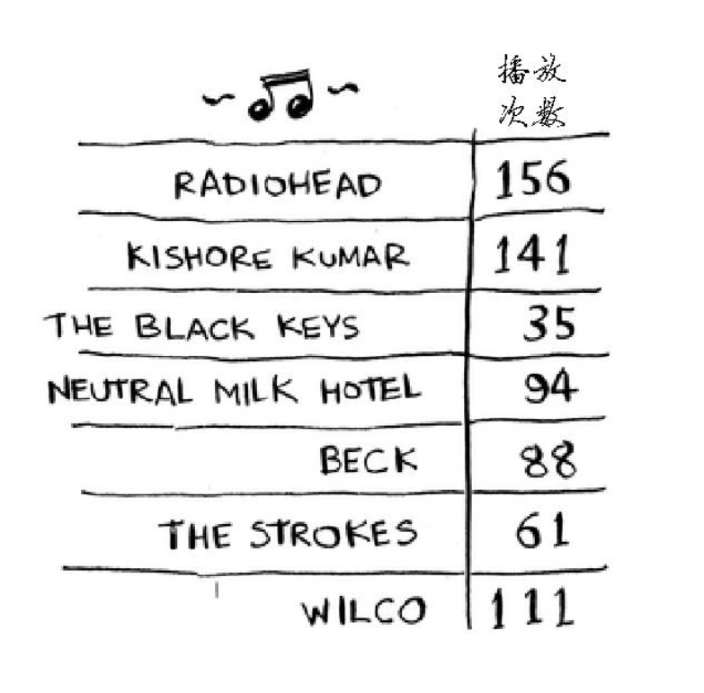
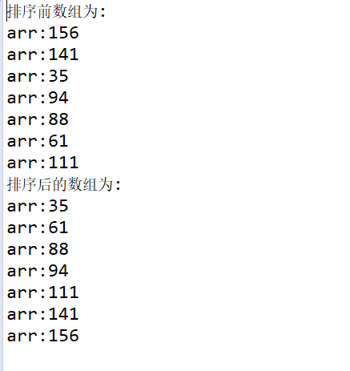

假设你的计算机存储了很多乐趣。对于每个乐队，你都记录了其作品被播放的次数。

<!--more-->
如果你要将这个列表按播放次数从多到少的顺序排列，从而将你喜欢的乐队排序。该如何做呢?

我第一眼看到这个问题时，想到的是通过sql解决这个问题
假设如果这是一个数据表的话，我很容易就可以通过order by 字段名 desc进行降序排序(也就是从大到小)

不过我觉得sql反而麻烦，于是转用冒泡排序。代码示例如下:
```
package cn.pratice.simple;

public class BubbleSort {

	
	public static void main(String[] args) {
	
		int [] arr = {156,141,35,94,88,61,111};
		
		System.out.println("排序前数组为:");
		for (int i = 0; i < arr.length; i++) {
			System.out.println("arr:"+arr[i]);
		}
		
		for (int i = 0; i < arr.length-1; i++) { //外层循环控制排序趟数
				for (int j = 0; j < arr.length-1-i; j++) {//内层循环控制每一趟排序多少次
					if(arr[j]>arr[j+1]) {
						int temp = arr[j];
						arr[j] = arr[j+1];
						arr[j+1]=temp;
					}
					
				}
			
		}
		System.out.println("排序后的数组为:");
		for (int i = 0; i < arr.length; i++) {
			System.out.println("arr:"+arr[i]);
		}
	}
}


```

这段代码的输出结果是:

但是该结果输出的是从小到大，显然不符合我的期望。
顺便提一下冒泡排序的原理:**比较两个相邻的元素，将值大的元素交换至右端**

不过以Java开发为例，一般情况我们拿轮子里面的东西即可实现，如下面代码所示:
```
package cn.pratice.simple;

import java.util.Arrays;

public class BubbleSort {

	
	public static void main(String[] args) {
	
		int [] arr = {156,141,35,94,88,61,111};
		
		for (int i = 0; i < arr.length; i++) {
			System.out.println("arr:"+arr[i]);
		}
		Arrays.sort(arr);
		
		for (int i = 0; i < arr.length; i++) {
			System.out.println("arr:"+arr[i]);
		}
		
	}
}


```

回到正题，那么我们如何将其变为降序?实现代码如下(还是复用现有的轮子)
```
package cn.pratice.simple;
import java.util.Comparator;


public class BubbleSort {

	public static void main(String[] args) {

		Integer[] array = new Integer[] { 156, 141, 35, 94, 88, 61, 111 };
		java.util.Arrays.sort(array, new Comparator<Integer>() {
			public int compare(Integer o1, Integer o2) {
				return o2 - o1;
			}
		});

		for (int i = 0; i < array.length; i++) {
			Integer integer = array[i];
			System.out.println("integer:" + integer);
		}
	}
}


```

我们再来看看选择排序的例子:
```
package cn.pratice.simple;
import java.util.Comparator;


public class BubbleSort {

	public static void main(String[] args) {
	
		long startTime = System.currentTimeMillis();    //获取开始时间

		int[] arr = new int[] { 156, 141, 35, 94, 88, 61, 111};
		System.out.println("交换前");
		for (int i = 0; i < arr.length; i++) {
			System.out.println("arr:"+arr[i]);
		}
		
		for (int i = 0; i < arr.length - 1; i++) {
			int k = i;
			for (int j = k + 1; j < arr.length; j++) {
				if(arr[j] < arr[k]) {
					k = j;
				}
			}
			if(i!=k) {
				int temp = arr[i];
				arr[i] = arr[k];
				arr[k] = temp;
			}
		}
		
		System.out.println("交换后:");
		for (int i = 0; i < arr.length; i++) {
			System.out.println("arr:"+arr[i]);
		}
		
		
		
		long endTime = System.currentTimeMillis();    //获取结束时间

		System.out.println("程序运行时间：" + (endTime - startTime) + "ms");    //输出程序运行时间
	}
}


```

那么选择排序的原理又是什么呢?
每一趟从待排序的记录中选出最小的元素，顺序放在已排好序的序列最后，直到全部记录排序完毕。也就是:每一趟在n-i+1(i=1,2...n-1)个记录中选取关键字最小的记录作为有序序列中第i个记录。基于此思想的有简单选择排序、树形选择排序和堆排序。我们现在所说的就是简单排序。


最后比较一下冒泡排序和简单排序的区别(从概念上分析):
**冒泡排序:**
依次比较相邻的两个数，将小数放在前面，大数放在后面。即第一趟比较第一个和第二个数，将小数放前，大数放后。然后比较第二个数和第三个数，嫁给你小数放前，大数放后，如此继续，直至比较最后两个数，嫁给你小数放前，大数放后。至此第一趟结束，将最大的数放在最后。如此下去，重复以上过程，直至最终完成。

**选择排序**
第一次从下标为0的开始，下标为0的这个数与后面的n-1个进行比较，找出最小或者最大的放在下标为0的这个位置，第二次从下标为1的开始比较，查询剩下的最大或者最小值，放在下标为1的位置，以此类推，直至排序完成。

