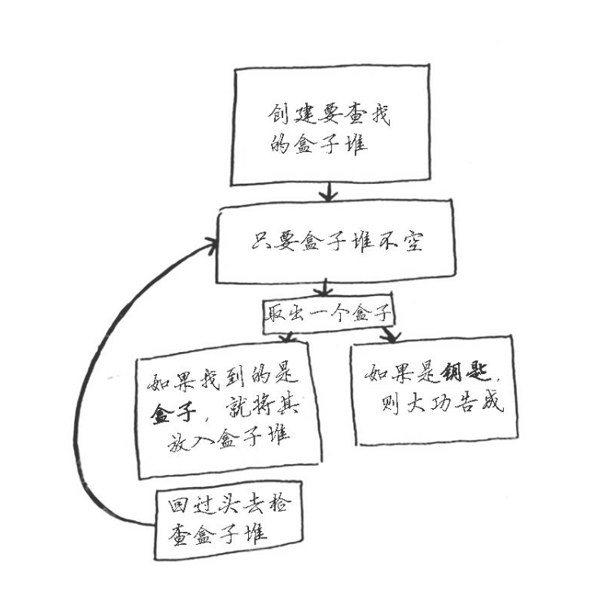
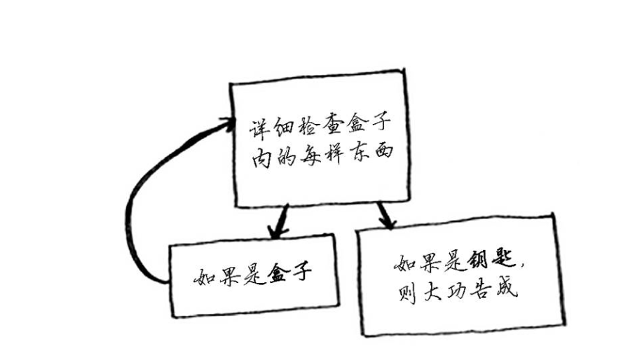
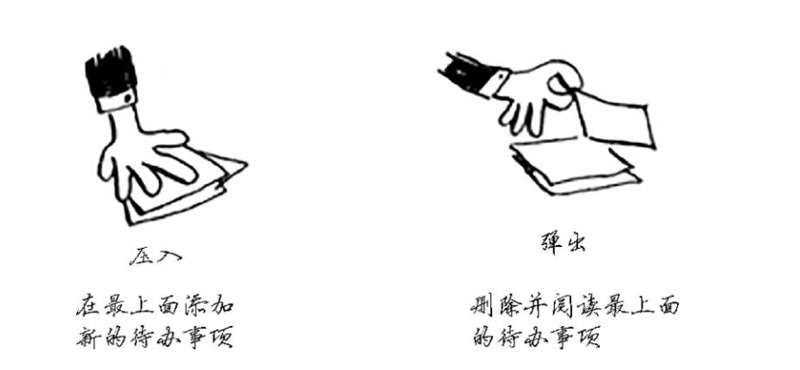

##  递归





图一和图二对比，它们的作用都是相同的。从流程上分析，图一流程相对比较复杂，而图二则简单明了，
<!--more-->
这是某位同行在stackoverflow上面说过的话:如果使用循环，程序的性能可能更高;如果使用递归，程序可能更容易死理解。如何选择要看什么对你来说跟重要。

那么递归和循环之间的区别是什么呢？
不同点:
递归是函数体中调用自己，如果不加以控制，将无休止的调用自己，直到堆栈溢出。
循环是反复执行某一段区域内的代码，如果不加以控制，就会形成死循环。


相同点:
不管是递归还是循环，都要设定一定的条件，以结束递归或循环。


## 基线条件和递归条件

编写递归函数时，必须告诉它何时停止递归。正因为如此，每个递归函数都有其两部分:基线部分和递归条件。
递归条件指的是函数调用自己，而基线条件则指的的函数不再调用自己，从而避免形成无线循环。

代码示例如下:
```
package cn.recursive.example;

public class RecursiveExample {
    
    
      /**
       * 一个递归方法
       * @param x
       * @return
       */
       public static int f(int x) {
           
           if (x == 0) {
               
               return 0;
           }
           
           return 2 * f(x - 1) + x * x;
       }
       
       
      

      
       public static void main(String[] args) {
           
    
         //调用该方法，当x=2时，输出为6
        System.out.println(RecursiveExample.f(2));
          
    
       }
}

```

代码中的return 0相当于基线条件，而return 2 * f(x-1)+x * x相当于递归条件。


## 栈
栈是一种数据结构，我们时常用它，而我们自己却不知道。


使用栈虽然很方便，但是也是要付出代价:
存储详尽的信息可能占用大量的内存。每个函数调用都要占用一定的内存，如果栈很高，就意味着计算机存储了大量函数调用的信息。在这种情况，通常有如下两种选择:
(1)重新编写代码，转而使用循环;
(2)使用尾递归。这是一个高级递归主题。另外并非所有的语言都支持尾递归;

我的感触:
其实算法图解之递归这一章对我的最大感触就是使用大量的伪代码和生动的图像，使我觉得代码的确是一个生动有活力的家伙。另外我觉得伪代码对于理清代码思路有很大帮助，特别是要写某个功能的时候，这时可以写写伪代码梳理一下逻辑，然后开始动手验证伪代码的逻辑是否正确。