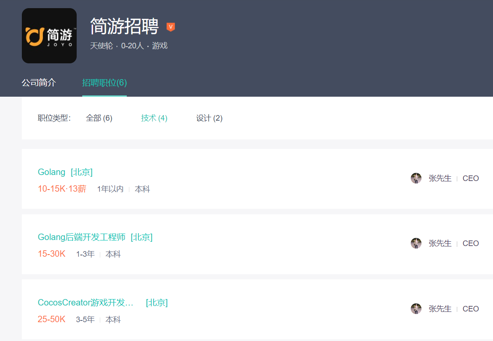
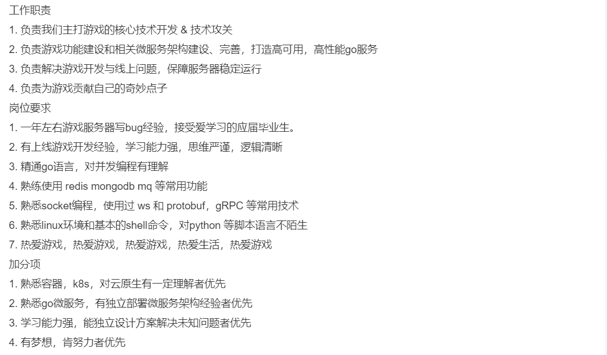
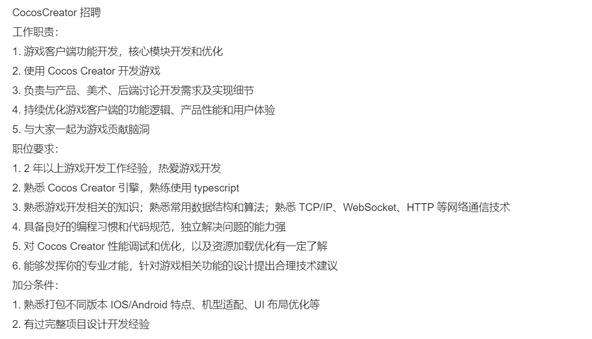

中秋节假期过后，羊了个羊这款微信小游戏，虽处可见，地铁上、公交上、电梯里、餐厅里，只要是有人停留的地方，总会看到一些人在玩这个游戏。
<!--more-->

初次打开微信小游戏，咋一看，这个与开心消消乐有啥区别呢？第一关很容易通过，第二关可谓是难倒一堆人(网传该游戏的通关率不到0.1%)。

我对羊了个羊这样的游戏一直处于无感状态，相对该游戏而言，我更喜欢如围棋、中国象棋、国际象棋、数独等之类的游戏。羊了个羊我玩了一下感觉实在是太没意思了(也许我不适合玩这一类的游戏吧)，最后发现网上不少朋友沉迷于此无法自拔。

由于该游戏的第二关比较难，居然形成了产业链(这让我想起了高中的政治课，供求影响价格)：

由于羊了个羊，我没有深入的玩这款游戏，我就不发表对于这游戏具体内容的看法了。我只拿几个我关心的点来谈一谈。

- 1.羊了个羊挂了。
- 2.微信小游戏是如何赚钱的。
- 3.如何开发一款属于自己的游戏。

## 一、羊了个羊挂了

引用澎湃新闻部分内容：
> 14日上午，据《羊了个羊》官方微博消息，由于该游戏过于火爆，出现了宕机的情况。截至目前，羊了个羊服务器2天内已经崩了3次。
由于火爆程度超预期，目前官方甚至称“急招后端服务器开发”。官方称“推荐入职的奖励五千，自荐入职的奖金五千”。

这也不禁使我对羊了个羊的研发团队好奇，于是查了一下**相关的资料：**
“羊了个羊”背后的制作团队——北京简游科技有限公司（以下简称为“简游科技”）创始人张佳旭，在多家媒体采访中介绍称，整个小游戏研发团队只有3个人，总共开发了3个月，“没想过会火，我们也没有准备好”。

于是查了一下这家公司的招聘情况：

由此可知，羊了个羊后端用的是Go语言相关生态，游戏客户端用的是Cocos Creator(支持跨平台，一次开发，全平台运行)。

挂了的原因正如他们所说，没有想过会怎么火，这就谈不上事前采取怎样的措施来保障高可用。

## 二、微信小游戏是如何赚钱的
主要还是靠广告收入。例如之前在微信上玩得斗地主（实际上也是微信小游戏），为了获取更多的豆子，不断的点击广告，很多微信小游戏实际也是如此，通过让用户点击更多的广告来获取更多的收益。其实，换句话说，整个微信生态乃至整个腾讯生态，均以广告赚钱，广告是腾讯的主要收入。

作为个人开发者而言，通过微信小游戏变现的方式只能是广告（充值相关，涉及支付，必须是要有一个公司作为主体才行）。

## 三、如何开发一款属于自己的游戏
如果你想自己独立的开发一款跨平台的游戏，**具备如下两点即可：**

- 1.掌握任意一门后端语言（C++、Java、Go、Python等）。
- 2.选择一个游戏引擎(Cocos、Laya、Unity 3D等国内或国外的均可)。

以羊了个羊招聘的后端Go开发工程师为例：

以羊了个羊招聘的游戏开发工程师为例：

我在[我的学习方法论](https://youcongtech.com/2022/04/30/%E6%88%91%E7%9A%84%E5%AD%A6%E4%B9%A0%E6%96%B9%E6%B3%95%E8%AE%BA/)一文中提到过岗位招聘学习法，通过面向岗位招聘有针对性的学习，这不仅仅适合有跳槽意愿的朋友，同样也适合想转岗或转行、跨行的朋友。

**关于CocosCreator相关学习资料如下:**

官网介绍:
https://www.cocos.com/products#CocosCreator

官方文档:
https://docs.cocos.com/creator/manual/zh/

视频教程:
https://space.bilibili.com/491120849

**关于Go语言相关学习资料如下:**

前段时间本人系统学习过Go，并写了相关文章以及上传相关代码示例，可供大家参考:
[Go语言学习分享(涵盖Go语言基础、Web开发、框架等)](https://youcongtech.com/2022/09/03/Go%E8%AF%AD%E8%A8%80%E5%AD%A6%E4%B9%A0%E5%88%86%E4%BA%AB/)

精选Go相关生态的开源项目:
https://github.com/avelino/awesome-go

如果你想小试牛刀的开发一些游戏示例，可参考我过往写的博文:
[基于Pygame实现五子棋](https://youcongtech.com/2022/07/24/%E5%9F%BA%E4%BA%8EPygame%E5%AE%9E%E7%8E%B0%E4%BA%94%E5%AD%90%E6%A3%8B/)
[Python之基于Panda3D游戏开发](https://youcongtech.com/2022/08/22/Python%E4%B9%8B%E5%9F%BA%E4%BA%8EPanda3D%E6%B8%B8%E6%88%8F%E5%BC%80%E5%8F%91/)

除此之外，你只需掌握一点JavaScript也是可以写一个游戏的！！！

babylon.js:
https://github.com/BabylonJS/Babylon.js

three.js:
https://github.com/mrdoob/three.js/

melon.js:
https://github.com/melonjs/melonJS

aframe.js:
https://github.com/aframevr/aframe/

phaser:
https://github.com/photonstorm/phaser