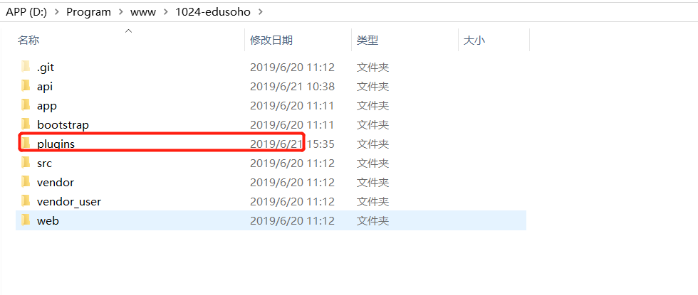

问题描述:
Edusoho如何迁移到本地windows或另外一台Linux服务器上

解决问题步骤:
<!--more-->

1.参考官方文档
官方文档地址如下:
http://www.qiqiuyu.com/my/course/331

试验过官方文档的方案，发现并不能直接解决我的问题

2.通过提问(像github对应的项目提issue)'

这个地址关于我对问题的描述和最终解决问题:
https://github.com/edusoho/edusoho/issues/63

3.最后发现问题仅仅只是少了一个plugins目录

4.在根目录增加这个plugins目录，然后就可以看到edusoho的界面了(windows和linux同理)

效果图如下:

