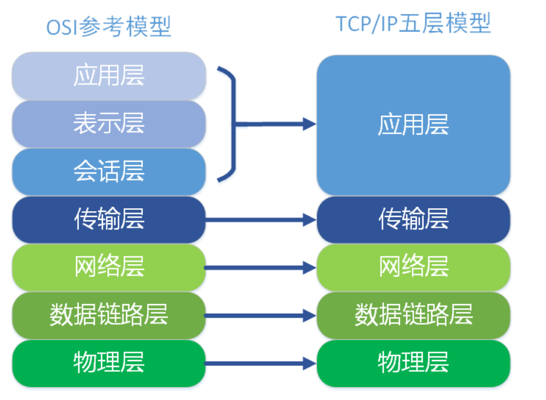
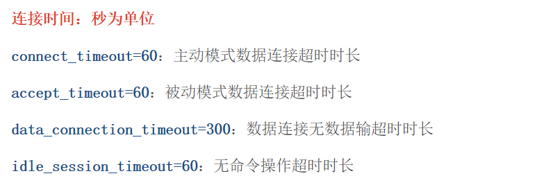

## 一、关于FTP

### 1.FTP是什么？
FTP，全称"文件传输协议"。属于TCP/IP四层模型中的应用层。
<!--more-->
### 2.TCP/IP五层模型有哪些？

如图所示:


用文字叙述(从高层到底层):
- (1)应用层;
- (2)传输层;
- (3)网络层;
- (4)数据链路层;
- (5)物理层。

其中如FTP、HTTP、SNMP等就属于应用层。

### 3.为什么要使用FTP
从我个人职业经历来谈，使用FTP的应用场景如下:
- (1)数据备份;
- (2)公司内部文件管理;
- (3)业务层应用;

#### (1)数据备份
关于数据备份，结合我之前做运维的一段经历，主要手段如下:
**编写shell脚本(基于scp命令)，配置crontab，进行定时文件传输备份(通常传输到另外一台备份服务器上)。**

除了基于scp之外，还可以有sftp、sz/rz、rsync和本文提到的ftp等。


**备份的内容通常如下:**
数据库脚本、应用软件日志(tomcat等)、常用脚本备份、重要配置文件和软件备份等。

#### (2)公司内部文件管理
关于公司内部文件管理，有的公司会搭建一个内部的FTP，主要用于管理公司重要文件(如公司规章制度文档、业务文档、技术文档、开发环境软件、重要第三方账号管理等)。

FTP有严格的权限控制，可以控制谁能访问某个目录下的文件和下载文件的权限。

#### (3)业务层应用
业务层应用的话，我之前用FTP作为我的博客系统文件管理工具，主要用于保存用户的头像和上传的如MP3、MP4、Pdf、Word等文件。

因为如果将其以二进制(其实将文件流转化为二进制)的形式存储，会影响数据库的性能。

**问:为什么将文件(这里指图片和其它文件格式的文件)以二进制的形式存储会影响数据库的性能？**
因为存储图片或其它文件的二进制需要非常长的字段(如text或longtext等)，对于数据库查找数据的时候，会增加处理时间(处理时间长)，在高并发的应用场景下，很多用户访问，这会加重数据库的负担，从而导致处理时间长(速度慢)，导致C端用户可能看到的景象是，点击某个功能加载很慢(如电商相关的，商品列表展示非常多的图片等)。

**问:为什么对于非常长的字段会增加数据库的查询时间呢？**
因为更长的列会消耗更多的内存，因为MySQL通常会分配固定大小的内存块来保存内部值。

以我之前写的博客系统，我会图片上传至FTP，然后通过Nginx做代理映射到FTP上传图片的目录，实际上保存在数据表里面的图片，仅仅是一个URL。而且nginx对于处理静态资源(如图片、css、html、js等)性能非常好。

**问:目前公司项目用FTP多吗？**
我的回答是分情况看，比方说对于中小公司或者创业公司来说，一般不会使用FTP，通常会用阿里云或者腾讯云、七牛云的存储服务。因为性能更好，不需要任何成本。因为自建，不管是FTP或者是分布式FastDFS都需要对其非常熟悉，不然的话，很容易遇到一些奇怪问题。
对于一些传统公司来说，用FTP的还是比较多(这里就不列举了)。


### 4.FTP的优缺点

#### (1)FTP有哪些优点?
- a.完善的权限管理;
- b.基于网络，操作灵活;
- c.安全性高，数据传输可通过SSL、SSH2进行安全加密;
- d.使用TCP/IP协议，保证数据准确到达;
- e.传输速度快,FTP的传输效率比HTTP更快;

#### (2)FTP有哪些缺点?
- a.FTP没有内置加速技术，传输巨型文件和海量文件需要很长时间，过程存在无故中断、传输文件内容不一致、传输文件丢失等(最近就特别感受到了，传输近二十个G文件，一旦中断，又得重新进行);
- b.FTP传输过程没有可视化的显示记录(使用winscp或xftp才能看到传输过程，代码层面上根本看不到);


### 5.FTP的替代方案有哪些？
就FTP方面，有如下方案:
- a.FTPS;
- b.SFTP;

但除此之外，还有很多第三方的文件存储方案如前面提到腾讯云对象存储、阿里云对象存储、七牛云对象存储等。

当然了，一切根据公司业务情况和公司背景情况而定，很多公司之所以不使用例如腾讯云、阿里云、七牛云的存储方案，是因为存储的东西非常重要，放在第三方不安全，害怕对方可能窃取其中的重要信息。

这也是为什么微信会有企业微信、阿里会有钉钉、美团会有大象的重要原因。

### 6.关于FTP的安装

#### (1)CentOS7安装FTP
参考如下流程，一步步执行即可:
```
#安装FTP
yum -y install vsftpd

#修改配置文件
vim /etc/vsftpd/vsftpd.conf

修改第12行为： anonymous_enable=NO  禁止匿名登录

取消第102行chroot_list_enable=YES，104行chroot_list_file=/etc/vsftpd/chroot_list的注释  

在最后一行新增 allow_writeable_chroot=YES

#新建用户
useradd test
passwd test

#防火墙放行
firewall-cmd --permanent --zone=public --add-service=ftp
firewall-cmd --reload

#ftp命令
#设置开机启动
systemctl enable vsftpd.service

#启动
systemctl start vsftpd.service

#停止
systemctl stop vsftpd.service

#查看状态
systemctl status vsftpd.service

#重启ftp服务器
systemctl restart vsftpd.service

```

#### (2)Ubuntu16.04安装FTP
[https://www.cnblogs.com/YangJieCheng/p/8252577.html](ubuntu16.04搭建ftp服务器)

#### (3)FTP配置文件各个配置的含义
[ftp配置详解](https://www.cnblogs.com/youcong/p/10786332.html)

## 二、Java中如何使用FTP

### 1.Java应用使用FTP

可以参考我之前写过的一篇[谈谈存储系统](https://www.cnblogs.com/youcong/p/10422360.html)
该篇文章主要针对如何使用阿里云的对象存储、FTP、常规存储等三种方案，有代码例子。

最近我的同事就使用其中的FTP方案。

### 2.SpringBoot应用使用FTP
与Java应用使用FTP一样，只不过将FTP相关的配置放在配置文件里如application.yml或application.properties文件里。

大家感兴趣的可以参考[springBoot 实现ftp上传与下载](https://blog.csdn.net/weixin_38326506/article/details/89891043)，这里我就不写代码了。

## 三、和FTP相爱相杀的经历

### 1.FTP访问不了
像FTP搭建好了并启动，通常是可以通过ftp://ip进行访问，此时访问不了，因为是我们自建的服务器，没有使用阿里云或者腾讯云，结果发现是防火墙的限制。

之前做运维的一段时间，接触CentOS6.5系统，知道有个iptables防火墙，没想到这次有个firewall。后来查了相关资料，原来CentOS7默认是firewall防火墙。

执行上面的开放ftp就可以访问了。

之前公司服务器对公网开放过，由于我忘记了没有设置防火墙开机自启动导致突然服务就不行了。为此我专门研究了一下服务器安全策略。

搜索了相关资料，总结了如下几个策略(常规性策略):
- 漏洞补丁;
- 防火墙;
- 杀毒软件;
- 关闭不需要的服务和端口;
- 定期备份;
- 账户和密码保护(定期更改和密码设置复杂);
- 监测系统日志.

#### 既然提到防火墙，那么提个问题防火墙有什么用呢？
答:防火墙主要目的是阻止网络蠕虫病毒的攻击以及网络中某些不怀好意的人访问你的电脑（通过这些访问，可以非法获取用户电脑中的文件数据，甚至可以修改用户电脑系统中的某些设置，远程控制用户的电脑），保证用户上网安全。

### 2.输入正确的用户名和密码还是弹出需要登录的界面
这个问题是因为改了一些ftp的配置导致的。无论怎么设置用户名和密码都不行。主要参考一个博客参考的有问题。其实很简单，按照我前面列举的步骤就可以了，一举成功。

### 3.没有权限
一般情况下，ftp安装好后，默认是/var/ftp/pub下的目录，这个通常是默认的ftp用户。但这次没有权限是因为公司的一个程序员小姐姐使用自建的用户访问。linux创建用户的命令，通常有两个:
一个是useradd username，另外一个是adduser username。

#### 问:useradd和adduser有何区别？
**以CentOS为例:**
两者没有区别，都是创建用户，并在/home目录下生成对应的用户目录，没有设置密码，需要重新设置密码。

**以Ubuntu为例:**
useradd在使用该命令创建用户是不会在/home下自动创建与用户名同名的用户目录，而且不会自动选择shell版本，也没有设置密码，那么这个用户是不能登录的，需要使用passwd命令修改密码。

adduser在使用该命令创建用户是会在/home下自动创建与用户名同名的用户目录，系统shell版本，会在创建时会提示输入密码，更加友好。

这让我联想到，当初使用Ubuntu16.04的useradd创建用户时，一直不在/home目录下生成对应的用户目录，于是我手动创建，然后通过授权命令进行关联。

### 4.下载大的文件，突然中断，又需要重新执行
使用Java程序下载FTP上的大文件(接近二十个G)，出现中断。
最后通过搜索确定了是连接时间配置，连接不上，超时从而中断。为此我修改了该配置并重启，解决了这个问题。
配置如图所示:


**注意**:这里分主动模式和被动模式。

### 5.FTP的被动模式设置
核心配置如下:
```
#被动模式相关配置
pasv_enable=YES
pasv_min_port=10221
pasv_max_port=11221
pasv_promiscuous=YES

```
#### 问:FTP的被动模式是什么？
所谓被动模式，指的是FTP服务器“被动”等待客户端来连接自己的数据端口，其过程具体是：当开启一个FTP连接时，客户端打开两个任意的非特权本地端口（N >1024和N+1）。第一个端口连接服务器的21端口，但与主动方式的FTP不同，客户端不会提交PORT命令并允许服务器来回连它的数据端口，而是提交PASV命令。这样做的结果是服务器会开启一个任意的非特权端口（P > 1024），并发送PORT P命令给客户端。然后客户端发起从本地端口N+1到服务器的端口P的连接用来传送数据。

#### 问:FTP的主动模式是什么?
所谓主动模式，指的是FTP服务器“主动”去连接客户端的数据端口来传输数据，其过程具体来说就是：客户端从一个任意的非特权端口N（N>1024）连接到FTP服务器的命令端口（即tcp 21端口），紧接着客户端开始监听端口N+1，并发送FTP命令“port N+1”到FTP服务器。然后服务器会从它自己的数据端口（20）“主动”连接到客户端指定的数据端口（N+1），这样客户端就可以和ftp服务器建立数据传输通道了。

#### 问:FTP的主动模式和被动模式的区别什么？
主动模式的FTP是指服务器主动连接客户端的数据端口，被动模式的FTP是指服务器被动地等待客户端连接自己的数据端口。
被动模式的FTP通常用在处于防火墙之后的FTP客户访问外界FTp服务器的情况，因为在这种情况下，防火墙通常配置为不允许外界访问防火墙之后主机，而只允许由防火墙之后的主机发起的连接请求通过。因此，在这种情况下不能使用主动模式的FTP传输，而被动模式的FTP可以良好的工作。

**有一位技术小伙伴幽默的概括:**
- 主动模式：服务器向客户端敲门，然后客户端开门;
- 被动模式：客户端向服务器敲门，然后服务器开门。

#### 问:为什么要使用被动模式？
从上面的FTP的主动模式和被动模式的区别，我们就能得知为什么要使用被动模式不是主动模式。因为主动模式是服务端主动连接客户端，而被动模式是服务端等待客户端连接。实际应用中，客户端的端口是多变的，而服务端的端口则相对统一。所以千万不要因为是被动模式就理解为是服务端去连接客户端。

#### 问:被动模式的优缺点有哪些？
被动FTP对FTP客户端的管理有利，但对服务器端的管理不利。因为客户端要与服务器端建立两个连接，其中一个连到一个高位随机端口，而这个端口很有可能被服务器端的防火墙阻塞掉。


### 6.FTP下载过慢如何提高速率？
这里需要修改配置，增加如下内容:
```
local_max_rate = 1048576(相当于下载M/S) #单位，默认为字节

```

### 7.FTP太慢了，使用临时方案写shell脚本，脚本里处理文件和传输文件。
针对FTP下载实在太慢了，我想到了一个临时的办法使用scp来进行文件传输。但是呢？scp免密登录处理不太安全，于是我想到了一个办法使用sshpass。
[sshpass和scp相结合](https://www.cnblogs.com/youcong/p/13734601.html)

关于scp免密传输，可以参考我的这篇博客:
[Linux远程传输文件免密码](https://www.cnblogs.com/youcong/p/10809056.html)

### 8.太过随意，FTP配置匿名的重大隐患。
之前为了做试验测试，我不太严谨，就直接设置为匿名访问且可以任意读写。但实际中不应该这么做。

官方的话来说:
**匿名开放模式是一种最不安全的认证模式，任何人都可以无需密码验证而直接登录到FTP服务器。**

这样一来任何人就可以在服务器上任意上传或下载文件，安全形同虚设。

#### 问:FTP除了匿名开放模式还有哪些模式？哪个模式更安全一些？
**本地用户模式：**
它是通过Linux系统本地的账户密码信息进行认证的模式，相较于匿名开放模式更安全，而且配置起来也很简单。但是如果被黑客破解了账户的信息，就可以畅通无阻地登录FTP服务器，从而完全控制整台服务器。

如果是默认useradd username创建用户，默认就有ftp和sftp、ssh等权限。但如果是执行这条命令`usermod -s /usr/sbin/nologin fujieace`那么只能ftp，不能sftp和ssh。

**虚拟用户模式：**
它是这三种模式中最安全的一种认证模式，它需要为FTP服务单独建立用户数据库文件，虚拟出用来进行口令验证的账户信息，而这些账户信息在服务器系统中实际上是不存在的，仅供FTP服务程序进行认证使用。这样，即使黑客破解了账户信息也无法登录服务器，从而有效降低了破坏范围和影响。