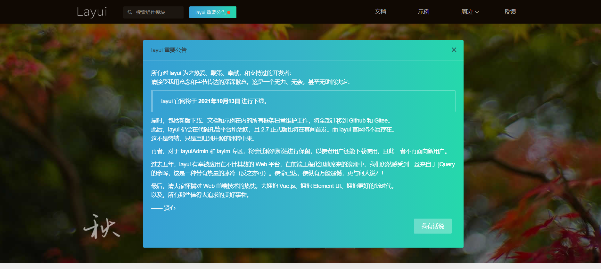
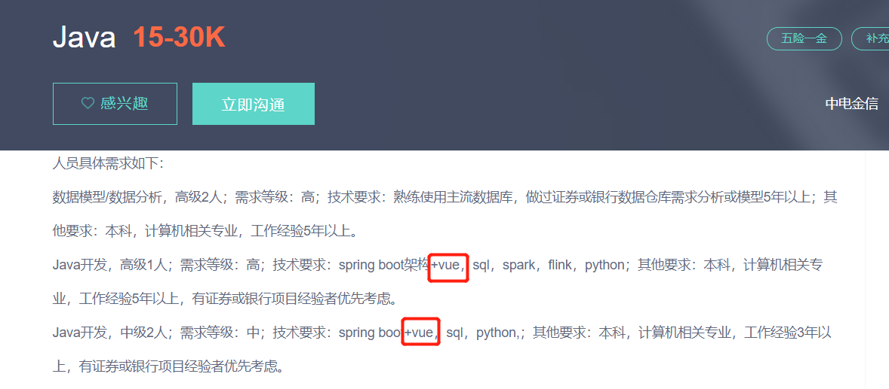
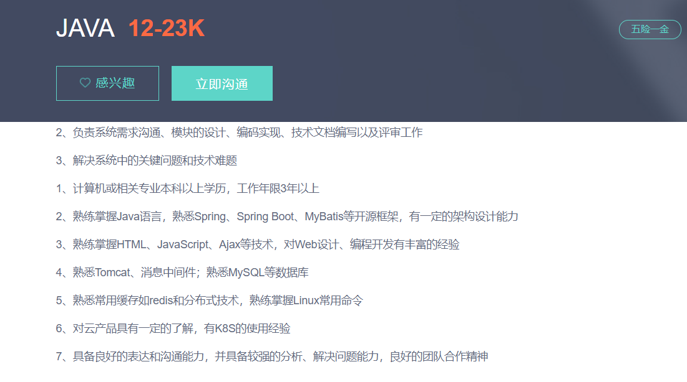

今天得知layui官网下线，如下图所示:

我个人还是蛮有感触的，不禁让我想起创业公司的五个产品，分别为智能酒店后台管理系统、智能门锁后台管理系统、资源共享平台、共享洗浴间管理系统、编程教育所涉及icode以及魔改系统等均用到layui这个web框架。
<!--more-->
在[挑战者V博客](https://www.cnblogs.com/youcong/)的找找看搜索，发现关于layui的也写了十多篇直接相关的文章。
以下是我写的:
[layui之日期和时间组件](https://www.cnblogs.com/youcong/p/10667039.html)
[layui之确认框](https://www.cnblogs.com/youcong/p/10657272.html)
[layui关闭弹出层](https://www.cnblogs.com/youcong/p/10371988.html)
[最易懂的layui分页](https://www.cnblogs.com/youcong/p/9296424.html)
[layui前端框架之分页](https://www.cnblogs.com/youcong/p/8326002.html)
[layui如何隐藏弹出层关闭的按钮](https://www.cnblogs.com/youcong/p/11070329.html)
[记一次layui弹框关闭问题](https://www.cnblogs.com/youcong/p/10657263.html)
[layui弹出层之应用实例讲解](https://www.cnblogs.com/youcong/p/9325620.html)
[layui上传文件组件(前后端代码实现)](https://www.cnblogs.com/youcong/p/11440639.html)
[layui如何自定义弹出层关闭事件](https://www.cnblogs.com/youcong/p/11070332.html)
[layui之table.render使用(含后台详细代码实现)](https://www.cnblogs.com/youcong/p/11342366.html)
[Uncaught ReferenceError: layer is not defined](https://www.cnblogs.com/youcong/p/10575270.html)

官网的首页有这样一句话:**由职业前端倾情打造，面向全层次的前后端开发者，易上手开源免费的 Web UI 组件库。**

对于过去前后端都做的Java开发人员来说，学习和熟练使用layui Web框架是一件非常容易的事情。而且layui做出来的后台管理系统，也十分美观。包括我在[2020年的一些思考和总结](https://youcongtech.com/2020/10/07/2020%E5%B9%B4%E7%9A%84%E4%B8%80%E4%BA%9B%E6%80%9D%E8%80%83%E5%92%8C%E6%80%BB%E7%BB%93/)这篇文章中提到的关于学习的思考，其中里面介绍了我的博客系统，我的博客的后台管理的主要前端框架就是layui，效果图如下:

当时该后台参考的是码云上面的一个开源项目，名字叫[layuiAdmin](https://gitee.com/thans/layuiAdmin)

从这则公告上的这句话:
**过去五年，layui 有幸被应用在不计其数的 Web 平台，在前端工程化迅速席来的浪潮中，我们仍然感受到一丝来自于 jQuery 的余晖，这是一种带有热量的冰冷（反之亦可）。使命已达，便纵有万般遗憾，更与何人说？！**

我看到了也是一种无奈之举。

**"做Java开发的，如果会jQuery能极大的增加找工作的机会"**。这句话我很有感触，当初能进入创业公司，这一点也是优势。对于不少中小企业而言，用人成本是很高的，如果招一个人既会写后端又会写前端，相当于一份工资做两个职位的事情，何乐而不为呢。我编程的五年里，其中写前端相关的我就写了三年。直到今天，我还有不少同学、朋友位于研发一线，不仅仅要写后端还得写前端。直到今天为止，仍然还有不少公司招Java开发的，要求其不仅仅是写Java，还得写前端，例如下面的招聘要求:

只不过要求的不再是jQuery了，而是目前最为流行的前端三大框架之一的Vue.js。

向下面这样的岗位招聘:

谈到了熟练掌握HTML、JavaScript以及Ajax，通常涉及到这个，一般进来是维护老系统，很多老系统难以重构，先不说后端，前端均采用jQuery的老版本或者一些老的前端框架之类的。

我印象比较深的是，我的四家公司的技术经理、技术总监、Leader均会写前端相关的代码。看来也是那个时代要求一个人不仅仅需要写后端，前端也得写，同时还得会运维。

如今专门化，专门化的好处在于**专业的人做专业的事情**。对于后端而言，学习写前端是一件成本很低的事情，但是写是一方面，如何写好也是需要花一些功夫的。我当初在创业公司的时候，前端写的非常溜，一天时间六七个模块的CRUD相关的就写完了，但是呢，一旦出bug，就很难受，那个时候没有这样的思想，**即通用方法抽取**(也可以叫组件化)。

layui此次下线，使我不得不意识到一个问题:**技术会持续不断的更新迭代，那些停滞不前或已经不满足潮流的旧技术终将会被无情的淘汰(包括人、公司、行业等)，那么怎样的东西才更有可持续发展的能力，不会随时间的流逝或技术上的更新迭代而被淘汰呢？**

我从招聘网站上找到一些答案，仅供参考，如下所示:

- 编程语言不限，我们更看重对工程设计的深刻理解和强大的迁移学习能力。
- 具备良好的分析解决问题能力，较完善的逻辑思维框架和全局思维。
- 具备良好的沟通表达能力和团队协作能力。
- 计算机理论知识扎实。
- 对技术有激情，有较强的学习能力与敏锐的技术前瞻性，对新的领域和技术能够快速掌握并应用到实际工作中。
- 能深入理解业务需求，分析和发现优化点。
- 深入理解和精通某一项编程语言。
- 具备优秀的自驱力和探索精神，勇于对系统和需求的不合理提出质疑，并且有能力推动落地。

我相信能够做到上面8点的人，不会因为技术更新迭代而被淘汰的。而上面8点也是我自己对我自己的要求。

