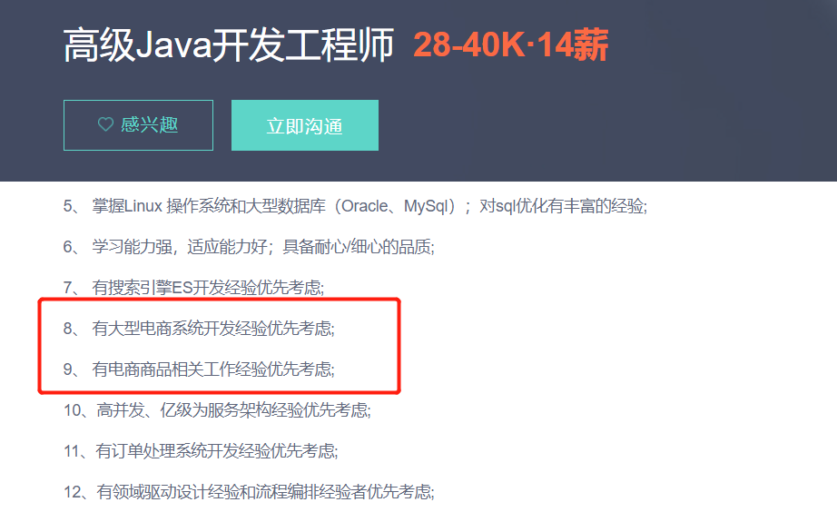

从2016年8月到迄今为止，我待过不少公司，从外包公司到自主产品公司，从运维到半个架构师兼Java中级开发工程师。至于为什么叫半个架构师？是因为目前公司的技术架构主要是由我负责主导，之所以由我负责主导，原因在于我上家教育SaaS公司分布式的落地实践经验以及我创业公司半分布式和半全栈相关的产品开发经验等。当然了，最关键的不是这个，最关键的是公司领导对我的信任和栽培，也许他们中的一些人，离开了，但我不会忘记这知遇之恩。

话有些的偏题了，回归正题，谈谈跳槽。跳槽也是离职的一种表现。马云曾说，**"员工离职的原因，林林总总，只有两点最真实，一是钱没给到位，二是受委屈了"**。

在我的职业生涯上，每次离开一家公司，都多多少少充满着不舍。但人总归是理性的，需要考虑很多现实的因素。现实的因素不仅仅是关于现在，更关系到将来。此文我会谈论如下几个问题:

- 为什么要跳槽？跳槽的真正目的是什么？
- 跳槽应该规避的不利因素有哪些？
<!--more-->

## 一、为什么要跳槽？跳槽的真正目的是什么？

### 1.为什么要跳槽？
在谈论这个问题的时候，我不想在百度或必应搜索这样的问题，我想从我自身职业经历谈论这个问题。

我当初在外包公司做运维的时候，我之所以待这家公司，原因很简单，因为我自身能力，非常缺乏，但幸运的是遇到了两个小伙伴对我帮助，我飞速成长，但是当我不断进步和成长的同时，但公司给我的薪资待遇仍然非常低，仅仅够我勉强温饱，同时我不想做运维，我想往Java开发这个方向发展，即便这一年里，我利用业余时间不断学习Java相关，但因为没有真正的企业级项目实践经验，很难遇到真正的业务场景问题，所以我无法胜任公司当时Java岗位的要求，我的转岗诉求被驳回。于是我决定离职，**这时的离职理由最主要的原因是我的转岗诉求被驳回，其次就是薪资低**。那个时候对我而言，离开这家公司，我很难找到合适的公司。所以我决定前往北京寻找一个更大的平台，圆我的Java开发梦。

也许是老天的眷顾，来到北京找到了住的地方后，投了十几份简历，最终我来到了创业公司，这个让我充满传奇经历的地方。
关于我在创业公司的经历和收获，可以阅读下面的文章:
[创业公司这两年](https://www.cnblogs.com/youcong/p/12153262.html)
[谈谈在创业公司的几点感触](https://www.cnblogs.com/youcong/p/10016594.html)
[作为程序员的思考与反省](https://www.cnblogs.com/youcong/p/9862712.html)
[一位北漂在创业公司的两年](https://mp.weixin.qq.com/s?__biz=MzUxODk0ODQ3Ng==&mid=2247485439&idx=1&sn=201a791086509ae93a29a669e8d402be&chksm=f98054eccef7ddfac7c6b7d30d40b33a1044cc702850cadf1ee2b0a9b3caca551f56779c719b&token=2104650779&lang=zh_CN#rd)

离开了创业公司的原因，**我归纳为如下:我想追求更好的发展，更高的薪资。**

创业公司的一年零九个月的经历，我非常感激，因为这使得我，从一个新手Java(没有经历过企业实战的Java开发，都算是新手Java)到半个全栈开发工程师，在创业公司我们团队每个小伙伴都身兼数职，在创业公司，前端开发、后端开发、运维、测试等，我全部都做过。这一定程度上提高了我的技术视野。

最终，更好的发展和更高的工资都在教育SaaS公司得到了实现，但却使我在一定程度上损失了身体健康。**鱼和熊掌不可兼得，当你想得到一样东西的时候，必然也会失去一些东西，得与失，互相转换。**

但我此时仍然没有意识到一个问题，那就是我每次换一份工作的时候，业务方面都与上一家公司关联性不大。例如从外包公司到创业公司，再从创业公司到教育SaaS。使我每次光有技术上的积累而缺乏业务上的沉淀。这也是后来我为了防止自己安于现状，时不时会去招聘网站上看一些岗位要求，以这些岗位要求为目的进行学习提高自己。举个例子:

图片中的红色标记就是业务方面的积累体现。这些业务方面的积累是需要时间沉淀的。例如想掌握Linux操作系统和数据库以及sql优化、搜索引擎ES开发经验、领域驱动设计经验、流程编排经验、高并发等是可以通过后天刻意练习实现大部分的。

### 2.跳槽的真正目的是什么？
从我的角度来看，跳槽的真正目的只有一个，**那就是让自己不断成长和进步，当然钱也很重要，但并不是最主要。**这几年来，我买过基金、买过比特币、买过股票，但我似乎忽视了一点，基金的本质就是风险平坦(实际还是股票，只不过不是鸡蛋放在一个篮子里，而是多个鸡蛋，多个篮子，哪怕其中一个篮子破了，也不影响整体)、比特币的本质我觉得就是炒作和投机(也许这句话有失片面，虽然我买了比特币没有亏，盈利了一点点，但也掩盖不了我是一个"韭菜")、股票的本质虽然有机构或大体量散户的投机成分但归根结底还是公司的盈利能力(公司不断成长和进步，盈利的能力便可持续提升)。对于我而言，每次跳槽实际也是一种投资，我对自己的投资，公司对我的投资。
导师常跟我强调一点，**千万不要为了多个两三千块而去跳槽，那样的跳槽价值很低，没有必要。**

## 二、跳槽应该规避的不利因素有哪些？
从我所经历的角度出发，可归纳为如下:

- 不要因为人际关系处的不好而跳槽(因为你很难确保你下一个或下下个公司不会遇到这样的情况，学会如何处理人际关系)；
- 不要因为跟领导产生矛盾而跳槽(人与人之间，哪怕再好的朋友都会产生矛盾，矛盾并不可怕，可怕的是任由矛盾激化而不是相办法对话解决该矛盾)；
- 不要因为看到人家跳槽涨薪，自己也想着跳槽涨薪(自己通过跳槽涨薪这种方式也能成功，但是最后你会发现可能没有这个必要)；
- 不要因为环境太安逸了，想着出去闯闯而跳槽(即便有这个想法，也要做好充足的准备，否则就是找"虐")。

也许有人会这样说，如果不出去闯一闯看一看，那么到了30岁或到不了35岁就会被裁了，因为长期处于一个安逸稳定的环境(舒适圈)，很容易让人退步(温水煮青蛙的故事体现)。

这的确是一个问题，所以人的职业生涯中需要一个"复业"，这个"复业"会促使你不断成长和进步。例如写博客对我而言就是一个"复业"。
关于写博客的好处，我在这篇文章谈论过，感兴趣的朋友可以阅读:

[致所有的开发者们](https://youcongtech.com/2019/05/27/%E8%87%B4%E6%89%80%E6%9C%89%E7%9A%84%E5%BC%80%E5%8F%91%E8%80%85%E4%BB%AC/)

至于如何跳槽才能最优化，我没有相关的经验，故不表述已见，免得误人误己。但我想这篇文章或许能给你带来一些启发:
[技术人对赚钱的思考与摸索](https://youcongtech.com/2021/05/23/%E6%8A%80%E6%9C%AF%E4%BA%BA%E5%AF%B9%E8%B5%9A%E9%92%B1%E7%9A%84%E6%80%9D%E8%80%83%E4%B8%8E%E6%91%B8%E7%B4%A2/)

[黑客价值观的思考与探索](https://youcongtech.com/2021/07/17/%E9%BB%91%E5%AE%A2%E4%BB%B7%E5%80%BC%E8%A7%82%E7%9A%84%E6%80%9D%E8%80%83%E4%B8%8E%E6%8E%A2%E7%B4%A2/)

[中国象棋之启发](https://youcongtech.com/2021/09/04/%E4%B8%AD%E5%9B%BD%E8%B1%A1%E6%A3%8B%E4%B9%8B%E5%90%AF%E5%8F%91/)

[肖申克的救赎之感悟关键词](https://youcongtech.com/2021/08/06/%E8%82%96%E7%94%B3%E5%85%8B%E7%9A%84%E6%95%91%E8%B5%8E%E4%B9%8B%E6%84%9F%E6%82%9F%E5%85%B3%E9%94%AE%E8%AF%8D/)

[2020年的一些思考和总结](https://youcongtech.com/2020/10/07/2020%E5%B9%B4%E7%9A%84%E4%B8%80%E4%BA%9B%E6%80%9D%E8%80%83%E5%92%8C%E6%80%BB%E7%BB%93/)

[致所有的开发者们](https://youcongtech.com/2019/05/27/%E8%87%B4%E6%89%80%E6%9C%89%E7%9A%84%E5%BC%80%E5%8F%91%E8%80%85%E4%BB%AC/)

## 三、总结
有一句话叫做，"知易行难"。很多事情实际做起来并没有想象中那么美好，肯定会遇到不少困难，但千万不要因为一时的困难而选择放弃，否则成功便会离你远去。