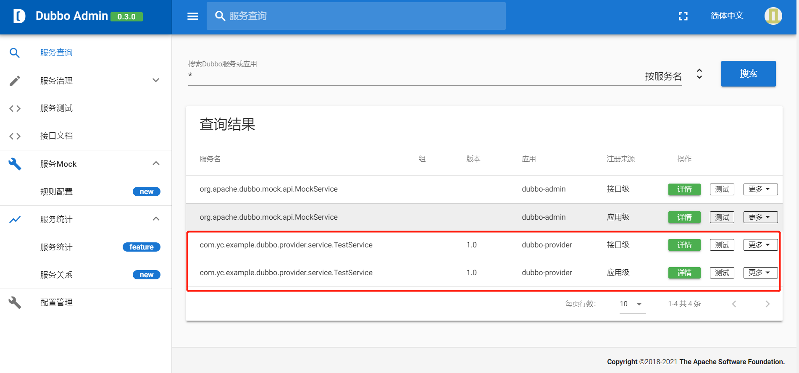
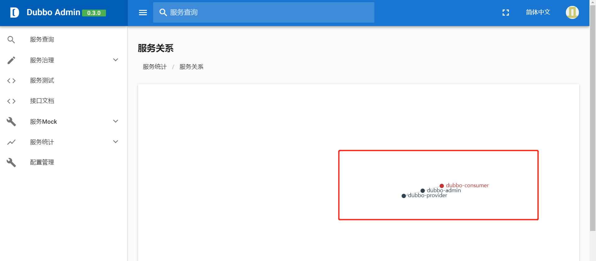

基于Dubbo架构体系，拿来即用，毫无任何杂糅的组件，可以基于此作为Dubbo分布式微服务的脚手架。
<!--more-->

dubbo-admin地址为:
https://github.com/apache/dubbo-admin

官方文档:
https://github.com/apache/dubbo-admin/blob/develop/README_ZH.md

注意需要安装Zookeeper(因为Dubbo使用Zookeeper作为注册中心)

一定要把dubbo-admin中的duboo-admin-server运行起来，对应的dubbo-ui通过npm run dev命令也要将其运行下来(记得npm install)

## 一、生产者

### 1.导入Maven依赖
```
 <dependencies>
        <dependency>
            <groupId>org.springframework.boot</groupId>
            <artifactId>spring-boot-starter</artifactId>
        </dependency>

        <dependency>
            <groupId>org.apache.dubbo</groupId>
            <artifactId>dubbo-spring-boot-starter</artifactId>
            <version>3.0.2.1</version>
        </dependency>

        <dependency>
            <groupId>org.apache.curator</groupId>
            <artifactId>curator-x-discovery</artifactId>
            <version>5.1.0</version>
        </dependency>

        <!-- zk的依赖 -->
        <dependency>
            <groupId>org.apache.dubbo</groupId>
            <artifactId>dubbo-dependencies-zookeeper</artifactId>
            <version>2.7.6</version>
            <type>pom</type>
            <exclusions>
                <exclusion>
                    <groupId>org.slf4j</groupId>
                    <artifactId>slf4j-log4j12</artifactId>
                </exclusion>
            </exclusions>
        </dependency>
    </dependencies>

```


### 2.主类
```
@SpringBootApplication
public class YcExampleDubboProviderApplication {
    public static void main(String[] args) {
        SpringApplication.run(YcExampleDubboProviderApplication.class, args);
    }
}

```

### 3.Service极其ServiceImpl

TestService.java
```
public interface TestService {
    String showName();
}


```

TestServiceImpl.java
```
@DubboService(version = "1.0")
public class TestServiceImpl implements TestService {
    @Override
    public String showName() {
        return "show server name";
    }
}

```

### 4.配置文件
```
# Spring boot application
spring.application.name=dubbo-provider
# Base packages to scan Dubbo Component: @org.apache.dubbo.config.annotation.Service
dubbo.scan.base-packages=com.yc.example.dubbo.provider.service.impl   
# Dubbo Application
## The default value of dubbo.application.name is ${spring.application.name}
dubbo.application.name=dubbo-provider
# Dubbo Protocol
dubbo.protocol.name=dubbo
dubbo.protocol.port=20881
## Dubbo Registry
dubbo.registry.address=zookeeper://127.0.0.1:2181
server.port=7010

```

### 5.运行效果



## 二、消费者

### 1.导入Maven依赖
```
<dependencies>
        <dependency>
            <groupId>com.yc.framework</groupId>
            <artifactId>yc-example-dubbo-provider</artifactId>
            <version>1.0</version>
        </dependency>

        <dependency>
            <groupId>org.springframework.boot</groupId>
            <artifactId>spring-boot-starter</artifactId>
        </dependency>

        <dependency>
            <groupId>org.springframework.boot</groupId>
            <artifactId>spring-boot-starter-web</artifactId>
        </dependency>

        <!-- dubbo的依赖 -->
        <!-- https://mvnrepository.com/artifact/org.apache.dubbo/dubbo-spring-boot-starter -->
        <dependency>
            <groupId>org.apache.dubbo</groupId>
            <artifactId>dubbo-spring-boot-starter</artifactId>
            <version>3.0.2.1</version>
        </dependency>

        <dependency>
            <groupId>org.apache.curator</groupId>
            <artifactId>curator-x-discovery</artifactId>
            <version>5.1.0</version>
        </dependency>

        <!-- zk的依赖 -->
        <dependency>
            <groupId>org.apache.dubbo</groupId>
            <artifactId>dubbo-dependencies-zookeeper</artifactId>
            <version>2.7.6</version>
            <type>pom</type>
            <exclusions>
                <exclusion>
                    <groupId>org.slf4j</groupId>
                    <artifactId>slf4j-log4j12</artifactId>
                </exclusion>
            </exclusions>
        </dependency>
    </dependencies>

```

### 2.主类
```
@SpringBootApplication
public class YcExampleDubboConsumerApplication {
    public static void main(String[] args) {
        SpringApplication.run(YcExampleDubboConsumerApplication.class, args);
    }
}

```

### 3.配置文件
```
spring.application.name=dubbo-consumer
dubbo.registry.address=zookeeper://127.0.0.1:2181
server.port=7000
dubbo.protocol.name=dubbo
dubbo.protocol.port=20881

```

### 4.测试类
TestController.java如下:
```
@RestController
public class TestController {
    @DubboReference(version = "1.0")
    private TestService testService;

    @GetMapping("test1")
    public String test1() {
        return testService.showName();
    }
}


```

### 5.测试效果



## 三、源代码
https://github.com/developers-youcong/yc-framework/tree/main/yc-example/yc-example-dubbo