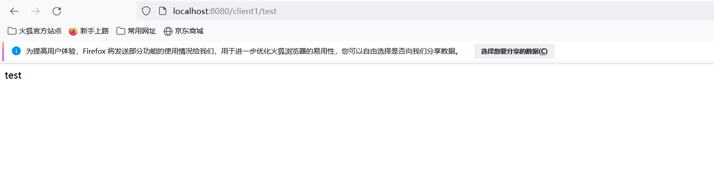

本文教你轻松搭建SpringCloud Eureka架构，即可用于自己深入学习分布式微服务，也可用于公司的商业化产品工程。本文偏实战类，而非理论。
<!--more-->

关于分布式相关理论类的，可以阅读我往期写的文章，文章列表如下:
[从单体架构到分布式微服务架构的思考](https://mp.weixin.qq.com/s?__biz=MzUxODk0ODQ3Ng==&amp;mid=2247485665&amp;idx=1&amp;sn=cc5ed01f671790ed9b3ac92a2f5c0aef&amp;chksm=f9805bf2cef7d2e4ed5ebda401c4e9dda708125ff6c0a77d77fe1a155666851e7e1ba0c3130c&token=143028030&lang=zh_CN#rd)
[CAP理论之思考](https://mp.weixin.qq.com/s?__biz=MzUxODk0ODQ3Ng==&amp;mid=2247486142&amp;idx=1&amp;sn=023961c3b5cc11316f9ec96bd984ca8d&amp;chksm=f98059adcef7d0bb309110de8b25e53194e323ec48f5fe3ba3c8628d2aefbbca5050c002ee65&token=143028030&lang=zh_CN#rd)
[BASE理论之思考](https://mp.weixin.qq.com/s?__biz=MzUxODk0ODQ3Ng==&amp;mid=2247486143&amp;idx=1&amp;sn=e375b84f1ac3ad6f86c6555e031e3052&amp;chksm=f98059accef7d0ba8f03ad4135803f1306c2d287ceed11b53097a3846e15419a605ac5f3827a&token=143028030&lang=zh_CN#rd)

## 一、服务注册中心

### 1.导入Maven依赖

```
  <dependencies>
        <dependency>
            <groupId>org.springframework.cloud</groupId>
            <artifactId>spring-cloud-starter-netflix-eureka-server</artifactId>
        </dependency>
    </dependencies>

```

### 2.主类
```
@EnableEurekaServer
@SpringBootApplication
public class YcExampleEurekaServerApplication {
    public static void main(String[] args) {
        SpringApplication.run(YcExampleEurekaServerApplication.class, args);
    }
}

```

## 3.配置文件
```
server:
  port: 8079

eureka:
  instance:
    hostname: localhost
  client:
    register-with-eureka: false
    fetch-registry: false
    serviceUrl:
      defaultZone: http://${eureka.instance.hostname}:${server.port}/eureka/
  server:
    enable-self-preservation: false

```

### 4.启动效果


## 二、搭建客户端

### 1.导入Maven依赖
```
 <dependencies>
        <dependency>
            <groupId>org.springframework.cloud</groupId>
            <artifactId>spring-cloud-starter-netflix-eureka-client</artifactId>
        </dependency>
        <dependency>
            <groupId>org.springframework.boot</groupId>
            <artifactId>spring-boot-starter-web</artifactId>
        </dependency>
        <dependency>
            <groupId>org.springframework.cloud</groupId>
            <artifactId>spring-cloud-starter-openfeign</artifactId>
        </dependency>
    </dependencies>

```

### 2.主类
```
@SpringBootApplication
@EnableEurekaClient
@RestController
public class YcExampleEurekaClientApplication {
    public static void main(String[] args) {
        SpringApplication.run(YcExampleEurekaClientApplication.class, args);
    }

    @GetMapping("/test")
    public String test() {
        return "test";
    }
}

```

### 3.配置文件
```
server:
  port: 8090
spring:
  application:
    # 服务名，后续可通过服务名访问这个服务，而不需要写具体的ip、端口
    name: client1
eureka:
  client:
    # eureka server的注册地址
    serviceUrl:
      defaultZone: http://localhost:8079/eureka/

```

### 4.启动成功后，Eureka Server效果


## 三、搭建网关

### 1.导入Maven依赖
```
   <dependencies>
        <dependency>
            <groupId>org.springframework.cloud</groupId>
            <artifactId>spring-cloud-starter-gateway</artifactId>
        </dependency>
        <dependency>
            <groupId>org.springframework.cloud</groupId>
            <artifactId>spring-cloud-starter-netflix-eureka-client</artifactId>
        </dependency>
        <dependency>
            <groupId>org.springframework.cloud</groupId>
            <artifactId>spring-cloud-starter-netflix-hystrix</artifactId>
        </dependency>
        <dependency>
            <groupId>org.springframework.cloud</groupId>
            <artifactId>spring-cloud-starter-netflix-ribbon</artifactId>
        </dependency>
        <dependency>
            <groupId>org.springframework.cloud</groupId>
            <artifactId>spring-cloud-starter-openfeign</artifactId>
        </dependency>
    </dependencies>

```

### 2.主类
```
@SpringBootApplication
@EnableEurekaClient
public class YcExampleGatewayApplication {
    public static void main(String[] args) {
        SpringApplication.run(YcExampleGatewayApplication.class, args);
    }

    @Bean
    @LoadBalanced
    public RestTemplate restTemplate() {
        return new RestTemplate();
    }
}

```

### 3.配置文件
```
server:
  port: 8080

spring:
  cloud:
    gateway:
      discovery:
        locator:
          lowerCaseServiceId: true
          enabled: true
      routes:
        # 认证中心
        - id: client1
          uri: lb://client1
          predicates:
            - Path=/client1/**
          filters:
            - StripPrefix=1

application:
  name: gateway

eureka:
  client:
    serviceUrl:
      defaultZone: http://localhost:8079/eureka/

#请求处理的超时时间
ribbon:
  ReadTimeout: 10000
  ConnectTimeout: 10000

```

### 4.测试



## 四、总结
关于搭建SpringCloud Eureka相关的文章一大堆，有读者可能会疑问，为什么还要写呢？答案是，接下来我的一系列文章将会围绕分布式微服务或者计算机底层原理等，既有实战系列，也有原理源码相关的解析。这篇文章作为一个样例存在，后面自会用到的。
该源码已上传GitHub，地址为如下:
https://github.com/developers-youcong/yc-framework/tree/main/yc-example/yc-example-eureka