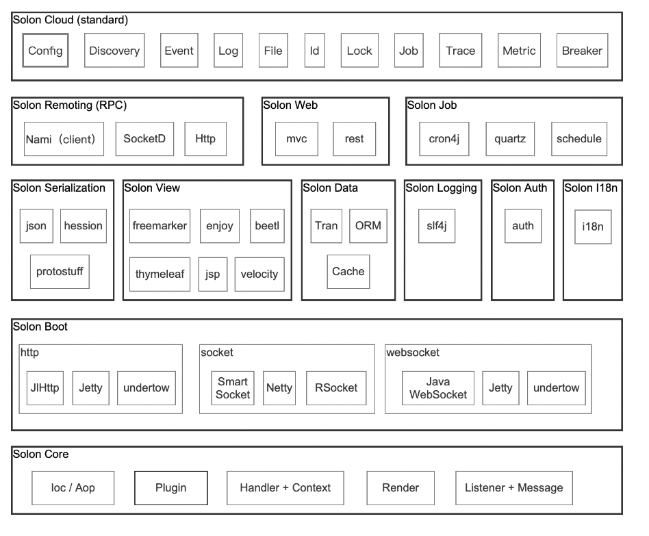
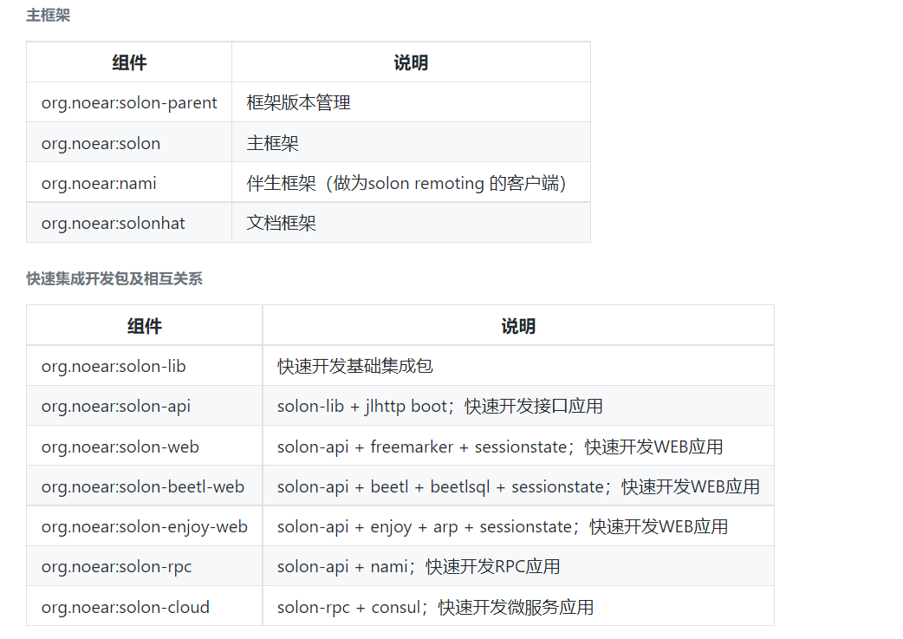
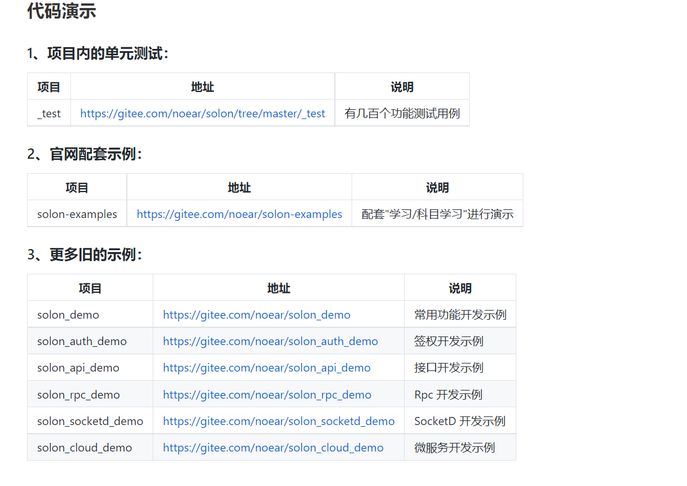

## 一、Solon是什么？
Solon，是一个轻量级的应用开发框架。更快、更小、更自由！
支持jdk8、jdk11、jdk17+；主框架0.1Mb；组合不同的插件应对不同需求；方便定制；快速开发。
<!--more-->


## 二、Solon具有哪些特点？
- 1.克制、简洁、开放。
- 2.Http、WebSocket、Socket 三种信号统一的开发体验（俗称：三源合一）。
- 3.支持注解与手动两种模式，按需自由操控。
- 4.Not Servlet，可以适配任何基础通讯框架（所以：最小0.2Mb运行rpc架构）。
- 5.基于订阅模式的 IOC & AOP 容器设计。
- 6.集合 Handler + Context 和 Listener + Message 两种架构模式；强调插件式扩展；适应不同的应用场景。
- 7.插件可扩展可切换：启动插件，扩展插件，序列化插件，数据插件，会话状态插件，视图插件(可共存) 等。
- 8.支持 Web、Job、Remoting、Cloud 等开发场景。
- 9.支持 GraalVM Native 打包。
- 10.体验与 Spring Boot 相近，迁移成本低。

## 三、Solon的学习资料有哪些？
官方网站:
http://solon.noear.org/

官方文档:
http://solon.noear.org/article/learn-start

Giee源代码:
https://gitee.com/noear/solon

Github源代码:
https://github.com/noear/solon

生态架构图:


主框架及快速集成开发包:


代码示例:


## 四、如何编写一个非常简单的示例进行体验？

### 1.新建项目并配置pom.xml
```
<parent>
    <groupId>org.noear</groupId>
    <artifactId>solon-parent</artifactId>
    <version>1.10.6</version>
    <relativePath />
</parent>

<properties>
    <maven.compiler.source>8</maven.compiler.source>
    <maven.compiler.target>8</maven.compiler.target>
</properties>

<dependencies>
    <dependency>
        <groupId>org.noear</groupId>
        <artifactId>solon-web</artifactId>
    </dependency>

    <dependency>
        <groupId>org.noear</groupId>
        <artifactId>solon-test</artifactId>
        <scope>test</scope>
    </dependency>
</dependencies>

<build>
    <finalName>${project.artifactId}</finalName>

    <plugins>
        <plugin>
            <groupId>org.apache.maven.plugins</groupId>
            <artifactId>maven-compiler-plugin</artifactId>
            <version>3.8.1</version>
            <configuration>
                <compilerArgument>-parameters</compilerArgument>
                <source>1.8</source>
                <target>1.8</target>
                <encoding>UTF-8</encoding>
            </configuration>
        </plugin>

        <plugin>
            <groupId>org.apache.maven.plugins</groupId>
            <artifactId>maven-assembly-plugin</artifactId>
            <version>3.3.0</version>
            <configuration>
                <finalName>${project.artifactId}</finalName>
                <appendAssemblyId>false</appendAssemblyId>
                <descriptorRefs>
                    <descriptorRef>jar-with-dependencies</descriptorRef>
                </descriptorRefs>
                <archive>
                    <manifest>
                        <mainClass>org.example.demo.DemoApp</mainClass>
                    </manifest>
                </archive>
            </configuration>
            <executions>
                <execution>
                    <id>make-assembly</id>
                    <phase>package</phase>
                    <goals>
                        <goal>single</goal>
                    </goals>
                </execution>
            </executions>
        </plugin>
    </plugins>
</build>

```

### 2.配置文件(app.yml)
```
server.port:  8080

solon.app:
  group: demo
  name: demoapp

```

### 3.编写主类
```
import org.noear.solon.Solon;
import org.noear.solon.annotation.Controller;
import org.noear.solon.annotation.Mapping;
import org.noear.solon.annotation.Param;

@Controller
public class DemoApp {
    public static void main(String[] args) {
        Solon.start(DemoApp.class, args);
    }

    @Mapping("/hello")
    public String hello(@Param(defaultValue = "world") String name) {
        return String.format("Hello %s!", name);
    }
}


```

## 五、为什么选择Solon?
为什么选择Solon不等同于一定要选择Solon，Solon即可应用于单体应用开发也能应用于微服务应用开发，相当于Solon可作为Java生态开发的另外一种选择。作为架构师而言，选择既要多，也要稳，既要敢于创新，也要结合实际业务需求进行平衡。