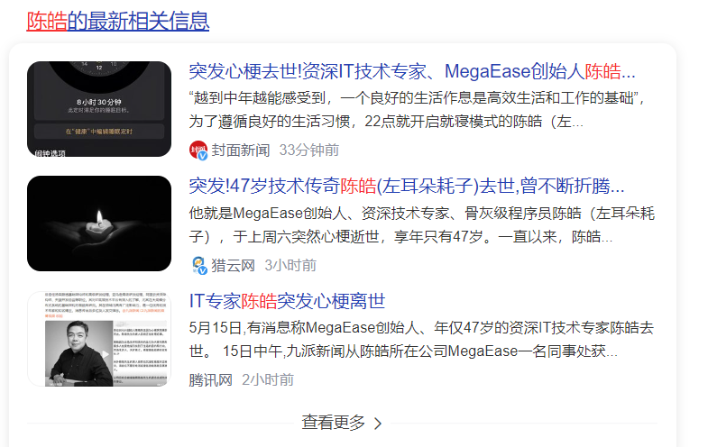

在我的IT职业生涯中，遇到了很多导师，陈皓就是导师群体中的其中一个。今天在一些技术群中看到有人在转发陈皓因突发心梗于上周周六晚间去世的消息，这让我感到非常震惊，最初觉得有些不敢相信，甚至怀疑是不是一些人在造谣，相关信息如下:
<!--more-->

连他所创建的公司官网都变灰了:

种种信息表明，这是真的。

最近几年我都会时不时阅读他所写的文章，每次一读，都能从中得到很大的启发(近来三年我的成长，不少得益于我思考并实践他写的一些文章中的思想或方法论)。因此我也写了相关文章:
[陈皓给我的一些启发](https://mp.weixin.qq.com/s?__biz=MzUxODk0ODQ3Ng==&mid=2247486891&idx=1&sn=d471e600f98352d0ff6f5b41f090c660&chksm=f9805eb8cef7d7ae8f90b40976c52a3eb5d0c43498472bf131ca0eb55c4513c67a088e3dda87&token=818666515&lang=zh_CN#rd)
[陈皓系列文章之记录与摘要](https://mp.weixin.qq.com/s?__biz=MzUxODk0ODQ3Ng==&mid=2247488099&idx=1&sn=55f99dc0f379dca80828af9b49264d13&chksm=f9804170cef7c8661a584db8a1e3dd3c4353918fec3ff892e05d6f0c263f8516637b9c5334e6&token=818666515&lang=zh_CN#rd)
[生产环境出了问题该怎么办？](https://mp.weixin.qq.com/s?__biz=MzUxODk0ODQ3Ng==&mid=2247487304&idx=1&sn=e0bcb82a6ed91dd2530235e89354e8f0&chksm=f9805c5bcef7d54d4d91261ac318252bc863221ed970f37ce8d572bdc86dcc6f1c79273c0b34&token=818666515&lang=zh_CN#rd)
[北京健康宝被攻击之高可用架构思考](https://mp.weixin.qq.com/s?__biz=MzUxODk0ODQ3Ng==&mid=2247486989&idx=1&sn=539be7f8c0bd1989926d54f23d9ec750&chksm=f9805d1ecef7d4085abaff5d96e204048ff57c162ec4dcb0ffacc421643a485331966054d950&token=818666515&lang=zh_CN#rd)
[程序员如何用技术变现？](https://mp.weixin.qq.com/s?__biz=MzUxODk0ODQ3Ng==&mid=2247486970&idx=1&sn=f034e91ec77241a74d6e6cf08124dedb&chksm=f9805ee9cef7d7ffd0f013f857f34d6c2db2ab1f92b78cfe56b0efcffb3c9ada204056ad90cc&token=818666515&lang=zh_CN#rd)

最后，致敬我所敬佩的技术大佬——陈皓先生/左耳朵耗子。同时，也希望更多的IT小伙伴们能够注意身体，平安健康。

